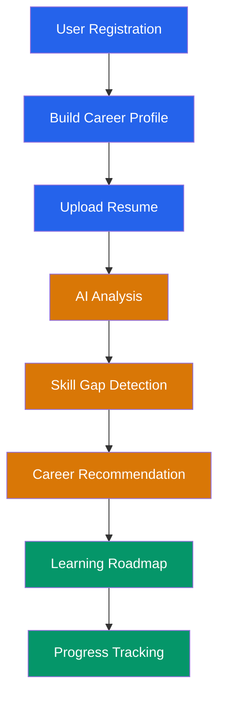
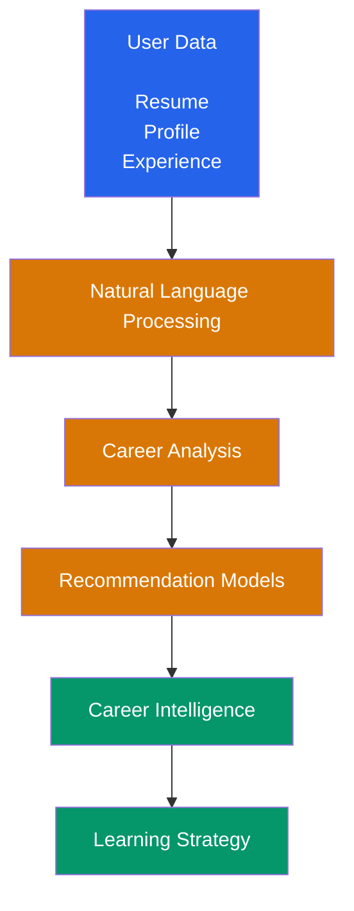
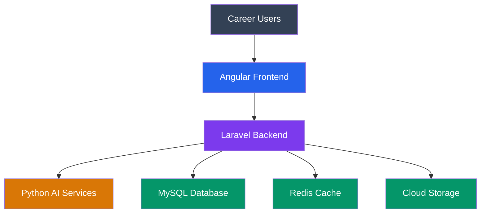
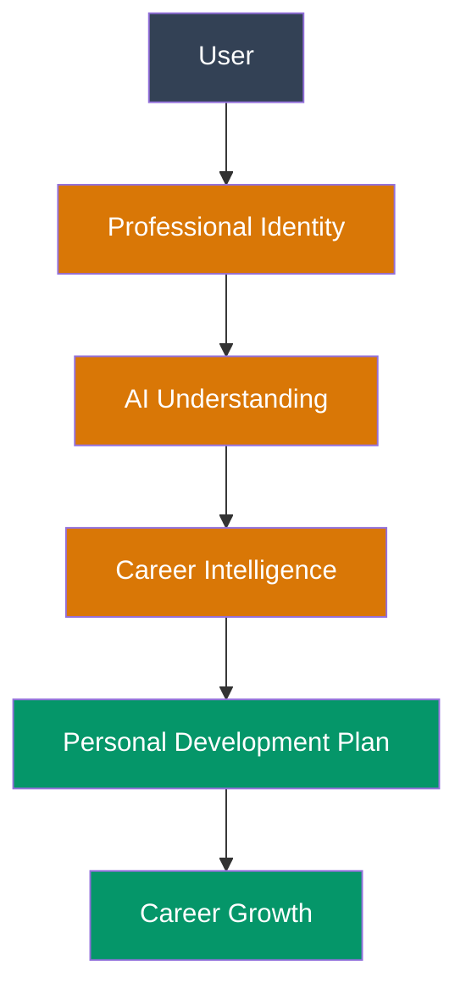

# CareerIQ AI


# Product Overview Document


---

# Document Information


| Field | Description |
|---|---|
| Project Name | CareerIQ AI |
| Document Type | Product Overview Document |
| Version | 2.0 |
| Product Category | AI-Powered Career Intelligence Platform |
| Product Type | SaaS Platform |
| Status | Development Planning |
| Architecture | Full-Stack AI Cloud Platform |
| Target Users | Students, Graduates, Professionals |
| Future Users | Recruiters and Organizations |


---

# 1. Executive Summary


## 1.1 Product Overview


CareerIQ AI is an intelligent career development platform designed to help individuals understand their professional capabilities, discover suitable career paths, identify skill gaps, and receive personalized development strategies.


The platform combines:


```
Artificial Intelligence

        +

Natural Language Processing

        +

Recommendation Systems

        +

Career Analytics

        +

Cloud Computing

```


to create a personalized career intelligence ecosystem.


Unlike traditional career platforms that focus on isolated services such as job searching, online learning, or resume improvement, CareerIQ AI creates a continuous understanding of a user's professional journey.


---

## 1.2 Product Mission


The mission of CareerIQ AI is:


> To empower individuals with AI-driven career intelligence that helps them make informed decisions, develop relevant skills, and continuously improve their professional journey.


---

## 1.3 Product Summary


CareerIQ AI enables users to:


- Build professional profiles
- Analyze resumes using AI
- Understand their current skills
- Identify missing skills
- Discover suitable career paths
- Generate personalized learning roadmaps
- Track professional growth


The platform acts as a personal AI career companion.


---

# 2. Product Introduction


## 2.1 Overview


Modern career development requires individuals to make complex decisions:


```
Which career should I choose?

        ↓

What skills do I need?

        ↓

How can I improve?

        ↓

Am I ready for my target role?

```


Many users struggle to answer these questions because career information is distributed across different platforms.


CareerIQ AI solves this problem by creating a unified intelligent career ecosystem.


---

# 2.2 Product Concept


CareerIQ AI analyzes:


```
User Background

        +

Education

        +

Experience

        +

Projects

        +

Technical Skills

        +

Career Goals

        +

Industry Requirements

                ↓

        AI Career Intelligence

                ↓

 Personalized Career Strategy

```


---

# 2.3 Product Philosophy


CareerIQ AI follows the principle:


> "Understand the person first, then recommend the career path."


The platform focuses on personalization rather than generic suggestions.


---

# 3. Product Vision


## 3.1 Vision Statement


> To build an intelligent career companion that continuously understands a person's professional journey and helps them make better career decisions using artificial intelligence and data-driven insights.


---

## 3.2 Long-Term Vision


CareerIQ AI aims to become a continuous AI career assistant that supports users throughout their professional lifecycle.


Future possibilities:


```
University Student

        ↓

Graduate

        ↓

Professional

        ↓

Career Transition

        ↓

Leadership Development

```


The platform evolves together with the user's career journey.


---

# 3.3 Vision Principles


CareerIQ AI is built around four principles:


---

## Personalization


Every recommendation should consider:


- Individual background
- Current abilities
- Career goals
- Learning progress


---

## Intelligence


AI should transform raw career information into meaningful insights.


---

## Continuous Improvement


The system should help users improve over time.


---

## Data-Driven Decisions


Career decisions should be supported by:


- User data
- Industry requirements
- Skill trends
- AI analysis


---

# 4. Product Objectives


## 4.1 Career Discovery Objective


### Goal


Help users identify suitable career directions.


### Solution


The system analyzes:


- Skills
- Education
- Experience
- Interests


and provides suitable career recommendations.


---

# 4.2 Skill Development Objective


### Goal


Help users understand what they need to learn.


### Solution


CareerIQ AI identifies:


- Existing skills
- Missing skills
- Required competencies


and generates improvement strategies.


---

# 4.3 Resume Intelligence Objective


### Goal


Improve professional presentation.


### Solution


The AI engine evaluates:


- Resume structure
- Skill representation
- Experience description
- ATS compatibility


---

# 4.4 Personalized Learning Objective


### Goal


Provide structured development plans.


### Solution


The system generates:


- Learning sequences
- Skill milestones
- Recommended resources
- Progress tracking


---

# 4.5 Career Intelligence Objective


### Goal


Transform career planning from guess-based decisions into data-supported decisions.


The platform combines:


```
Personal Data

        +

AI Analysis

        +

Industry Knowledge

        ↓

Career Intelligence

```


---

# 5. Problem Statement


## 5.1 Current Career Development Challenges


Modern career development is fragmented across multiple platforms.


Users currently depend on:


| Platform Type | Purpose |
|---|---|
|LinkedIn|Professional networking|
|Online Learning Platforms|Skill development|
|Job Portals|Finding opportunities|
|Resume Tools|CV improvement|
|Coding Platforms|Technical portfolio|


However, these platforms usually solve only one part of career development.


---

# 5.2 Lack of Career Direction


Many students and graduates struggle with:


- Choosing suitable career paths
- Understanding industry expectations
- Planning skill development


Example:


```
I studied Computer Science.

        ↓

Which career fits me?

        ↓

What skills should I learn?

        ↓

Am I job-ready?

```


---

# 5.3 Skill Gap Uncertainty


Users often cannot determine:


- Current capability level
- Missing skills
- Required learning path
- Career readiness


---

# 5.4 Generic Recommendations


Existing platforms often provide:


- Generic courses
- Generic job suggestions
- Generic career advice


without understanding:


- Individual background
- Personal goals
- Existing skills


---

# 5.5 Career Development Gap


The current ecosystem lacks a system that connects:


```
Who I am

        +

What I know

        +

Where I want to go

        +

What I need to learn

        ↓

Personal Career Strategy

```


---

---

# 6. Product Solution


## 6.1 Solution Overview


CareerIQ AI provides a unified intelligent career platform that connects:


```
Personal Background

        +

Professional Experience

        +

Current Skills

        +

Career Goals

        +

Industry Requirements

                ↓

        AI Career Intelligence

                ↓

 Personalized Career Development Strategy

```


The platform transforms fragmented career information into actionable insights.


---

# 6.2 Core Solution Components


CareerIQ AI provides:


## Career Profile Intelligence


The system creates a complete professional identity by analyzing:


- Education
- Experience
- Projects
- Certifications
- Technical skills
- Career interests


---

## Resume Intelligence


The platform analyzes resumes using AI.


Capabilities:


- Resume parsing
- Information extraction
- Skill identification
- Resume scoring
- Improvement recommendations


---

## Skill Intelligence


The system evaluates:


- Current capabilities
- Required skills
- Missing competencies
- Development priorities


---

## Career Recommendation


The AI engine recommends suitable career directions based on:


```
User Profile

+

Skills

+

Experience

+

Career Goals

        ↓

Career Recommendation

```


---

## Learning Roadmap


CareerIQ AI generates personalized development plans.


Includes:


- Skills to learn
- Learning sequence
- Suggested resources
- Progress milestones


---

# 6.3 Solution Workflow


---

# 7. Product Value Proposition


## 7.1 Core Value


CareerIQ AI transforms career development from a reactive process into a proactive intelligence system.


Traditional approach:


```
Search Career

        ↓

Find Courses

        ↓

Apply Jobs

        ↓

Improve Later

```


CareerIQ AI approach:


```
Understand User

        ↓

Analyze Current Position

        ↓

Identify Career Direction

        ↓

Find Skill Gaps

        ↓

Create Development Strategy

        ↓

Track Growth

```


---

# 7.2 Unique Value Proposition


CareerIQ AI provides:


## Personalized Career Intelligence


Instead of generic recommendations, the system understands each user's:


- Background
- Skills
- Experience
- Goals


---

## Continuous Career Guidance


The platform supports users throughout their journey:


```
Student

 ↓

Graduate

 ↓

Professional

 ↓

Career Growth

```


---

## AI-Powered Decision Support


The platform helps users answer:


- Which career fits me?
- What skills am I missing?
- What should I learn next?
- Am I ready for my target role?


---

# 8. Competitive Positioning


## 8.1 Existing Career Ecosystem


Current platforms usually focus on individual problems.


| Platform | Main Purpose | Limitation |
|-|-|-|
|LinkedIn|Professional networking|Limited personal career intelligence|
|Coursera|Online learning|Does not understand career direction|
|Job Portals|Job discovery|Limited skill development guidance|
|Resume Tools|Resume improvement|No long-term career planning|
|GitHub|Technical portfolio|Does not evaluate career readiness|


---

# 8.2 CareerIQ AI Position


CareerIQ AI combines multiple capabilities into one ecosystem.


```
Professional Identity

        +

Resume Intelligence

        +

Skill Analysis

        +

Career Recommendation

        +

Learning Strategy

        +

AI Assistance

```


The platform acts as a bridge between:


```
Current Capability

        ↓

Required Capability

        ↓

Career Goal

```


---

# 8.3 Competitive Advantage


CareerIQ AI differentiates through:


|Capability|Traditional Platforms|CareerIQ AI|
|-|-|-|
|Career Profile Understanding|Limited|Integrated|
|Resume Intelligence|Separate tools|Built-in|
|Skill Gap Analysis|Limited|AI-powered|
|Learning Roadmap|Generic|Personalized|
|Career Growth Tracking|Limited|Continuous|


---

# 9. Target Users


CareerIQ AI serves multiple user groups.


---

# 9.1 University Students


## Goal


Find suitable career directions.


## Challenges


Students often face:


- Limited industry knowledge
- Unclear career options
- Difficulty planning skills


## CareerIQ AI Solution


Provides:


- Career exploration
- Skill roadmap
- Learning guidance
- Career recommendations


---

# 9.2 Fresh Graduates


## Goal


Become employment-ready.


## Challenges


Graduates often struggle with:


- Weak resumes
- Unknown skill gaps
- Interview preparation


## CareerIQ AI Solution


Provides:


- Resume intelligence
- ATS improvement
- Skill gap analysis
- Career readiness evaluation


---

# 9.3 Working Professionals


## Goal


Advance or transition careers.


## Challenges


Professionals face:


- Changing technology requirements
- Skill obsolescence
- Career uncertainty


## CareerIQ AI Solution


Provides:


- Career transition planning
- Skill improvement tracking
- Personalized development strategy


---

# 9.4 Recruiters (Future Module)


## Goal


Identify suitable candidates.


## Future Capabilities


The recruiter platform may provide:


- Skill-based candidate search
- Candidate intelligence
- Profile analysis
- Matching recommendations


---

# 10. User Journey


## 10.1 Complete User Journey Flow




---

# 11. Product Feature Matrix


| Feature | Student | Graduate | Professional | Recruiter |
|-|-|-|-|-|
|Account Management|✓|✓|✓|-|
|Career Profile|✓|✓|✓|-|
|Resume Analysis|✓|✓|✓|-|
|Skill Analysis|✓|✓|✓|-|
|Career Recommendation|✓|✓|✓|-|
|Learning Roadmap|✓|✓|✓|-|
|Progress Tracking|✓|✓|✓|-|
|Candidate Search|-|-|-|Future|
|Recruitment Analytics|-|-|-|Future|


---

---

# 12. Product Modules


CareerIQ AI is organized into several intelligent product modules.


The modules work together to provide a complete career development ecosystem.


```
Career Profile

        ↓

Resume Intelligence

        ↓

Skill Intelligence

        ↓

Career Recommendation

        ↓

Learning Roadmap

        ↓

Career Growth

```


---

# 12.1 Career Profile Engine


## Purpose


The Career Profile Engine creates a complete digital representation of a user's professional identity.


---

## Core Functions


The module manages:


- Personal information
- Education history
- Professional experience
- Projects
- Certifications
- Technical skills
- Career interests


---

## Value


It provides the foundation for AI-based career analysis.


The system understands:


```
Who the user is

        +

What the user knows

        +

What the user wants to achieve

```


---

# 12.2 AI Resume Intelligence Engine


## Purpose


The Resume Intelligence Engine analyzes resumes and extracts meaningful career information.


---

## Core Capabilities


The system performs:


## Resume Parsing


Extracts:


- Personal information
- Education
- Experience
- Skills
- Projects


---

## Skill Extraction


Identifies:


- Technical skills
- Tools
- Frameworks
- Domain knowledge


---

## Resume Evaluation


Analyzes:


- Resume structure
- Content quality
- Skill presentation
- ATS compatibility


---

## Improvement Suggestions


Provides:


- Missing information
- Formatting recommendations
- Content improvements


---

# 12.3 Skill Intelligence Engine


## Purpose


The Skill Intelligence Engine evaluates user capabilities and identifies development opportunities.


---

## Core Functions


The module provides:


- Skill collection
- Skill categorization
- Skill evaluation
- Skill gap detection
- Skill improvement recommendations


---

## Skill Analysis Process


```
Current Skills

        +

Target Career Requirements

        ↓

Skill Comparison

        ↓

Skill Gap Identification

        ↓

Learning Recommendation

```


---

# 12.4 Career Recommendation Engine


## Purpose


The Career Recommendation Engine identifies suitable career paths based on user information.


---

## Analysis Factors


The AI considers:


- Education background
- Professional experience
- Technical skills
- Career interests
- Industry requirements


---

## Recommendation Output


The system provides:


- Suitable career roles
- Required skills
- Career readiness level
- Development suggestions


---

# 12.5 Learning Roadmap Engine


## Purpose


The Learning Roadmap Engine creates personalized skill development plans.


---

## Capabilities


The system generates:


- Learning sequence
- Skill milestones
- Recommended resources
- Progress tracking


---

## Example


```
Target:

Machine Learning Engineer


Current Status:

Python + Basic Statistics


Required Development:

1. Advanced Python

2. Machine Learning

3. Deep Learning

4. MLOps

```


---

# 12.6 Interview Intelligence Engine


## Purpose


A future AI-powered interview preparation system.


---

## Future Capabilities


The module may provide:


- AI-generated interview questions
- Technical evaluation
- Answer analysis
- Communication feedback
- Improvement suggestions


---

# 13. AI Capability Overview


## 13.1 Artificial Intelligence Role


Artificial Intelligence is the core intelligence layer of CareerIQ AI.


AI transforms user information into personalized career insights.


Architecture concept:


```
User Data

        ↓

AI Processing

        ↓

Career Intelligence

        ↓

Personalized Recommendations

```


---

# 13.2 Natural Language Processing


NLP enables the system to understand unstructured career documents.


Applications:


- Resume understanding
- Skill extraction
- Experience analysis
- Text similarity analysis


---

# 13.3 Recommendation Intelligence


The recommendation system analyzes:


```
User Profile

+

Career Requirements

+

Industry Trends

        ↓

Career Recommendation

```


---

# 13.4 Skill Intelligence AI


AI identifies:


- Existing capabilities
- Missing skills
- Skill priorities
- Learning requirements


---

# 13.5 Predictive Career Analysis


Future AI capabilities may include:


- Career readiness prediction
- Skill demand prediction
- Career transition suggestions


---

# 13.6 AI Intelligence Pipeline




---

# 14. Product Architecture Overview


## 14.1 High-Level Product Architecture


CareerIQ AI consists of:


```
Frontend Experience Layer

        ↓

Application Logic Layer

        ↓

AI Intelligence Layer

        ↓

Data Management Layer

        ↓

Cloud Infrastructure

```


---

# 14.2 Product Architecture Diagram




---

# 15. Development Roadmap


CareerIQ AI development follows an incremental product evolution strategy.


---

# Phase 1: Foundation Platform


## Goal


Build the core career management platform.


Features:


- User authentication
- Career profile
- Database foundation
- Basic dashboard


---

# Phase 2: Resume Intelligence


## Goal


Introduce AI-powered resume understanding.


Features:


- Resume upload
- Resume parsing
- Skill extraction
- Resume evaluation


---

# Phase 3: Career Intelligence


## Goal


Provide personalized career guidance.


Features:


- Skill gap analysis
- Career recommendation
- Learning roadmap


---

# Phase 4: AI Expansion


## Goal


Increase intelligence and personalization.


Features:


- AI interview simulator
- Career assistant chatbot
- Market intelligence


---

# Phase 5: Career Ecosystem


## Goal


Expand the platform beyond individual users.


Features:


- Recruiter platform
- Candidate matching
- Recruitment analytics


---

---

# 16. Product Success Metrics


Product success is measured through user engagement, AI performance, and platform reliability.


---

# 16.1 User Growth Metrics


Measures platform adoption.


Key metrics:


|Metric|Description|
|-|-|
|Registered Users|Number of created accounts|
|Active Users|Users regularly using the platform|
|Profile Completion Rate|Percentage of completed career profiles|
|User Retention|Returning users over time|


---

# 16.2 AI Performance Metrics


Measures the intelligence quality of the platform.


Key metrics:


|Metric|Description|
|-|-|
|Resume Analysis Accuracy|Quality of resume evaluation|
|Skill Matching Accuracy|Correctness of skill identification|
|Recommendation Relevance|Quality of career suggestions|
|Roadmap Effectiveness|Usefulness of learning plans|


---

# 16.3 User Engagement Metrics


Measures how users interact with the platform.


Metrics:


- Resume analysis usage
- Career recommendation usage
- Learning roadmap completion
- Skill improvement progress


---

# 16.4 Technical Performance Metrics


Measures system quality.


Metrics:


|Metric|Target|
|-|-|
|API Response Time|< 3 seconds|
|System Availability|99.5%+|
|Deployment Reliability|Automated CI/CD|
|Data Protection|Secure storage|


---

# 17. Technology Overview


CareerIQ AI uses modern full-stack and cloud technologies.


---

# 17.1 Technology Stack


| Layer | Technology | Purpose |
|-|-|-|
|Frontend|Angular + TypeScript|User interface|
|Styling|Tailwind CSS|Responsive design|
|Backend|Laravel + PHP|Business logic and APIs|
|AI Service|Python + FastAPI|AI processing|
|Database|MySQL 8.x|Structured data storage|
|Cache|Redis|Caching and background jobs|
|Storage|AWS S3|Document storage|
|Containerization|Docker|Environment consistency|
|CI/CD|GitHub Actions|Automation pipeline|
|Cloud|AWS|Production infrastructure|
|Infrastructure as Code|Terraform|Cloud automation|


---

# 17.2 Technology Selection Philosophy


Technology choices are based on:


## Maintainability


The system should be easy to modify and extend.


---

## Scalability


Components should support future growth.


---

## Developer Productivity


The technology stack should enable efficient development.


---

## AI Flexibility


The architecture should support future AI improvements.


---

# 18. Long-Term Product Vision


## 18.1 Future Direction


CareerIQ AI aims to become a continuous AI-powered career companion.


The long-term vision is:


```
Career Understanding

        ↓

Career Planning

        ↓

Skill Development

        ↓

Career Growth

        ↓

Professional Success

```


---

# 18.2 Future Capabilities


Future versions may include:


---

## AI Career Assistant


An intelligent conversational assistant that helps users with:


- Career questions
- Learning decisions
- Professional planning


---

## Real-Time Market Intelligence


The platform may analyze:


- Industry trends
- Emerging skills
- Job market requirements


---

## AI Interview Coach


Future capability:


- Mock interviews
- Answer evaluation
- Communication feedback
- Technical assessment


---

## Professional Digital Twin


A future AI representation of a user's professional identity.


Possible capabilities:


- Career simulation
- Growth prediction
- Opportunity matching


---

## Recruiter Intelligence Platform


Future B2B expansion:


- Candidate discovery
- Skill-based matching
- Talent analytics


---

# 19. Project Goals


CareerIQ AI demonstrates capabilities across multiple engineering domains.


---

# 19.1 Software Engineering Goals


The project demonstrates:


- Full-stack application development
- Modular architecture design
- API engineering
- Database management
- Software documentation


---

# 19.2 Artificial Intelligence Goals


The project demonstrates:


- Natural Language Processing
- Resume understanding
- Recommendation systems
- AI-assisted decision support


---

# 19.3 Quality Engineering Goals


The project demonstrates:


- Automated testing
- Performance validation
- Security testing
- Quality assurance practices


---

# 19.4 Cloud and DevOps Goals


The project demonstrates:


- Docker-based deployment
- CI/CD automation
- AWS infrastructure
- Cloud-native development


---

# 20. Final Product Summary


CareerIQ AI is an AI-powered career intelligence platform designed to transform how individuals understand and develop their professional journey.


The platform combines:


```
Career Profile

        +

Resume Intelligence

        +

Skill Analysis

        +

Career Recommendation

        +

Learning Roadmap

        +

AI Assistance

```


to provide personalized career guidance.


---

# Product Impact


CareerIQ AI aims to:


## For Students


Provide career clarity and development direction.


---

## For Graduates


Improve job readiness and professional presentation.


---

## For Professionals


Support career growth and transition.


---

## For Organizations


Enable future intelligent talent discovery.


---

# Complete Product Journey




---

