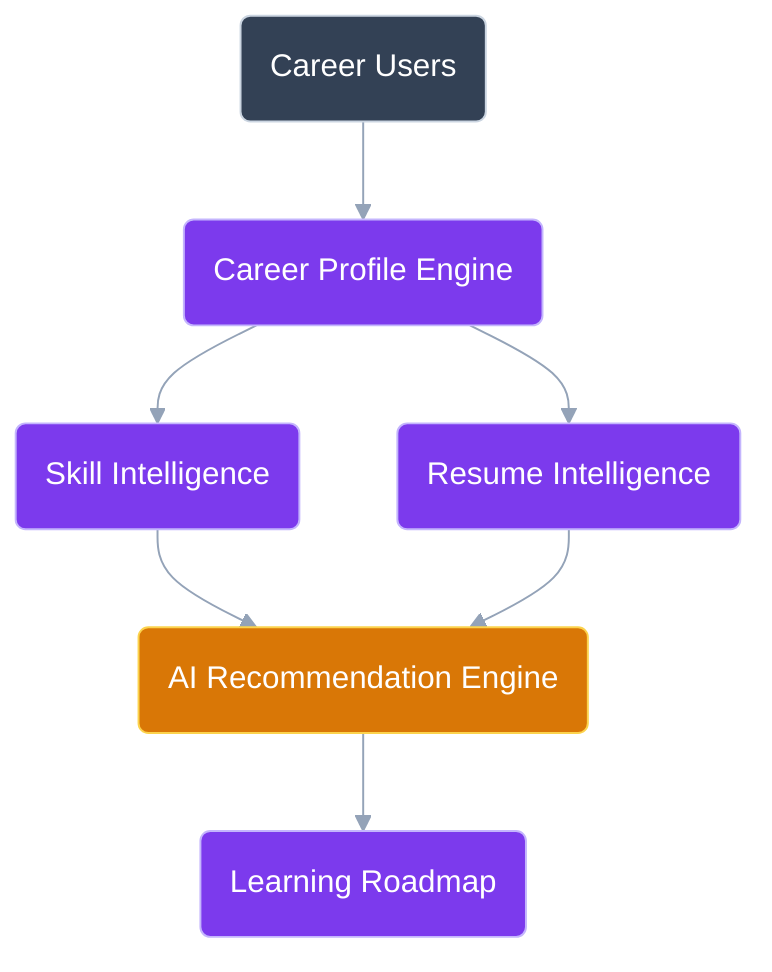

# CareerIQ AI

# Product Overview Document

---

# Document Information

| Field | Description |
|---|---|
| Project Name | CareerIQ AI |
| Product Type | AI-powered Career Intelligence Platform |
| Version | 1.0 |
| Status | Development Planning |
| Architecture | Full-stack AI SaaS Platform |

---

# 1. Product Introduction


## 1.1 Overview


CareerIQ AI is an intelligent career development platform designed to help individuals understand their professional identity, evaluate their skills, identify career gaps, and receive personalized career development recommendations.


The platform combines:


- Artificial Intelligence
- Natural Language Processing
- Recommendation Systems
- Data Analytics
- Cloud Computing


to create a personalized career intelligence experience.


---

# 2. Product Vision


## Vision Statement


> To build an intelligent career companion that continuously understands a person's professional journey and helps them make better career decisions using artificial intelligence and data-driven insights.


CareerIQ AI aims to move career development from a fragmented experience into a personalized intelligent system.


---

# 3. Problem Statement


## 3.1 Current Problem


Modern career development is distributed across multiple disconnected platforms.


Users currently depend on:


| Platform Type | Purpose |
|-|-|
| LinkedIn | Networking and professional identity |
| Online Courses | Learning new skills |
| Job Portals | Finding opportunities |
| Resume Tools | Improving CVs |
| Coding Platforms | Demonstrating technical skills |


However, these platforms do not understand the complete career journey of an individual.


---

## 3.2 Existing Challenges


Users face:


### Lack of Career Direction

Many students and graduates do not know:

- Which career path matches their abilities
- Which skills they should learn
- What industry expects from them


---

### Skill Gap Uncertainty

Users often cannot answer:

- What skills am I missing?
- How far am I from my target role?
- What should I learn next?


---

### Generic Recommendations

Most platforms provide:

- Generic courses
- Generic job recommendations
- Generic career advice


without understanding individual backgrounds.


---

# 4. Product Solution


CareerIQ AI provides a unified intelligent career platform.


The system analyzes:


```
User Background

+

Skills

+

Experience

+

Career Goals

+

Market Requirements

        ↓

AI Career Intelligence

        ↓

Personalized Career Strategy
```


---

# 5. Product Differentiation


## Comparison With Existing Platforms


| Platform | Strength | Limitation |
|-|-|-|
| LinkedIn | Professional networking | Limited personalized career intelligence |
| Coursera | Learning resources | Does not analyze career direction |
| Job Portals | Job discovery | Limited skill development guidance |
| Resume Tools | CV improvement | No long-term career planning |
| GitHub | Project showcase | Does not evaluate career readiness |


## CareerIQ AI Advantage


CareerIQ AI combines:


```
Career Profile

+

Resume Intelligence

+

Skill Analysis

+

Learning Roadmap

+

Career Recommendation

+

Interview Preparation

```


into one intelligent system.


---

# 6. Target Users


# 6.1 University Students


## Goal

Find the right career direction.


## Problems

- Lack of industry knowledge
- Unclear skill requirements
- Difficulty planning learning journey


## CareerIQ AI Solution

- Career path recommendation
- Skill roadmap
- Learning guidance


---

# 6.2 Fresh Graduates


## Goal

Become job-ready.


## Problems

- Weak resumes
- Poor interview preparation
- Unknown skill gaps


## CareerIQ AI Solution

- Resume analysis
- ATS improvement
- Interview preparation


---

# 6.3 Working Professionals


## Goal

Career growth or transition.


## Problems

- Changing industry requirements
- Skill obsolescence
- Lack of development planning


## CareerIQ AI Solution

- Career transition roadmap
- Skill improvement tracking
- Market intelligence


---

# 6.4 Recruiters (Future Module)


## Goal

Find suitable candidates.


## CareerIQ AI Solution


- Skill-based candidate search
- Candidate intelligence
- Profile analysis


---

# 7. Core Product Modules


## 7.1 Career Profile Engine


Manages:


- Education
- Experience
- Projects
- Certifications
- Skills
- Career interests


---

## 7.2 AI Resume Intelligence Engine


Capabilities:


- Resume parsing
- Skill extraction
- ATS analysis
- Improvement suggestions


---

## 7.3 Skill Intelligence Engine


Provides:


- Skill evaluation
- Skill tracking
- Skill gap detection


---

## 7.4 Career Recommendation Engine


Analyzes:


```
Current Skills

+

Target Career

+

Industry Requirements

        ↓

Career Recommendation

```


---

## 7.5 Learning Roadmap Engine


Creates:


- Personalized learning paths
- Skill improvement plans
- Progress tracking


---

## 7.6 Interview Intelligence Engine


Future capability:


- AI-generated questions
- Answer evaluation
- Interview feedback


---

# 8. Product Architecture Overview




---

# 9. Development Roadmap


## Phase 1: Foundation


Features:


- User authentication
- Career profile
- Database design
- Basic dashboard


---

## Phase 2: Resume Intelligence


Features:


- Resume upload
- Resume parsing
- Skill extraction
- Resume analysis


---

## Phase 3: Career Intelligence


Features:


- Skill gap analysis
- Career recommendation
- Learning roadmap


---

## Phase 4: AI Expansion


Features:


- Interview simulator
- AI career assistant
- Market intelligence


---

## Phase 5: Recruiter Platform


Features:


- Candidate search
- Skill matching
- Recruitment analytics


---

# 10. Technology Overview


| Layer | Technology |
|-|-|
| Frontend | Angular + TypeScript |
| Backend | Laravel + PHP |
| Database | MySQL 8.x |
| AI Service | Python + FastAPI |
| Cache | Redis |
| Containerization | Docker |
| CI/CD | GitHub Actions |
| Cloud | AWS |
| Infrastructure | Terraform |


---

# 11. Project Goals


CareerIQ AI demonstrates:


## Software Engineering

- Full-stack development
- Database engineering
- API design


## Artificial Intelligence

- NLP integration
- Recommendation systems
- AI-assisted decision making


## Quality Engineering

- Automated testing
- Performance testing
- Security testing


## DevOps and Cloud

- Docker deployment
- CI/CD pipelines
- AWS infrastructure


---

# End of Document