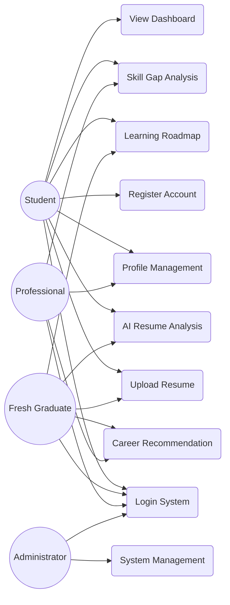
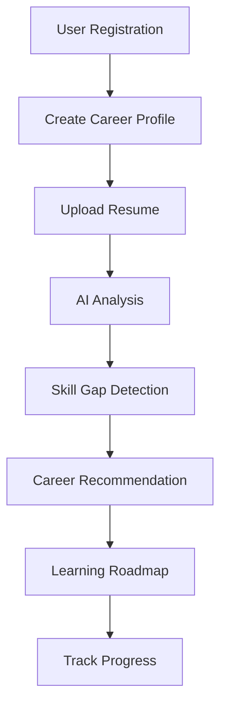

# Software Requirements Specification (SRS)

# CareerIQ AI


---

# Document Information


| Field | Description |
|---|---|
| Project Name | CareerIQ AI |
| Document Type | Software Requirements Specification |
| Version | 2.0 |
| Status | Development Planning |
| Product Type | AI-Powered Career Intelligence SaaS Platform |
| Frontend | Angular |
| Backend | Laravel |
| AI Service | Python FastAPI |
| Database | MySQL 8.x |
| Cloud Platform | AWS |


---

# Document Purpose


This Software Requirements Specification (SRS) document defines the complete requirements of CareerIQ AI.


The document serves as a reference for:


- Software development
- System architecture
- Database design
- Testing activities
- Quality assurance
- Deployment planning
- Future system enhancement


This document defines:


- Business requirements
- User requirements
- Functional requirements
- Non-functional requirements
- System constraints
- External dependencies
- Acceptance criteria


---

# Table of Contents


1. Introduction

2. Product Overview

3. Business Objectives

4. System Scope

5. Stakeholders and User Personas

6. System Use Cases

7. Functional Requirements

8. User Stories

9. Non-Functional Requirements

10. External Interface Requirements

11. Data Requirements

12. Security Requirements

13. Testing Requirements

14. DevOps Requirements

15. Assumptions and Constraints

16. External Dependencies

17. Acceptance Criteria

18. Requirement Traceability Matrix

19. Final Requirement Summary


---

# 1. Introduction


## 1.1 Purpose


CareerIQ AI is an AI-powered career intelligence platform designed to help users understand their professional capabilities, identify skill gaps, and receive personalized career development recommendations.


This SRS defines what the system should provide and how requirements will be validated.


---

# 1.2 Product Overview


CareerIQ AI combines:


```
Artificial Intelligence

        +

Natural Language Processing

        +

Recommendation Systems

        +

Career Analytics

        +

Learning Intelligence

```


The platform analyzes user information such as:


- Education background
- Professional experience
- Projects
- Technical skills
- Resume documents
- Career goals


and generates:


- Career recommendations
- Skill gap analysis
- Learning roadmaps
- Resume improvement suggestions


---

# 1.3 Document Relationship


This SRS works together with other technical documents.


| Document | Purpose |
|---|---|
|Product Overview|Defines product vision and goals|
|System Architecture|Defines technical implementation|
|Database Design|Defines data structure|
|API Design|Defines service communication|
|Test Plan|Defines quality assurance strategy|
|Deployment Plan|Defines production deployment|


---

# 2. Product Overview


## 2.1 Product Perspective


CareerIQ AI is a complete full-stack AI SaaS platform.


The system consists of:


```
Angular Frontend

        |

Laravel REST API

        |

Python AI Service

        |

MySQL Database

        |

AWS Cloud Infrastructure

```


Each layer has a specific responsibility.


---

## Frontend Layer


Responsible for:


- User interface
- Dashboard visualization
- Resume upload
- Career progress display


Technology:


```
Angular

TypeScript

Tailwind CSS

```


---

## Backend Layer


Responsible for:


- Authentication
- Business logic
- API management
- Data processing


Technology:


```
Laravel

PHP

REST API

```


---

## AI Intelligence Layer


Responsible for:


- Resume analysis
- Skill extraction
- Career matching
- Recommendation generation


Technology:


```
Python

FastAPI

Machine Learning Models

LLM Services

```


---

## Data Layer


Responsible for:


- Persistent storage
- User information
- AI results
- Application data


Technology:


```
MySQL

Redis

AWS S3

```


---

# 2.2 Product Vision


CareerIQ AI aims to create an intelligent career guidance ecosystem where users can:


```
Understand Their Current Skills

            ↓

Identify Skill Gaps

            ↓

Select Career Direction

            ↓

Follow Personalized Learning Path

            ↓

Improve Employability

```


---

# 3. Business Objectives


## 3.1 Primary Objectives


CareerIQ AI focuses on solving the following problems:


| Problem | Solution |
|---|---|
|Users do not know suitable career paths|AI career recommendations|
|Skill gaps are difficult to identify|AI-powered skill analysis|
|Resume quality is uncertain|Resume intelligence|
|Learning paths are unclear|Personalized roadmap generation|
|Career decisions lack data support|Career analytics|


---

# 3.2 Business Goals


The system aims to:


## Goal 1: Career Guidance


Provide users with personalized career recommendations.


---

## Goal 2: Skill Development


Identify missing skills required for target careers.


---

## Goal 3: Resume Improvement


Analyze resumes and provide improvement suggestions.


---

## Goal 4: Learning Assistance


Generate structured learning roadmaps.


---

## Goal 5: AI-Based Decision Support


Use artificial intelligence to support career planning decisions.


---

# 3.3 Success Metrics


CareerIQ AI success can be measured through:


|Metric|Description|
|---|---|
|User Engagement|Number of active users|
|Resume Analysis Usage|Number of processed resumes|
|Recommendation Accuracy|Quality of AI suggestions|
|Roadmap Completion|User learning progress|
|System Performance|Response time and reliability|


---

# 4. System Scope


## 4.1 In Scope


Version 1.0 includes:


---

# User Management


Features:


- User registration
- User login
- Authentication
- Profile management


---

# Career Profile Management


Users can manage:


- Education history
- Work experience
- Projects
- Certifications
- Skills


---

# Resume Intelligence


The system provides:


- Resume upload
- Resume parsing
- Information extraction
- Resume scoring
- Improvement suggestions


Supported formats:


```
PDF

DOCX

```


---

# Skill Intelligence


The system supports:


- Skill tracking
- Skill evaluation
- Skill gap identification
- Skill recommendations


---

# Career Recommendation


The system provides:


- Career goal selection
- Career matching
- Required skill analysis
- Personalized roadmap


---

# Dashboard


The dashboard displays:


- Career readiness score
- Skill progress
- Learning progress
- AI recommendations


---

# 4.2 Future Scope


Future versions may include:


- AI interview simulator
- GitHub project analysis
- Job market intelligence
- Recruiter platform
- Candidate ranking system
- AI career assistant chatbot


---

# 5. Stakeholders and User Personas


CareerIQ AI serves multiple user groups.


---

# 5.1 Student User


## Goal


Understand career direction and required skills.


## Needs


- Career guidance
- Learning recommendations
- Skill development plan


## System Features


- Career profile
- Skill analysis
- Learning roadmap


---

# 5.2 Fresh Graduate


## Goal


Become employment-ready.


## Needs


- Resume improvement
- Interview preparation
- Career planning


## System Features


- Resume intelligence
- Career readiness analysis
- Skill gap analysis


---

# 5.3 Professional User


## Goal


Career growth or transition.


## Needs


- Skill improvement
- Career advancement
- Industry direction


## System Features


- Skill tracking
- Career recommendations
- Development roadmap


---

# 5.4 Administrator


## Goal


Manage and maintain the platform.


## Responsibilities


- User management
- System monitoring
- Platform configuration
- Data management


---

---

# 6. System Use Cases


## 6.1 Use Case Overview


The use case model defines how different users interact with CareerIQ AI.


Main actors:


```
Student User

        +

Fresh Graduate

        +

Professional User

        +

Administrator

```


---

# 6.2 System Use Case Diagram




---

# 6.3 Use Case Descriptions


---

# UC-001: User Registration


## Actor


Student / Graduate / Professional


## Goal


Create a new CareerIQ AI account.


## Preconditions


- User does not already have an account


## Main Flow


```
User enters information

        ↓

System validates data

        ↓

Account is created

        ↓

User receives confirmation

```


## Alternative Flow


If email already exists:


```
System displays error message

```

---

# UC-002: User Login


## Actor


Registered User


## Goal


Access the CareerIQ AI platform.


## Main Flow


```
User enters credentials

        ↓

System verifies information

        ↓

Authentication token generated

        ↓

User enters dashboard

```


---

# UC-003: Resume Analysis


## Actor


Student / Graduate / Professional


## Goal


Analyze resume quality using AI.


## Preconditions


- User account exists
- Resume file is valid


## Main Flow


```
User uploads resume

        ↓

System stores file

        ↓

AI extracts information

        ↓

Skills are identified

        ↓

Resume score generated

        ↓

Recommendations displayed

```


## Output


The system provides:


- Resume score
- Skill analysis
- Improvement suggestions
- Career recommendations


---

# UC-004: Career Recommendation


## Actor


User


## Goal


Receive suitable career suggestions.


## Main Flow


```
User selects career goal

        ↓

System analyzes skills

        ↓

AI compares requirements

        ↓

Career recommendation generated

```


---

# UC-005: Learning Roadmap Generation


## Actor


User


## Goal


Receive personalized learning path.


## Main Flow


```
Career Goal Selected

        ↓

Skill Gap Identified

        ↓

Learning Resources Generated

        ↓

Roadmap Created

```


---

# 6.4 User Journey Flow




---

# 7. User Stories


User stories describe system requirements from the user's perspective.


Format:


```
As a [user]

I want [feature]

So that [benefit]

```


---

# US-001: Account Creation


## User Story


As a new user,


I want to create an account,


so that I can access CareerIQ AI services.


## Acceptance Criteria


```
Given:

User provides valid information


When:

User submits registration form


Then:

Account should be created

```


Priority:


```
Must Have

```


---

# US-002: Resume Upload


## User Story


As a user,


I want to upload my resume,


so that the system can analyze my professional background.


## Acceptance Criteria


```
Given:

User has a valid account


When:

User uploads PDF/DOCX resume


Then:

System stores and processes the document

```


Priority:


```
Must Have

```


---

# US-003: Resume Intelligence


## User Story


As a user,


I want AI feedback on my resume,


so that I can improve my employment opportunities.


## Acceptance Criteria


```
Given:

Resume has been uploaded


When:

AI processing completes


Then:

System displays analysis report

```


Priority:


```
Must Have

```


---

# US-004: Skill Gap Analysis


## User Story


As a user,


I want to know missing skills,


so that I can prepare for my target career.


## Acceptance Criteria


```
Given:

User selects career goal


When:

System compares skills


Then:

Missing skills are displayed

```


Priority:


```
Must Have

```


---

# US-005: Career Roadmap


## User Story


As a user,


I want a personalized learning roadmap,


so that I know what skills to develop next.


## Acceptance Criteria


```
Given:

Career goal exists


When:

AI generates roadmap


Then:

Learning sequence is displayed

```


Priority:


```
Should Have

```


---

# 8. Requirement Priority Classification


CareerIQ AI follows the MoSCoW prioritization method.


---

# 8.1 Must Have Requirements


Critical features required for Version 1.0.


Examples:


|Requirement|Description|
|-|-|
|User Registration|Create account|
|User Login|Authentication|
|Profile Management|Store career information|
|Resume Upload|Submit documents|
|Resume Analysis|AI evaluation|
|Skill Gap Analysis|Identify missing skills|


---

# 8.2 Should Have Requirements


Important features that improve user experience.


Examples:


|Requirement|Description|
|-|-|
|Career Dashboard|Visual progress|
|Learning Roadmap|Structured learning path|
|Progress Tracking|Monitor development|


---

# 8.3 Could Have Requirements


Useful future enhancements.


Examples:


|Requirement|Description|
|-|-|
|AI Interview Simulator|Interview practice|
|GitHub Analysis|Project evaluation|
|Career Chatbot|AI assistant|


---

# 8.4 Won't Have in Version 1.0


Features planned for later releases.


Examples:


```
Recruiter Platform

Candidate Ranking

Job Marketplace

```


---

# 9. Functional Requirement Framework


Functional requirements define what CareerIQ AI must do.


Each requirement contains:


|Field|Description|
|-|-|
|Requirement ID|Unique identifier|
|Requirement Name|Feature name|
|Actor|User/system component|
|Description|Expected behavior|
|Precondition|Required state|
|Input|Provided information|
|Process|System operation|
|Output|Expected result|
|Exception|Failure handling|
|Priority|Importance level|


---

---

# 10. Functional Requirements


Functional requirements define the behavior and capabilities of CareerIQ AI.


Each requirement follows a structured format:


- Requirement ID
- Requirement Name
- Actor
- Description
- Preconditions
- Input
- Process
- Output
- Exception
- Priority


---

# Module 1: Authentication and User Management


---

# FR-001: User Registration


## Actor

New User


## Description


The system shall allow users to create a new account.


## Preconditions


- User does not already exist
- Registration service is available


## Input


```
Name

Email

Password

Password Confirmation

```


## Process


```
Validate User Information

        ↓

Check Existing Account

        ↓

Create User Record

        ↓

Return Confirmation

```


## Output


A new user account is created.


## Exception


If email already exists:


```
Registration Failed

Email Already Registered

```


## Priority


```
Must Have

```


---

# FR-002: User Login


## Actor

Registered User


## Description


The system shall authenticate users and provide secure access.


## Input


```
Email

Password

```


## Process


```
Receive Credentials

        ↓

Validate Information

        ↓

Generate Authentication Token

        ↓

Create User Session

```


## Output


User receives:


- Authentication token
- Dashboard access


## Exception


Invalid credentials:


```
Authentication Failed

```


## Priority


```
Must Have

```


---

# FR-003: Password Management


## Description


The system shall support secure password management.


Features:


- Password reset
- Password update
- Account recovery


## Priority


```
Must Have

```


---

# Module 2: Career Profile Management


---

# FR-004: Create Career Profile


## Actor


User


## Description


The system shall allow users to create professional profiles.


## Input


User information:


```
Personal Information

Education

Experience

Projects

Certifications

Skills

```


## Process


```
Receive Information

        ↓

Validate Data

        ↓

Store Profile Information

```


## Output


Complete career profile created.


## Priority


```
Must Have

```


---

# FR-005: Update Career Profile


## Description


Users shall be able to modify existing profile information.


Users can update:


- Education
- Experience
- Projects
- Skills


## Priority


```
Should Have

```


---

# FR-006: Manage Professional Experience


## Description


The system shall allow users to maintain employment history.


Information includes:


```
Company Name

Job Position

Responsibilities

Duration

```


## Priority


```
Should Have

```


---

# Module 3: Resume Intelligence


---

# FR-007: Resume Upload


## Actor


User


## Description


The system shall allow users to upload resumes.


## Supported Formats


```
PDF

DOCX

```


## Constraints


Maximum size:


```
10 MB

```


## Process


```
Upload File

        ↓

Validate Format

        ↓

Store Resume

        ↓

Create Processing Task

```


## Priority


```
Must Have

```


---

# FR-008: Resume Text Extraction


## Actor


AI Service


## Description


The system shall extract meaningful information from resumes.


The system extracts:


- Name
- Education
- Experience
- Skills
- Projects
- Certifications


## Process


```
Resume File

        ↓

Document Parser

        ↓

Extracted Text

        ↓

Structured Information

```


## Priority


```
Must Have

```


---

# FR-009: AI Resume Analysis


## Actor


AI Engine


## Description


The AI system shall analyze resume quality.


The analysis includes:


- Resume score
- Skill identification
- Strength analysis
- Weakness identification
- Improvement suggestions


## Output


Example:


```
Resume Score:

82%


Missing Skills:

Cloud Computing


Suggestions:

Add AWS Projects

```


## Priority


```
Must Have

```


---

# FR-010: ATS Compatibility Analysis


## Description


The system shall evaluate resume compatibility with applicant tracking systems.


The system analyzes:


- Keyword usage
- Formatting
- Skill matching
- Structure quality


## Priority


```
Should Have

```


---

# Module 4: Skill Intelligence


---

# FR-011: Skill Management


## Description


The system shall maintain user skill information.


Supported skills:


```
Programming Languages

Frameworks

Tools

Databases

Cloud Technologies

Soft Skills

```


## Priority


```
Must Have

```


---

# FR-012: Skill Assessment


## Description


The system shall evaluate user's current skill level.


Skill levels:


```
Beginner

Intermediate

Advanced

Expert

```


## Priority


```
Should Have

```


---

# FR-013: Skill Gap Analysis


## Actor


AI Engine


## Description


The system shall compare current skills with target career requirements.


Process:


```
Current Skills

        +

Career Requirements

        ↓

Skill Comparison

        ↓

Missing Skill Identification

```


## Output


The system provides:


- Missing skills
- Skill priority
- Recommended learning


## Priority


```
Must Have

```


---

# Module 5: Career Recommendation


---

# FR-014: Career Goal Selection


## Description


Users shall select desired career paths.


Examples:


```
Software Engineer

Data Scientist

AI Engineer

Cloud Engineer

Backend Developer

```


## Priority


```
Must Have

```


---

# FR-015: Career Matching


## Description


The AI engine shall recommend suitable career paths based on:


- Skills
- Experience
- Education
- Interests


## Process


```
User Profile

        ↓

AI Analysis

        ↓

Career Matching

        ↓

Recommended Careers

```


## Priority


```
Should Have

```


---

# FR-016: Learning Roadmap Generation


## Description


The system shall generate personalized learning plans.


The roadmap includes:


- Required skills
- Learning sequence
- Suggested resources
- Progress milestones


## Priority


```
Must Have

```


---

# Module 6: Dashboard


---

# FR-017: Career Dashboard


## Description


The system shall provide a personalized dashboard.


Dashboard displays:


- Career readiness score
- Skill progress
- Learning progress
- AI recommendations


## Priority


```
Should Have

```


---

# FR-018: Progress Tracking


## Description


The system shall track user development progress.


Tracks:


```
Completed Skills

Learning Activities

Roadmap Progress

Career Goals

```


## Priority


```
Should Have

```


---

# Module 7: AI Interview Intelligence


---

# FR-019: AI Interview Simulation


## Description


The system may provide AI-based interview practice.


Features:


- Question generation
- Answer evaluation
- Feedback generation


## Priority


```
Could Have

```


---

# FR-020: Interview Performance Analysis


## Description


The AI system evaluates:


- Communication
- Technical answers
- Confidence
- Improvement areas


## Priority


```
Could Have

```


---

# Functional Requirement Summary


|Module|Requirement Range|Priority|
|-|-|-|
|Authentication|FR-001 to FR-003|Must Have|
|Profile Management|FR-004 to FR-006|Must/Should Have|
|Resume Intelligence|FR-007 to FR-010|Must Have|
|Skill Intelligence|FR-011 to FR-013|Must Have|
|Career Recommendation|FR-014 to FR-016|Must/Should Have|
|Dashboard|FR-017 to FR-018|Should Have|
|Interview Intelligence|FR-019 to FR-020|Could Have|


---

---

# 11. Non-Functional Requirements


Non-functional requirements define the quality attributes and operational expectations of CareerIQ AI.


The system shall satisfy:


- Performance requirements
- Security requirements
- Scalability requirements
- Availability requirements
- Maintainability requirements
- Usability requirements


---

# 11.1 Performance Requirements


## NFR-001: Response Time


## Description


The system shall provide fast responses for normal user operations.


Requirement:


```
Standard API Response:

< 3 seconds

```


Applicable operations:


- Login
- Profile loading
- Dashboard access
- Skill retrieval


Priority:


```
Must Have

```


---

# NFR-002: AI Processing Performance


## Description


Heavy AI operations shall not block user interaction.


Examples:


- Resume analysis
- Career recommendation generation
- Interview evaluation


The system shall process these tasks asynchronously.


Architecture:


```
User Request

        ↓

Queue System

        ↓

AI Worker

        ↓

Result Notification

```


Priority:


```
Must Have

```


---

# NFR-003: Concurrent Users


## Description


The system should support multiple users accessing the platform simultaneously.


Target:


```
Minimum:

1000 concurrent users

```


Priority:


```
Should Have

```


---

# 11.2 Security Requirements


Security is implemented throughout the system lifecycle.


---

# NFR-004: Authentication Security


## Description


The system shall provide secure user authentication.


Requirements:


- Password hashing
- Secure token management
- Session protection
- Account recovery


Technology:


```
Laravel Authentication

bcrypt Hashing

Token-Based Access

```


Priority:


```
Must Have

```


---

# NFR-005: Data Protection


## Description


Sensitive user information shall be protected.


Protected data:


- Personal information
- Resume documents
- Career records
- AI analysis results


Methods:


```
Encryption

Access Control

Secure Storage

```


Priority:


```
Must Have

```


---

# NFR-006: Attack Prevention


The system shall protect against:


|Threat|Protection|
|-|-|
|SQL Injection|Prepared queries|
|XSS|Input sanitization|
|CSRF|Security tokens|
|Unauthorized Access|Authorization rules|
|Data Leakage|Access control|


Priority:


```
Must Have

```


---

# 11.3 Scalability Requirements


## NFR-007: Horizontal Scaling


## Description


The system shall support adding additional application instances.


Example:


```
Load Balancer

        |

Application Instance 1

Application Instance 2

Application Instance 3

```


Priority:


```
Should Have

```


---

# NFR-008: AI Service Scalability


## Description


The AI service shall scale independently from the main application.


Benefits:


- Increased AI processing capacity
- Independent resource allocation
- Easier model upgrades


Priority:


```
Should Have

```


---

# NFR-009: Database Scalability


The database architecture shall support:


- Index optimization
- Query optimization
- Database backup
- Read replicas


Priority:


```
Should Have

```


---

# 11.4 Availability Requirements


## NFR-010: System Availability


## Description


CareerIQ AI should provide reliable service availability.


Target:


```
99.5% Availability

```


Priority:


```
Should Have

```


---

# NFR-011: Backup and Recovery


## Description


The system shall maintain backup and recovery mechanisms.


Requirements:


- Automated database backup
- File backup
- Recovery procedures


Priority:


```
Must Have

```


---

# NFR-012: Error Handling


## Description


The system shall gracefully handle failures.


Examples:


- Network failure
- AI service failure
- Database errors
- Invalid requests


The system shall:


- Display meaningful messages
- Log errors
- Recover safely


Priority:


```
Must Have

```


---

# 11.5 Maintainability Requirements


## NFR-013: Code Quality


The system shall follow:


- Clean code principles
- Modular architecture
- Coding standards
- Documentation guidelines


Priority:


```
Must Have

```


---

# NFR-014: Modular Design


## Description


System components shall remain independent.


Example:


```
Frontend

Backend

AI Service

Database

```


Benefits:


- Easier maintenance
- Independent updates
- Better testing


Priority:


```
Must Have

```


---

# NFR-015: Documentation


The project shall maintain documentation for:


- Architecture
- Database
- APIs
- Deployment
- Testing


Priority:


```
Should Have

```


---

# 11.6 Usability Requirements


## NFR-016: User Interface


The system shall provide:


- Simple navigation
- Clear information display
- Responsive design
- User-friendly interaction


Priority:


```
Must Have

```


---

# NFR-017: Accessibility


The system should support accessibility practices:


Including:


- Semantic HTML
- Keyboard navigation
- Proper labels
- Color contrast
- Alternative text


Priority:


```
Should Have

```


---

# 12. External Interface Requirements


External interfaces define communication between CareerIQ AI components and external systems.


---

# 12.1 User Interface Requirements


Frontend technology:


```
Angular

TypeScript

Tailwind CSS

```


The interface provides:


- Registration screens
- Dashboard
- Resume upload
- Career reports
- Learning roadmap


---

# 12.2 Backend API Interface


Communication:


```
Angular Frontend

        |

HTTPS REST API

        |

Laravel Backend

```


Example endpoints:


|Method|Endpoint|Purpose|
|-|-|-|
|POST|/api/register|Create account|
|POST|/api/login|Authenticate user|
|GET|/api/profile|Retrieve profile|
|POST|/api/resume/upload|Upload resume|
|GET|/api/roadmap|Retrieve roadmap|


---

# 12.3 AI Service Interface


Communication:


```
Laravel Backend

        |

Internal REST API

        |

Python FastAPI AI Service

```


AI operations:


- Resume analysis
- Skill extraction
- Recommendation generation


---

# 12.4 External Service Interfaces


Possible external integrations:


|Service|Purpose|
|-|-|
|LLM API|AI reasoning|
|AWS S3|File storage|
|Email Service|Notifications|
|Cloud Monitoring|System monitoring|


---

# 13. Data Requirements


Data requirements define information managed by CareerIQ AI.


---

# 13.1 Data Storage Requirements


The system shall store:


## User Data


```
Name

Email

Password Hash

Profile Information

```


---

## Career Data


```
Education

Experience

Projects

Skills

Certifications

```


---

## Resume Data


```
Resume Files

Extracted Information

Analysis Results

```


---

## AI Data


```
Models

Predictions

Recommendations

Evaluation Results

```


---

# 13.2 Database Requirements


The system shall use:


```
MySQL 8.x

```


The database shall support:


- Primary keys
- Foreign keys
- Transactions
- Data integrity
- Index optimization


---

# 13.3 Data Validation Requirements


The system shall validate:


- User input
- Uploaded files
- Required fields
- Data formats


Examples:


```
Email format validation

Resume file validation

Password rules

```


---

---

# 14. Security Requirements


Security requirements define how CareerIQ AI protects user information, application services, and system resources.


---

# 14.1 Authentication and Authorization


## Requirement


The system shall ensure that only authenticated users can access protected resources.


Implementation:


```
User Authentication

        ↓

Token Validation

        ↓

Permission Verification

        ↓

Resource Access

```


Controls:


- Secure login mechanism
- Token-based authentication
- Role-based authorization
- Session management


Priority:


```
Must Have

```


---

# 14.2 Data Security


## Requirement


The system shall protect sensitive user information.


Protected information:


- Personal details
- Resume documents
- Career history
- AI-generated reports


Security methods:


|Method|Purpose|
|-|-|
|Encryption|Protect stored information|
|HTTPS|Secure communication|
|Access Control|Prevent unauthorized access|
|Backup Security|Protect stored data|


Priority:


```
Must Have

```


---

# 14.3 File Security


## Requirement


Uploaded documents shall be securely handled.


Controls:


- File type validation
- File size restriction
- Secure storage
- Access permission checking


Example:


```
Allowed:

PDF

DOCX


Maximum:

10 MB

```


Priority:


```
Must Have

```


---

# 14.4 Privacy Requirements


CareerIQ AI shall:


- Collect only required information
- Protect user confidentiality
- Prevent unauthorized data sharing
- Allow secure account management


Priority:


```
Must Have

```


---

# 15. Testing Requirements


Testing ensures that CareerIQ AI meets functional and quality expectations.


---

# 15.1 Testing Strategy


The system shall follow multiple testing levels.


```
Unit Testing

        ↓

Integration Testing

        ↓

System Testing

        ↓

User Acceptance Testing

```


---

# 15.2 Unit Testing


## Purpose


Validate individual components.


Examples:


Frontend:


- Components
- Services
- Form validation


Backend:


- Controllers
- Services
- Models


AI:


- Processing functions
- Model evaluation


Tools:


```
Jasmine

PHPUnit

PyTest

```


Priority:


```
Must Have

```


---

# 15.3 Integration Testing


## Purpose


Verify communication between system components.


Test areas:


- Frontend API communication
- Backend database interaction
- Laravel-FastAPI communication
- Queue processing


Priority:


```
Must Have

```


---

# 15.4 System Testing


The complete platform shall be tested for:


- User workflows
- Performance
- Security
- Reliability


Examples:


```
Registration Flow

Resume Analysis Flow

Career Recommendation Flow

```


Priority:


```
Must Have

```


---

# 15.5 User Acceptance Testing


## Purpose


Validate that the system satisfies user expectations.


Acceptance participants:


- Students
- Graduates
- Professionals


Priority:


```
Should Have

```


---

# 16. DevOps Requirements


CareerIQ AI follows modern software delivery practices.


---

# 16.1 Version Control


The project shall use:


```
Git

+

GitHub Repository

```


Purpose:


- Source management
- Collaboration
- Change tracking


---

# 16.2 Continuous Integration


The system shall automatically perform:


- Code validation
- Automated tests
- Build verification


Pipeline:


```
Code Commit

        ↓

CI Pipeline

        ↓

Testing

        ↓

Build Verification

```


---

# 16.3 Continuous Deployment


The deployment process shall support:


- Automated builds
- Docker image creation
- Cloud deployment


Architecture:


```
GitHub Actions

        ↓

Docker Build

        ↓

AWS Deployment

```


---

# 16.4 Infrastructure Requirements


Production environment requires:


|Component|Technology|
|-|-|
|Application Hosting|AWS EC2/ECS|
|Database|Amazon RDS|
|Storage|Amazon S3|
|Cache|Redis|
|Monitoring|CloudWatch|


---

# 17. Assumptions and Constraints


## 17.1 Assumptions


The system assumes:


|Assumption|Description|
|-|-|
|Internet Availability|Users have internet access|
|Valid Documents|Users upload valid resumes|
|AI Availability|AI services are accessible|
|Cloud Availability|AWS services remain operational|


---

# 17.2 Constraints


The system has the following constraints:


## File Upload Constraint


```
Supported:

PDF

DOCX


Maximum:

10 MB

```


---

## Technology Constraint


The first version shall use:


```
Angular

Laravel

Python FastAPI

MySQL

AWS

```


---

## Resource Constraint


AI processing performance depends on:


- Available computing resources
- External AI service limits
- Model complexity


---

# 18. External Dependencies


CareerIQ AI depends on external technologies and services.


---

# 18.1 AI Dependencies


|Dependency|Purpose|
|-|-|
|LLM API|Natural language reasoning|
|NLP Models|Text processing|
|ML Models|Prediction and recommendation|


---

# 18.2 Cloud Dependencies


|Service|Purpose|
|-|-|
|AWS EC2/ECS|Application hosting|
|AWS RDS|Database hosting|
|AWS S3|Document storage|
|CloudWatch|Monitoring|


---

# 18.3 Software Dependencies


|Technology|Purpose|
|-|-|
|Angular|Frontend|
|Laravel|Backend|
|FastAPI|AI Service|
|MySQL|Database|
|Redis|Queue and Cache|
|Docker|Containerization|


---

# 19. Acceptance Criteria


Acceptance criteria define when the system is considered complete.


---

# 19.1 Functional Acceptance Criteria


The system shall successfully:


✓ Register users

✓ Authenticate users

✓ Manage career profiles

✓ Upload resumes

✓ Analyze resumes using AI

✓ Identify skill gaps

✓ Generate career recommendations

✓ Create learning roadmaps


---

# 19.2 Performance Acceptance Criteria


The system should:


✓ Provide normal responses within 3 seconds

✓ Handle multiple simultaneous users

✓ Process AI tasks asynchronously


---

# 19.3 Security Acceptance Criteria


The system shall:


✓ Protect user authentication

✓ Secure stored data

✓ Prevent unauthorized access

✓ Validate user inputs


---

# 19.4 Deployment Acceptance Criteria


The system shall:


✓ Deploy successfully on AWS

✓ Run through Docker containers

✓ Support automated deployment pipeline

✓ Provide monitoring capability


---

# 20. Requirement Traceability Matrix


The traceability matrix connects requirements with system modules and validation methods.


|Requirement|Module|Design Reference|Testing Method|
|-|-|-|-|
|FR-001 Registration|Authentication|System Architecture|Unit Test|
|FR-002 Login|Authentication|Security Design|Integration Test|
|FR-004 Profile Management|Profile Module|Database Design|System Test|
|FR-007 Resume Upload|Resume Module|Storage Architecture|Integration Test|
|FR-009 AI Resume Analysis|AI Module|AI Architecture|AI Validation Test|
|FR-013 Skill Gap Analysis|Skill Module|Recommendation Design|Functional Test|
|FR-016 Learning Roadmap|Career Module|AI Architecture|System Test|
|FR-017 Dashboard|Frontend Module|Frontend Architecture|UI Test|


---

# 21. Final Requirement Summary


CareerIQ AI requirements define a complete AI-powered career intelligence platform.


The system provides:


## User Management


- Secure authentication
- Profile management
- Career information storage


---

## AI Intelligence


- Resume analysis
- Skill extraction
- Career recommendations
- Learning roadmap generation


---

## Technical Quality


Through:


- Scalable architecture
- Secure design
- Automated testing
- Cloud deployment


---

# Complete Requirement Overview


```
User

 ↓

Career Profile

 ↓

Resume Intelligence

 ↓

AI Analysis

 ↓

Skill Gap Detection

 ↓

Career Recommendation

 ↓

Learning Roadmap

 ↓

Career Growth

```


---

