# System Architecture Document

# CareerIQ AI


---

# Document Information


| Field | Description |
|---|---|
| Project Name | CareerIQ AI |
| Document Type | System Architecture Document |
| Version | 2.0 |
| Architecture Style | Modular Layered Cloud-Native Architecture |
| Backend Architecture | Laravel Modular Service Architecture |
| Frontend Architecture | Angular Component-Based Architecture |
| AI Architecture | Independent AI Microservice |
| Database | MySQL 8.x |
| Cache & Queue | Redis |
| Cloud Platform | AWS |
| Deployment Approach | Docker-Based Deployment |


---

# Document Purpose


This document defines the complete technical architecture of CareerIQ AI.


The purpose is to describe:


- System components
- Architecture decisions
- Service communication
- Data flow
- AI processing architecture
- Cloud deployment strategy
- Security integration
- Scalability approach


CareerIQ AI is designed as an AI-powered career intelligence platform combining:


```
Angular Frontend

        +

Laravel Backend API

        +

Python AI Services

        +

MySQL Database

        +

Redis Queue System

        +

AWS Cloud Infrastructure

```


---

# 1. Architecture Vision


## 1.1 System Overview


CareerIQ AI is a modern intelligent career platform that helps users:


- Analyze resumes
- Identify skills
- Discover career opportunities
- Generate learning roadmaps
- Receive AI-based career recommendations
- Practice interviews


The system follows a modular architecture where each major responsibility is separated into independent components.


---

# 1.2 Architecture Goals


The architecture is designed around the following goals:


| Goal | Description |
|---|---|
|Maintainability|Clear separation between system modules|
|Scalability|Independent scaling of services|
|Security|Protection of user and career data|
|Performance|Fast response and efficient processing|
|AI Flexibility|Easy replacement and improvement of AI models|
|Cloud Readiness|Production deployment on AWS|


---

# 1.3 Architectural Approach


CareerIQ AI follows:


```
Modular Architecture

        +

Service Separation

        +

API-First Communication

        +

Cloud-Native Deployment

        +

AI Service Isolation

```


---

# 2. Architecture Principles


CareerIQ AI follows professional software architecture principles.


---

# 2.1 Separation of Concerns


Each system component has a dedicated responsibility.


Example:


```
Angular

↓

User Interface


Laravel

↓

Business Logic


FastAPI

↓

AI Processing


MySQL

↓

Data Storage

```


Benefits:


- Easier maintenance
- Better testing
- Independent development


---

# 2.2 Modular Design


The system is divided into independent modules.


Example:


```
Authentication Module

Resume Module

Career Module

Skill Module

AI Module

Interview Module

```


Each module can evolve independently.


---

# 2.3 API-First Architecture


All communication between services occurs through defined APIs.


Architecture:


```
Frontend

        |

        | REST API

        |

Backend

        |

        | Internal API

        |

AI Service

```


Benefits:


- Platform independence
- Easier integration
- Better scalability


---

# 2.4 Cloud-Native Design


CareerIQ AI is designed for cloud deployment.


Features:


- Containerized services
- Automated deployment
- Elastic scaling
- Managed cloud services


---

# 2.5 Security by Design


Security is integrated throughout the architecture.


Security controls include:


- Authentication
- Authorization
- Encryption
- Secure API communication
- Access control


---

# 2.6 AI Service Independence


AI workloads are separated from the main application.


Reasons:


- Independent scaling
- Python AI ecosystem support
- Easier model replacement
- Better resource management


Architecture:


```
Laravel Application

        |

        |

FastAPI AI Service

        |

        |

AI Models

```


---

# 3. System Context Architecture


## 3.1 Overview


CareerIQ AI connects users, application services, AI systems, and cloud infrastructure.


---

# 3.2 System Context Diagram


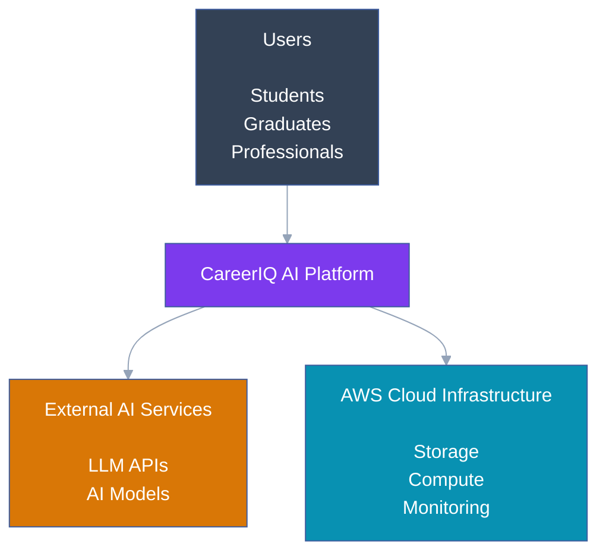

---

# 3.3 External Actors


## Users


CareerIQ AI serves:


- Students
- Fresh graduates
- Professionals
- Career changers


Users interact through the Angular frontend.


---

## AI Services


External and internal AI services provide:


- Natural language processing
- Resume understanding
- Recommendation generation
- Career intelligence


---

## Cloud Infrastructure


AWS provides:


- Application hosting
- File storage
- Database services
- Monitoring


---

# 4. High-Level System Architecture


## 4.1 Architectural Layers


CareerIQ AI follows a layered architecture:


```
Presentation Layer

        ↓

Application Layer

        ↓

AI Intelligence Layer

        ↓

Data Layer

        ↓

Infrastructure Layer

```


---

# 4.2 Layer Responsibilities


## Presentation Layer


Responsible for:


- User interaction
- Dashboard visualization
- Resume upload
- Career analytics


Technology:


```
Angular

TypeScript

Tailwind CSS

```


---

## Application Layer


Responsible for:


- Authentication
- Business logic
- API management
- Data processing


Technology:


```
Laravel

PHP

REST API

```


---

## AI Intelligence Layer


Responsible for:


- Resume analysis
- Skill extraction
- Career recommendation
- Interview evaluation


Technology:


```
Python

FastAPI

Machine Learning Models

LLM APIs

```


---

## Data Layer


Responsible for:


- Persistent storage
- Caching
- Queue processing


Technology:


```
MySQL

Redis

```


---

## Infrastructure Layer


Responsible for:


- Deployment
- Monitoring
- Storage
- Networking


Technology:


```
AWS

Docker

CI/CD

```


---

# 4.3 Complete High-Level Architecture


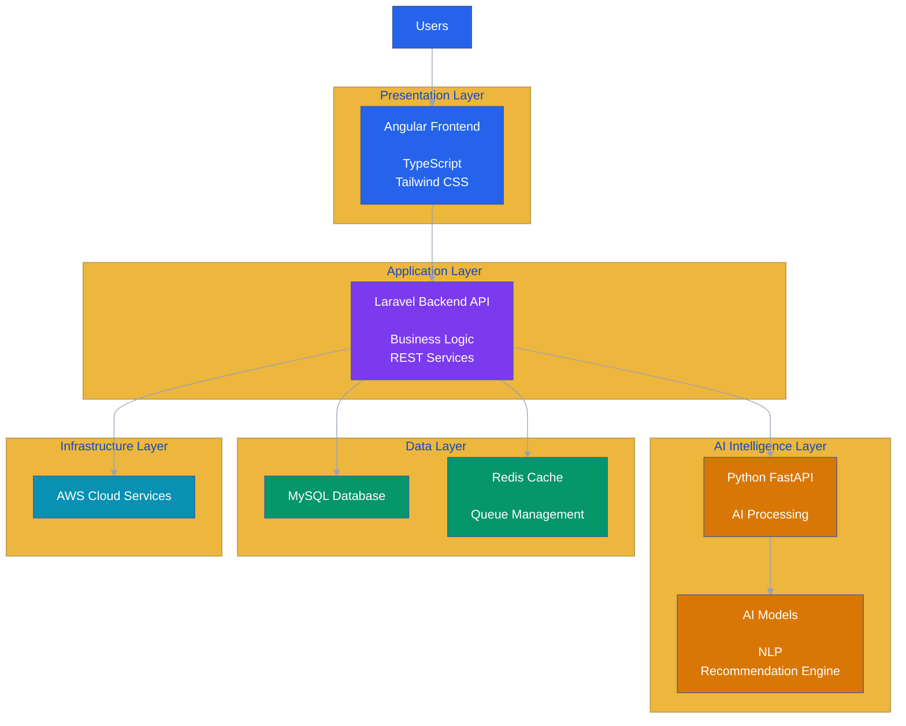

---

---

# 5. Component Architecture


## 5.1 Overview


CareerIQ AI is divided into independent software components.


Each component has a specific responsibility:


```
Frontend Components

        ↓

Backend Services

        ↓

AI Services

        ↓

Data Services

        ↓

Infrastructure Services

```


---

# 5.2 Complete Component Architecture


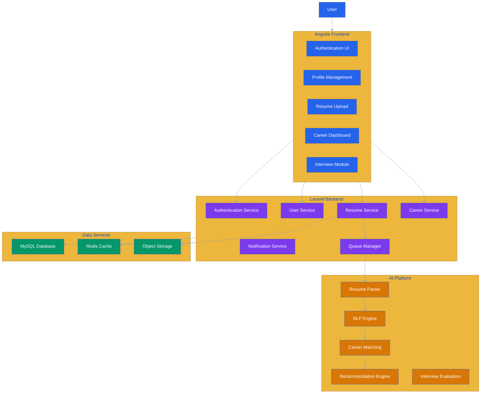

---

# 5.3 Component Responsibilities


## Frontend Components


Responsible for:


- User interaction
- Data visualization
- Form handling
- API communication
- User experience


---

## Backend Components


Responsible for:


- Business rules
- Authentication
- Authorization
- Data processing
- API management


---

## AI Components


Responsible for:


- Document processing
- Natural language understanding
- Recommendation generation
- Intelligent evaluation


---

## Data Components


Responsible for:


- Persistent storage
- Temporary caching
- File storage


---

# 6. Frontend Architecture


## 6.1 Technology Stack


| Technology | Purpose |
|---|---|
|Angular|Frontend Framework|
|TypeScript|Programming Language|
|Tailwind CSS|Styling Framework|
|Angular Material|UI Components|
|RxJS|Reactive Programming|


---

# 6.2 Frontend Responsibilities


The Angular application manages:


- User authentication
- Dashboard rendering
- Resume upload interface
- Career visualization
- Learning roadmap display
- Interview interface


---

# 6.3 Angular Application Structure


CareerIQ AI follows a feature-based Angular architecture.


Example:


```
frontend/

│

├── core/

│   ├── authentication/

│   ├── guards/

│   └── interceptors/


├── shared/

│   ├── components/

│   ├── services/

│   └── utilities/


├── features/

│

├── profile/

├── resume/

├── career/

├── interview/

└── dashboard/

```


---

# 6.4 Angular Module Architecture


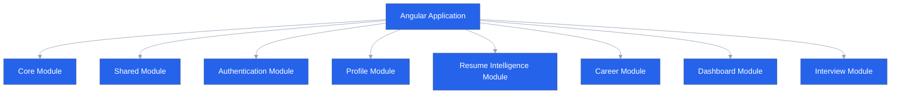

---

# 6.5 Frontend Data Flow


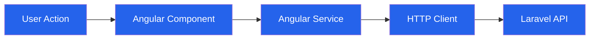

---

# 7. Backend Architecture


## 7.1 Technology Stack


|Technology|Purpose|
|-|-|
|Laravel|Backend Framework|
|PHP|Programming Language|
|REST API|Communication|
|Laravel Sanctum|Authentication|
|Laravel Queue|Background Processing|
|Eloquent ORM|Database Interaction|


---

# 7.2 Backend Responsibilities


Laravel handles:


- User authentication
- API endpoints
- Business logic
- Database operations
- AI service communication
- Background jobs


---

# 7.3 Laravel Internal Architecture


CareerIQ AI follows a service-oriented Laravel architecture.


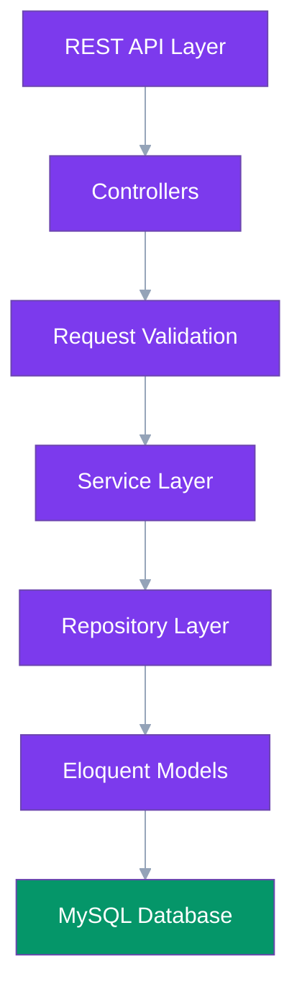

---

# 7.4 Backend Module Structure


Example:


```
backend/


app/


├── Http/

│   ├── Controllers/


├── Services/


│   ├── ResumeService.php

│   ├── CareerService.php


├── Repositories/


├── Models/


├── Jobs/


└── Policies/

```


---

# 8. AI Intelligence Architecture


## 8.1 AI Service Design


CareerIQ AI separates AI workloads from the Laravel application.


Benefits:


- Independent scaling
- Faster AI development
- Model replacement flexibility
- Better resource allocation


---

# 8.2 AI Technology Stack


|Technology|Purpose|
|-|-|
|Python|AI Development|
|FastAPI|AI Service API|
|NLP Models|Text Understanding|
|LLM APIs|AI Reasoning|
|ML Models|Prediction|


---

# 8.3 AI Service Architecture


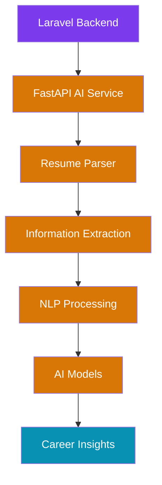

---

# 9. API Communication Architecture


## 9.1 Communication Overview


CareerIQ AI uses API-based communication between services.


Communication:


```
Angular

        |

        HTTPS REST API

        |

Laravel Backend

        |

        Internal API

        |

FastAPI AI Service

```


---

# 9.2 API Communication Diagram


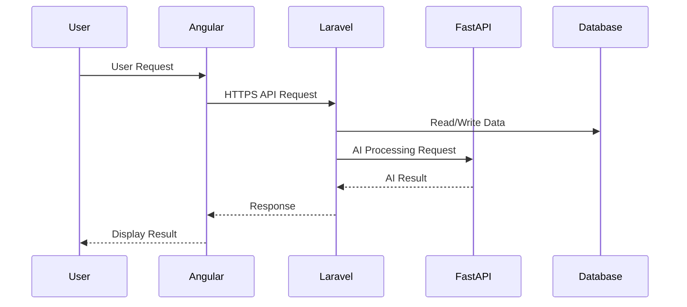

---

---

# 10. Advanced AI Intelligence Architecture


## 10.1 AI Processing Pipeline Overview


CareerIQ AI uses a multi-stage AI processing pipeline for transforming raw user data into intelligent career insights.


The pipeline includes:


```
User Data

        ↓

Document Processing

        ↓

Information Extraction

        ↓

Skill Identification

        ↓

Career Matching

        ↓

Recommendation Generation

        ↓

User Insights

```


---

# 10.2 AI Processing Pipeline


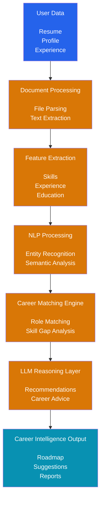

---

# 10.3 Resume Intelligence Workflow


The resume intelligence module processes uploaded resumes through multiple stages.


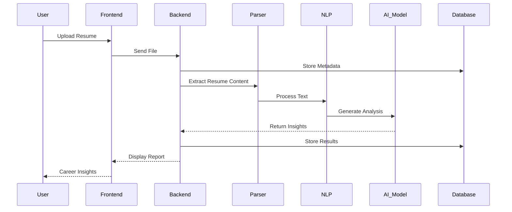

---

# 10.4 AI Model Lifecycle Management


CareerIQ AI manages AI models through a controlled lifecycle.


Lifecycle:


```
Development

        ↓

Training

        ↓

Evaluation

        ↓

Versioning

        ↓

Deployment

        ↓

Monitoring

        ↓

Improvement

```


---

# 10.5 AI Model Management Architecture


---

# 10.6 AI Model Versioning


Each AI model maintains:


| Information | Purpose |
|---|---|
|Model Name|Identify model|
|Version|Track changes|
|Accuracy|Measure performance|
|Training Date|Maintain history|
|Deployment Status|Control production usage|


Example:


```
Career Recommendation Model

Version:

v2.1


Status:

Production


Accuracy:

94%

```

---

# 11. Data Architecture


## 11.1 Data Management Overview


CareerIQ AI manages different categories of data:


```
User Data

        +

Career Data

        +

Resume Data

        +

AI Generated Data

        +

System Data

```


---

# 11.2 Data Architecture Layers


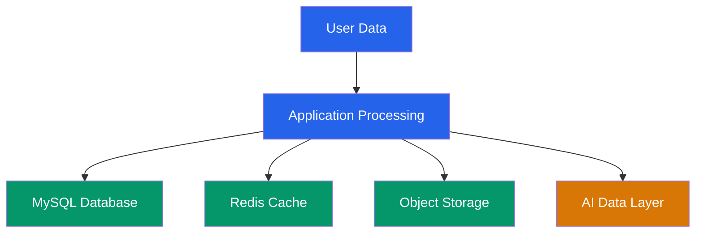

---

# 11.3 Data Storage Responsibilities


|Storage|Purpose|
|-|-|
|MySQL|Structured application data|
|Redis|Temporary cache and queues|
|AWS S3|Resume files and documents|
|AI Storage|Model and prediction data|


---

# 12. Database Architecture Integration


## 12.1 Database Communication Flow


CareerIQ AI uses Laravel Eloquent ORM for database interaction.


Architecture:


```
Frontend Request

        ↓

Laravel Controller

        ↓

Service Layer

        ↓

Eloquent ORM

        ↓

MySQL Database

```


---

# 12.2 Database Integration Diagram


---

# 12.3 Database Responsibilities


The database stores:


## User Management


```
Users

Profiles

Education

Experience

Projects

```


---

## Career Intelligence


```
Skills

Career Goals

Learning Roadmaps

Progress Tracking

```


---

## AI Intelligence


```
AI Models

AI Predictions

Analysis Results

```


---

# 13. Redis Queue and Event Architecture


## 13.1 Purpose of Asynchronous Processing


Some operations require significant processing time:


Examples:


- Resume analysis
- AI recommendation generation
- Interview evaluation
- Report generation


Instead of blocking users, these tasks run asynchronously.


---

# 13.2 Queue Architecture


---

# 13.3 Event-Driven Processing Flow


Example:


Resume analysis:


```
Resume Uploaded

        ↓

ResumeUpload Event

        ↓

Queue Job Created

        ↓

AI Worker Processes Resume

        ↓

Analysis Completed Event

        ↓

User Notification

```


---

# 13.4 Queue Benefits


Using asynchronous processing provides:


- Faster user response
- Better resource utilization
- Independent AI scaling
- Improved reliability


---

---

# 14. Infrastructure Architecture


## 14.1 Infrastructure Overview


CareerIQ AI uses a cloud-native infrastructure approach.


The infrastructure supports:


- Application hosting
- AI processing
- Database services
- File storage
- Monitoring
- Automated deployment


Architecture:


```
User Request

        ↓

Cloud Infrastructure

        ↓

Application Services

        ↓

Data Services

```


---

# 14.2 Infrastructure Components


| Component | Technology | Purpose |
|---|---|---|
|Application Hosting|AWS EC2/ECS|Run application services|
|Database|Amazon RDS MySQL|Managed relational database|
|Cache|Amazon ElastiCache Redis|Caching and queues|
|Storage|Amazon S3|Resume and document storage|
|CDN|CloudFront|Content delivery|
|Monitoring|CloudWatch|System monitoring|
|Deployment|GitHub Actions|CI/CD automation|


---

# 15. Docker Architecture


## 15.1 Containerization Strategy


CareerIQ AI uses Docker to ensure:


- Environment consistency
- Service isolation
- Easy deployment
- Developer productivity
- Cloud compatibility


Each major service runs independently.


---

# 15.2 Docker Container Architecture


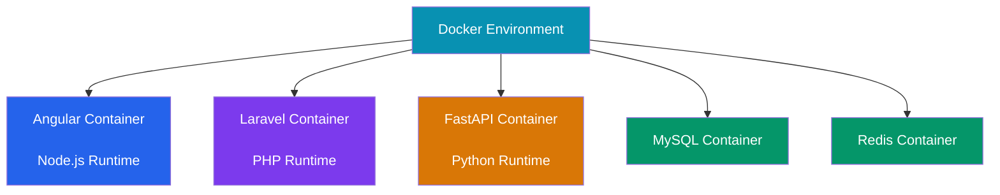

---

# 15.3 Container Responsibilities


## Angular Container


Responsible for:


- Frontend application
- Static assets
- User interface


---

## Laravel Container


Responsible for:


- REST API
- Authentication
- Business logic
- Database communication


---

## FastAPI Container


Responsible for:


- AI processing
- Model execution
- Recommendation generation


---

## Database Containers


Responsible for:


- Data persistence
- Cache management
- Queue processing


---

# 16. AWS Cloud Architecture


## 16.1 Cloud Deployment Strategy


CareerIQ AI uses AWS as the production cloud platform.


The architecture follows:


```
Managed Services

        +

Container Deployment

        +

Automated Scaling

        +

Monitoring

```


---

# 16.2 AWS Production Architecture


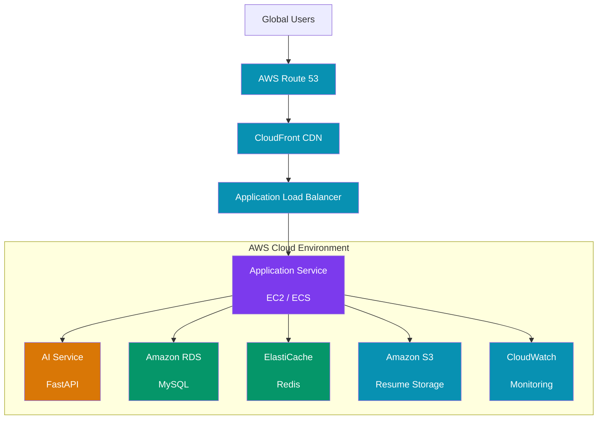

---

# 16.3 AWS Service Responsibilities


## Amazon EC2 / ECS


Used for:


- Laravel backend hosting
- AI service deployment
- Container execution


---

## Amazon RDS


Used for:


- MySQL database hosting
- Automated backups
- Database maintenance


---

## Amazon S3


Used for:


- Resume documents
- User uploaded files
- Static resources


---

## CloudFront


Used for:


- Faster content delivery
- Reduced latency
- CDN caching


---

## CloudWatch


Used for:


- Logs
- Metrics
- Alerts


---

# 17. Network Architecture


## 17.1 Network Design


CareerIQ AI follows a secure cloud network structure.


Architecture:


```
Internet

        ↓

CDN Layer

        ↓

Load Balancer

        ↓

Application Layer

        ↓

Private Database Layer

```


---

# 17.2 AWS Network Architecture


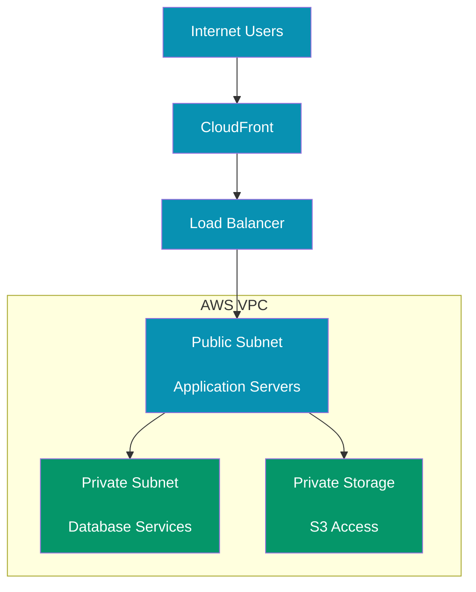

---

# 17.3 Network Security Controls


Implemented controls:


- HTTPS communication
- Security groups
- Private database access
- Restricted ports
- Network isolation
- IAM permissions


---

# 18. Security Architecture Integration


## 18.1 Security Overview


Security is integrated into every architectural layer.


Security layers:


```
Frontend Security

        ↓

API Security

        ↓

Application Security

        ↓

Database Security

        ↓

Cloud Security

```


---

# 18.2 Security Architecture Diagram


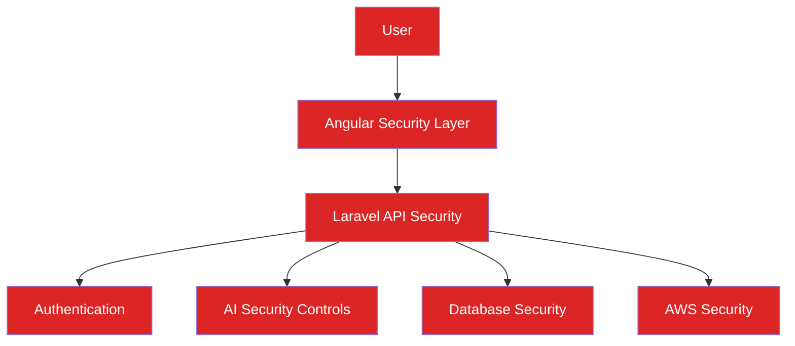

---

# 18.3 Security Controls


## Application Security


Includes:


- Authentication
- Authorization
- Input validation
- Secure API requests


---

## Database Security


Includes:


- Encryption
- Access control
- Query protection
- Backup security


---

## Cloud Security


Includes:


- IAM roles
- Security groups
- Network isolation
- Monitoring


---

# 19. Authentication Architecture


## 19.1 Authentication Flow


CareerIQ AI uses token-based authentication.


Flow:


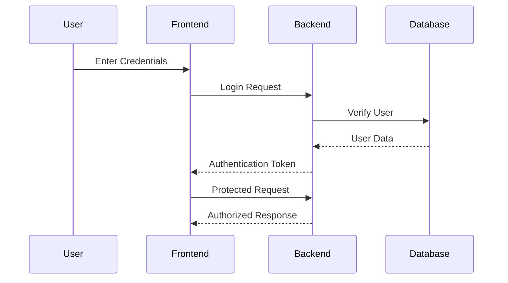


---

# 19.2 Authentication Responsibilities


## Frontend


Handles:


- Login interface
- Token management
- Route protection


---

## Backend


Handles:


- Credential validation
- Token generation
- Permission checking


---

## Database


Stores:


- User identity
- Password hash
- Account information


---

---

# 20. CI/CD Architecture


## 20.1 Deployment Philosophy


CareerIQ AI uses an automated CI/CD pipeline to ensure reliable software delivery.


The pipeline provides:


- Automated testing
- Consistent builds
- Container deployment
- Faster releases
- Reduced deployment errors


---

# 20.2 CI/CD Pipeline Flow


---

# 20.3 CI/CD Pipeline Stages


| Stage | Purpose |
|---|---|
|Code Commit|Developer pushes changes|
|Build|Create application artifacts|
|Testing|Execute automated tests|
|Security Scan|Detect vulnerabilities|
|Docker Build|Create containers|
|Deployment|Release to AWS|
|Monitoring|Track application health|


---

# 21. Monitoring and Observability


## 21.1 Overview


Production systems require continuous monitoring to maintain reliability.


CareerIQ AI monitors:


- Application performance
- API requests
- Database health
- AI processing status
- Infrastructure metrics


---

# 21.2 Observability Architecture


```mermaid
flowchart TB


APPLICATION["CareerIQ AI Services"]


LOGS["Application Logs"]


METRICS["Performance Metrics"]


ERRORS["Error Tracking"]


MONITOR["Monitoring Platform"]


ALERT["Alerts"]


TEAM["Engineering Team"]


APPLICATION --> LOGS

APPLICATION --> METRICS

APPLICATION --> ERRORS


LOGS --> MONITOR

METRICS --> MONITOR

ERRORS --> MONITOR


MONITOR --> ALERT

ALERT --> TEAM


classDef application fill:#2563EB,color:white;

classDef monitor fill:#0891B2,color:white;

classDef alert fill:#DC2626,color:white;


class APPLICATION application;

class LOGS,METRICS,ERRORS,MONITOR monitor;

class ALERT,TEAM alert;

```

---

# 21.3 Monitoring Components


| Component | Purpose |
|---|---|
|AWS CloudWatch|Infrastructure monitoring|
|Application Logs|Debugging and analysis|
|Error Tracking|Identify failures|
|Performance Metrics|Measure system health|
|Database Monitoring|Track database performance|


---

# 21.4 Logging Architecture


CareerIQ AI maintains structured logs.


Log categories:


```
Application Logs

        +

Security Logs

        +

API Logs

        +

AI Processing Logs

        +

Database Logs

```


---

# 21.5 Logging Flow


```mermaid
flowchart LR


SERVICE["Application Services"]


LOGGER["Logging Layer"]


STORAGE["Log Storage"]


ANALYSIS["Monitoring Analysis"]


ALERT["Alerts"]


SERVICE --> LOGGER

LOGGER --> STORAGE

STORAGE --> ANALYSIS

ANALYSIS --> ALERT


classDef logging fill:#0891B2,color:white;


class SERVICE,LOGGER,STORAGE,ANALYSIS,ALERT logging;

```

---

# 22. Disaster Recovery Architecture


## 22.1 Recovery Strategy


CareerIQ AI follows a disaster recovery approach to maintain availability during failures.


Recovery objectives:


|Objective|Description|
|-|-|
|Backup|Protect critical data|
|Recovery|Restore services quickly|
|Availability|Minimize downtime|
|Data Integrity|Prevent data loss|


---

# 22.2 Disaster Recovery Flow


```mermaid
flowchart LR


PRIMARY["Primary AWS Environment"]


BACKUP["Automated Backup"]


STORAGE["Secure Backup Storage"]


RECOVERY["Recovery Environment"]


SERVICE["Restored Service"]


PRIMARY --> BACKUP

BACKUP --> STORAGE

STORAGE --> RECOVERY

RECOVERY --> SERVICE


classDef cloud fill:#0891B2,color:white;

classDef recovery fill:#059669,color:white;


class PRIMARY,BACKUP,STORAGE cloud;

class RECOVERY,SERVICE recovery;

```

---

# 22.3 Recovery Components


## Database Recovery


Includes:


- Automated database snapshots
- Backup verification
- Restore procedures


---

## File Recovery


Includes:


- S3 versioning
- File backup
- Access control


---

## Application Recovery


Includes:


- Container redeployment
- Infrastructure automation
- CI/CD restoration


---

# 23. Scalability Strategy


## 23.1 Scalability Goals


CareerIQ AI is designed to support:


- Increasing users
- Larger AI workloads
- More stored documents
- Higher request volume


---

# 23.2 Application Scaling


Current:


```
Single Application Instance

```


Future:


```
Multiple Application Instances

        +

Load Balancer

        +

Auto Scaling

```


---

# 23.3 AI Scaling Strategy


AI workloads can scale independently.


Future improvements:


- Dedicated AI workers
- GPU acceleration
- Distributed model execution
- Model optimization


Architecture:


```mermaid
flowchart LR


REQUEST["AI Requests"]


QUEUE["AI Queue"]


WORKER1["AI Worker 1"]

WORKER2["AI Worker 2"]

WORKER3["AI Worker 3"]


MODEL["AI Models"]


REQUEST --> QUEUE

QUEUE --> WORKER1

QUEUE --> WORKER2

QUEUE --> WORKER3


WORKER1 --> MODEL

WORKER2 --> MODEL

WORKER3 --> MODEL


classDef ai fill:#D97706,color:white;


class REQUEST,QUEUE,WORKER1,WORKER2,WORKER3,MODEL ai;

```

---

# 23.4 Database Scaling


Future improvements:


```
Query Optimization

        ↓

Advanced Indexing

        ↓

Read Replicas

        ↓

Database Clustering

```


---

# 24. Future Architecture Evolution


CareerIQ AI can evolve into a large-scale AI platform.


---

# 24.1 Evolution Roadmap


```mermaid
flowchart LR


CURRENT["Current Architecture<br/><br/>Modular Monolith<br/>+ AI Service"]


FUTURE1["Service-Oriented Architecture<br/><br/>Independent Services"]


FUTURE2["Cloud-Native AI Platform<br/><br/>Kubernetes<br/>Vector Database<br/>Distributed AI"]


CURRENT --> FUTURE1

FUTURE1 --> FUTURE2


classDef current fill:#7C3AED,color:white;

classDef future fill:#D97706,color:white;


class CURRENT current;

class FUTURE1,FUTURE2 future;

```

---

# 24.2 Future Improvements


Potential improvements:


## Microservices


Separate:


- Authentication service
- Career service
- AI service
- Notification service


---

## Vector Database


Used for:


- Semantic resume search
- Skill similarity
- AI matching


---

## Kubernetes


Used for:


- Container orchestration
- Automatic scaling
- High availability


---

# 25. Architecture Decision Records (ADR)


Architecture decisions are documented to maintain technical clarity.


---

# ADR-001: Separate AI Service


## Decision


Use an independent FastAPI AI service.


## Reason


- Python AI ecosystem
- Independent scaling
- Easier model replacement


---

# ADR-002: Use MySQL Database


## Decision


Use relational database architecture.


## Reason


- Structured career data
- Strong relationships
- Transaction support
- Data consistency


---

# ADR-003: Use Redis Queue


## Decision


Use asynchronous processing.


## Reason


- Long AI tasks should not block users
- Better performance
- Improved reliability


---

# ADR-004: Use AWS Cloud


## Decision


Deploy production infrastructure on AWS.


## Reason


- Managed services
- Scalability
- Monitoring
- Security features


---

# 26. Technology Decisions


| Technology | Reason |
|---|---|
|Angular|Enterprise frontend framework|
|TypeScript|Reliable frontend development|
|Laravel|Rapid backend development|
|FastAPI|Efficient AI service development|
|MySQL|Reliable relational database|
|Redis|Caching and background processing|
|Docker|Environment consistency|
|AWS|Cloud infrastructure|
|GitHub Actions|Automated deployment|


---

# 27. Final Architecture Summary


CareerIQ AI architecture provides:


## Maintainability


Through:


- Modular components
- Clear responsibilities
- Service separation


---

## Scalability


Through:


- Independent AI services
- Cloud deployment
- Container architecture


---

## Reliability


Through:


- CI/CD automation
- Monitoring
- Backup strategy


---

## Intelligence


Through:


- AI-powered analysis
- Recommendation systems
- Career prediction


---

# Final System Architecture


```mermaid
flowchart TB


USER["Users"]


FRONTEND["Angular Frontend"]


BACKEND["Laravel Backend"]


AI["FastAPI AI Platform"]


DATABASE["MySQL Database"]


CACHE["Redis Queue"]


STORAGE["AWS S3"]


CLOUD["AWS Infrastructure"]


MONITOR["Monitoring System"]


USER --> FRONTEND

FRONTEND --> BACKEND

BACKEND --> AI

BACKEND --> DATABASE

BACKEND --> CACHE

BACKEND --> STORAGE

BACKEND --> CLOUD


CLOUD --> MONITOR

AI --> MONITOR


classDef frontend fill:#2563EB,color:white;

classDef backend fill:#7C3AED,color:white;

classDef ai fill:#D97706,color:white;

classDef database fill:#059669,color:white;

classDef cloud fill:#0891B2,color:white;


class FRONTEND frontend;

class BACKEND backend;

class AI ai;

class DATABASE,CACHE database;

class STORAGE,CLOUD,MONITOR cloud;

```

---

