# System Architecture Document

# CareerIQ AI

---

# Document Information

| Field | Description |
|---|---|
| Project Name | CareerIQ AI |
| Document Type | System Architecture Document |
| Version | 1.0 |
| Architecture Style | Layered Modular Architecture |
| Backend Architecture | Laravel Modular Backend |
| AI Architecture | Independent AI Service |
| Database | MySQL 8.x |
| Cloud Platform | AWS |

---

# Table of Contents

1. Architecture Vision  
2. System Context Architecture  
3. High-Level Architecture  
4. Frontend Architecture  
5. Backend Architecture  
6. AI Intelligence Architecture  
7. Database Architecture  
8. Infrastructure Architecture  
9. Cloud Deployment Architecture  
10. Security Architecture  
11. CI/CD Architecture  
12. Scalability Strategy  
13. Technology Decisions  


---

# 1. Architecture Vision


## 1.1 Purpose


This document defines the technical architecture of CareerIQ AI.


The purpose is to describe:


- System components
- Application structure
- Data flow
- Communication between services
- Cloud deployment strategy
- Security model
- Scalability approach


CareerIQ AI is designed as a modern AI-powered career intelligence platform combining:


- Angular frontend
- Laravel backend
- MySQL database
- Python AI services
- AWS cloud infrastructure


---

# 2. System Context Architecture


## 2.1 Overview


The system connects users, application services, AI capabilities, and cloud infrastructure.


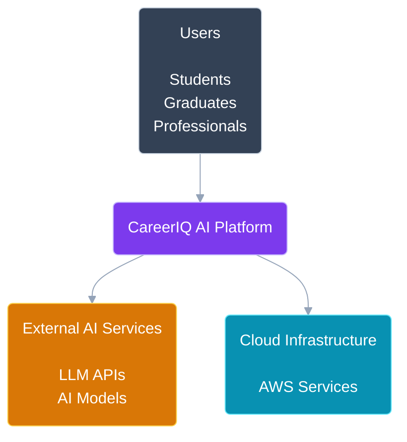

---

# 3. High-Level Architecture


## 3.1 Architectural Layers


CareerIQ AI follows a layered architecture:


```
Presentation Layer

        ↓

Application Layer

        ↓

AI Intelligence Layer

        ↓

Data Layer

        ↓

Cloud Infrastructure Layer

```


---

## 3.2 Complete System Architecture


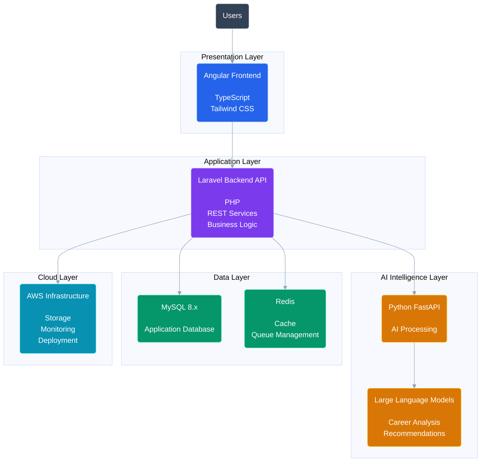

---

# Architecture Explanation


## Presentation Layer

Responsible for:

- User interface
- Dashboard visualization
- Resume upload
- Career analytics


Technology:

```
Angular
TypeScript
Tailwind CSS
```


---

## Application Layer


Responsible for:

- Authentication
- Business logic
- API management
- User management
- Database communication


Technology:

```
Laravel
PHP
REST API
```


---

## AI Intelligence Layer


Responsible for:

- Resume analysis
- Skill extraction
- Career recommendations
- Interview evaluation


Technology:

```
Python
FastAPI
LLM Models
```


---

## Data Layer


Responsible for:

- Persistent storage
- Caching
- Background processing


Technology:

```
MySQL
Redis
```


---

# 4. Frontend Architecture


## 4.1 Technology Stack


| Technology | Purpose |
|-|-|
| Angular | Frontend Framework |
| TypeScript | Programming Language |
| Tailwind CSS | Styling |
| Angular Material | UI Components |


---

## 4.2 Frontend Responsibilities


The frontend manages:


- User interaction
- Dashboard rendering
- Resume upload interface
- Career visualization
- API communication


---

## 4.3 Angular Module Architecture


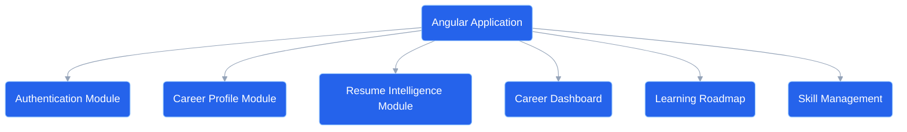

---

# 5. Backend Architecture


## 5.1 Technology Stack


| Technology | Purpose |
|-|-|
| Laravel | Backend Framework |
| PHP | Programming Language |
| REST API | Communication |
| Laravel Sanctum | Authentication |
| Laravel Queue | Background Jobs |


---

## 5.2 Backend Responsibilities


Laravel handles:


- Authentication
- Authorization
- Business logic
- Database operations
- API endpoints
- Background processing


---

## 5.3 Laravel Internal Architecture


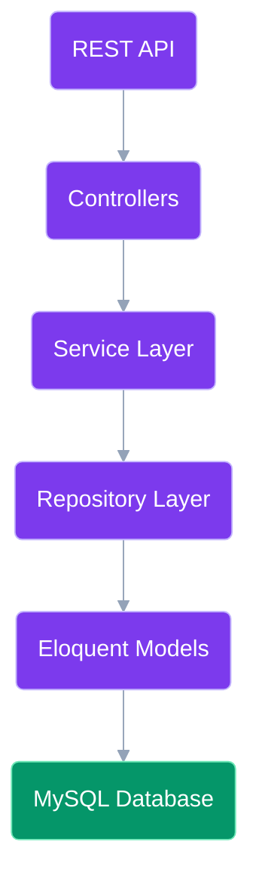

---

**End of Part 1/3**

I will provide **Part 2/3** next:
- AI Intelligence Architecture
- AI processing pipeline
- Database architecture
- ER diagram
- Redis queue architecture

Then **Part 3/3**:
- Docker architecture
- AWS deployment
- Security
- CI/CD
- Scalability
- Technology decisions
---

# 6. AI Intelligence Architecture


## 6.1 AI Service Design


CareerIQ AI separates artificial intelligence workloads from the main Laravel application.


This approach provides:


- Independent scaling
- Easier AI model replacement
- Better resource management
- Faster AI development cycle


---

## 6.2 AI Technology Stack


| Technology | Purpose |
|-|-|
| Python | AI Development |
| FastAPI | AI Service API |
| NLP Models | Text Processing |
| LLM APIs | Intelligent Recommendations |
| Machine Learning Models | Prediction and Analysis |


---

## 6.3 AI Service Architecture


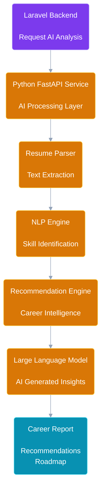

---

# 6.4 AI Resume Analysis Workflow


The resume analysis process follows these steps:


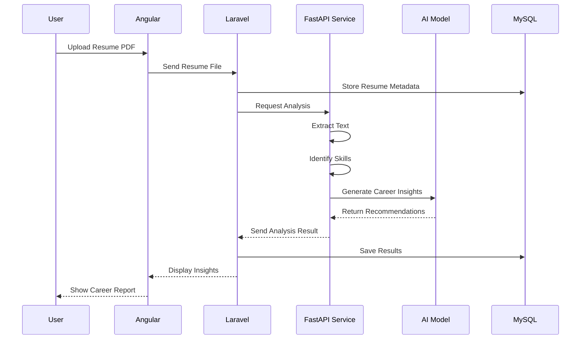

---

# 7. Database Architecture


## 7.1 Database Overview


CareerIQ AI uses a relational database architecture.


Technology:


```
MySQL 8.x

+

InnoDB Storage Engine

+

Laravel Eloquent ORM

```


---

# 7.2 Database Responsibilities


The database manages:


- User accounts
- Career profiles
- Education records
- Professional experience
- Technical skills
- Projects
- Resumes
- Career goals
- Learning progress
- AI analysis results


---

# 7.3 Database Design Principles


The database follows:


## Normalization

Reducing duplicate data and maintaining consistency.


## Indexing

Improving query performance for:


- User search
- Skill lookup
- Career matching


## Relationships

Maintaining:

- One-to-many relationships
- Many-to-many relationships
- Foreign key constraints


---

# 7.4 Entity Relationship Diagram


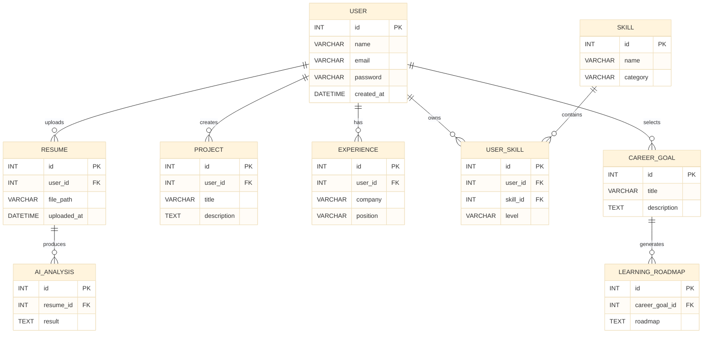

---

# 7.5 Database Access Architecture


The application communicates with MySQL through Laravel's ORM layer.


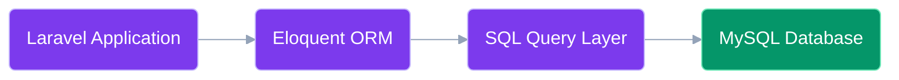

---

# 8. Redis Cache and Queue Architecture


## 8.1 Purpose of Redis


Redis improves system performance by handling:


### Cache Layer

Stores:


- Frequently accessed career recommendations
- Skill information
- Dashboard statistics


### Queue Layer

Handles:


- Resume processing
- AI analysis tasks
- Background reports


---

# 8.2 Redis Processing Flow


---

# 9. Data Flow Summary


The complete data lifecycle:


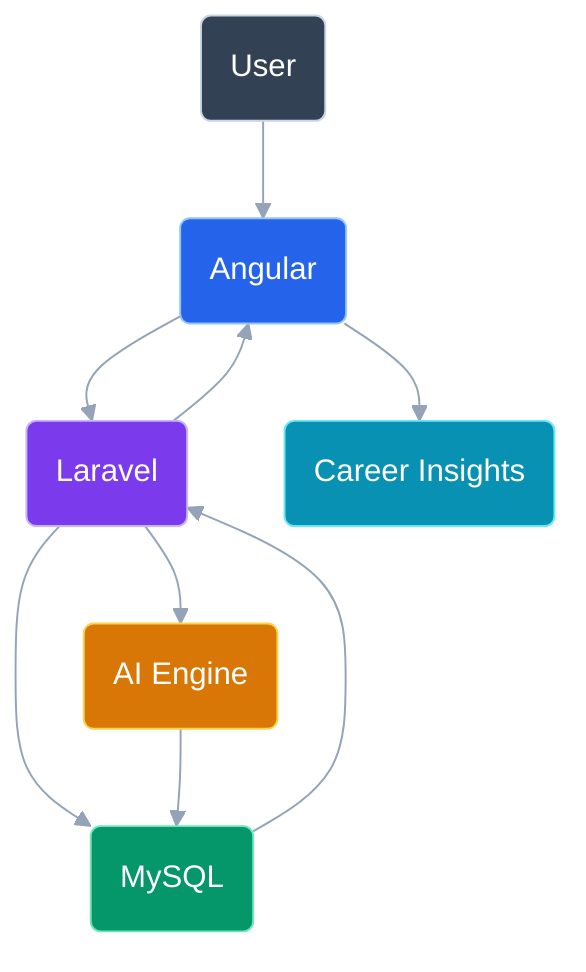

---

**End of Part 2/3**

Next Part 3/3 will contain:

- Docker container architecture
- AWS production architecture
- Security architecture
- CI/CD pipeline
- Scalability strategy
- Future architecture evolution
- Technology decisions table
- Final conclusion
---

# 10. Infrastructure Architecture


## 10.1 Docker Container Strategy


CareerIQ AI uses Docker to provide:


- Environment consistency
- Service isolation
- Easier deployment
- Cloud readiness
- Simplified development workflow


Each major service runs inside an independent container.


---

# 10.2 Container Architecture


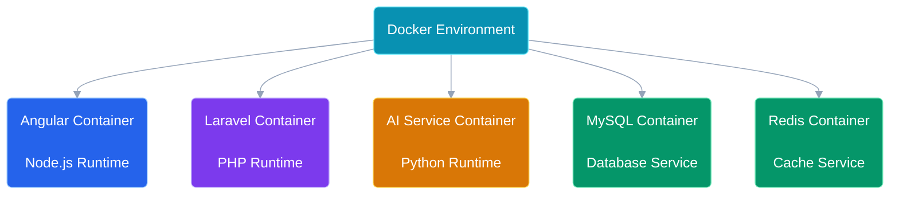

---

# 11. Cloud Deployment Architecture


## 11.1 AWS Production Design


CareerIQ AI is designed for deployment on AWS cloud infrastructure.


The production architecture includes:


| AWS Service | Purpose |
|-|-|
| Route 53 | Domain management |
| CloudFront | Content delivery |
| Load Balancer | Traffic distribution |
| ECS / EC2 | Application hosting |
| RDS | Managed MySQL database |
| ElastiCache | Redis caching |
| S3 | File storage |
| CloudWatch | Monitoring |


---

# 11.2 AWS Architecture Diagram


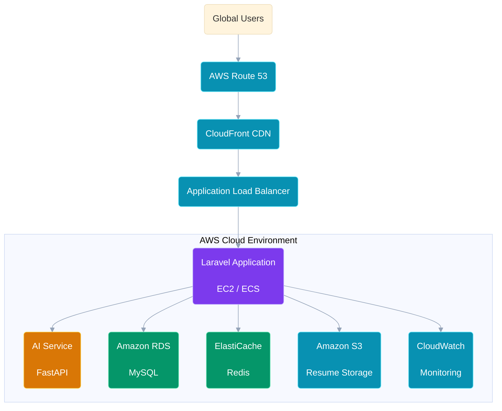

---

# 12. Security Architecture


## 12.1 Security Strategy


Security is implemented across every layer of the system.


---

## Application Security


Implemented using:


- Authentication
- Authorization
- Input validation
- Secure API communication
- OWASP security practices


---

## Database Security


Implemented through:


- Secure credentials
- Prepared statements
- Role-based access
- Backup policies


---

## Cloud Security


Implemented through:


- AWS IAM
- Security Groups
- HTTPS certificates
- Network isolation


---

# 12.2 Security Flow


---

# 13. CI/CD Architecture


## 13.1 Development Pipeline


CareerIQ AI follows an automated CI/CD workflow.


Pipeline stages:


1. Code Development
2. Version Control
3. Automated Testing
4. Docker Build
5. Deployment


---

# 13.2 CI/CD Pipeline Diagram


---

# 14. Scalability Strategy


CareerIQ AI is designed to grow from a single deployment into a large-scale platform.


---

## Current Architecture


```
Modular Laravel Backend

+

Independent AI Service

+

Relational Database

```


---

## Future Scaling Improvements


## Application Scaling

Future improvements:


- Multiple backend instances
- Load balancing
- Auto scaling


---

## Database Scaling


Future improvements:


- Query optimization
- Advanced indexing
- Read replicas
- Database clustering


---

## AI Scaling


Future improvements:


- Dedicated AI workers
- GPU acceleration
- Model optimization
- Vector database integration


---

## Infrastructure Scaling


Future improvements:


- Kubernetes deployment
- Microservice architecture
- Event-driven processing


---

# 15. Future Architecture Evolution


CareerIQ AI can evolve from a modular platform into a highly scalable AI ecosystem.


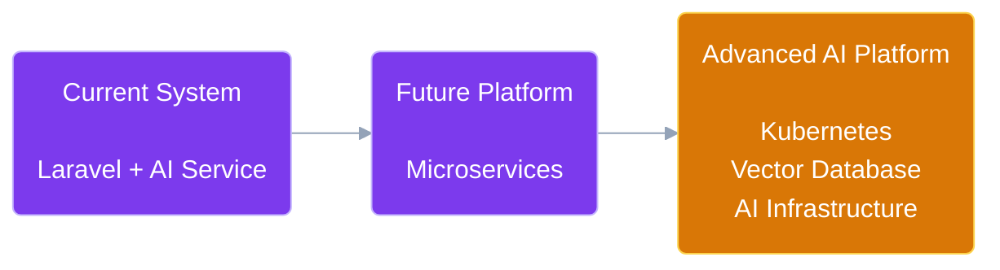

---

# 16. Technology Decisions


| Technology | Reason |
|-|-|
| Angular | Enterprise frontend framework with strong TypeScript support |
| Laravel | Mature PHP ecosystem and rapid backend development |
| MySQL 8.x | Reliable relational database with strong transactional support |
| FastAPI | Lightweight and scalable AI service framework |
| Redis | High-performance caching and background processing |
| Docker | Consistent development and deployment environments |
| GitHub Actions | Automated CI/CD workflow |
| AWS | Production-ready cloud infrastructure |
| Terraform | Infrastructure as Code automation |


---

# 17. Final Architecture Summary


CareerIQ AI architecture provides:


## Maintainability

Through:

- Modular design
- Clear separation of responsibilities
- Documented architecture


## Scalability

Through:

- Independent AI services
- Cloud deployment
- Containerization


## Reliability

Through:

- Automated testing
- CI/CD pipeline
- Monitoring


## Intelligence

Through:

- AI-powered analysis
- Recommendation systems
- Data-driven career insights


---

# End of Document