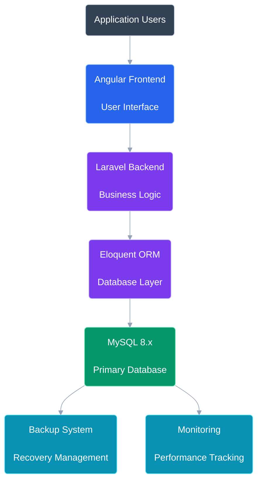
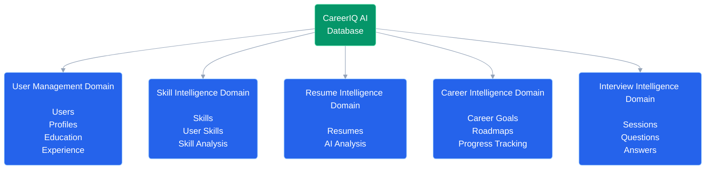
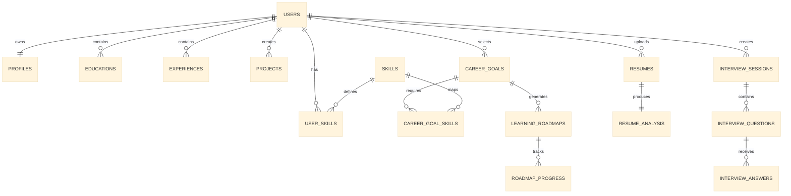
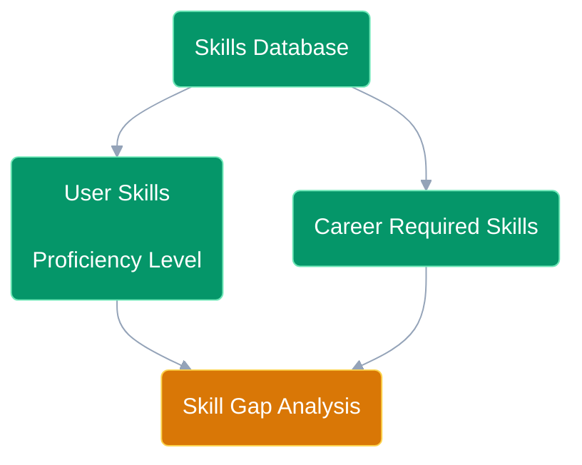
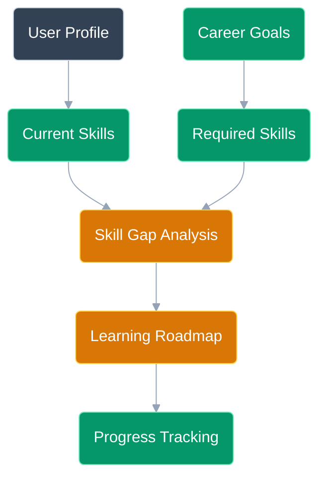
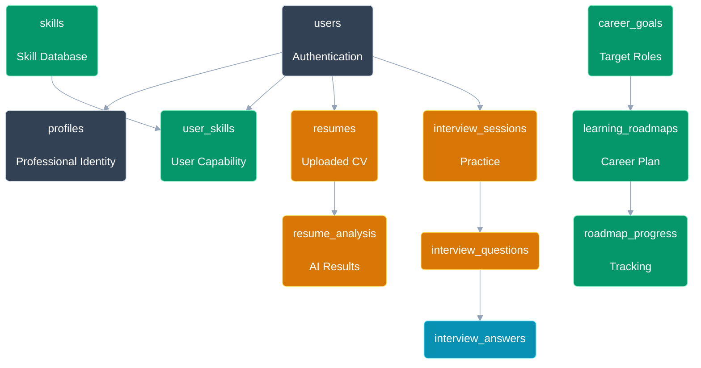
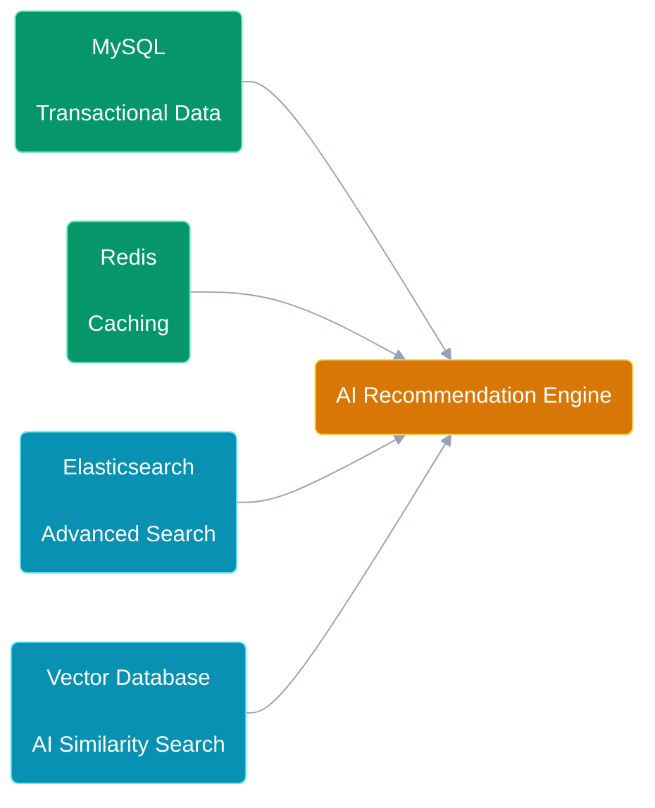

# Database Design Document

# CareerIQ AI

---

# Document Information


| Field | Description |
|-|-|
| Project Name | CareerIQ AI |
| Document Type | Database Design Document |
| Version | 1.0 |
| Database System | MySQL 8.x |
| Storage Engine | InnoDB |
| ORM Framework | Laravel Eloquent ORM |
| Architecture Style | Relational Database Architecture |


---

# Table of Contents


1. Database Overview  
2. Database Architecture  
3. Database Design Principles  
4. Entity Relationship Model  
5. Database Schema Design  
6. Laravel Database Integration  
7. Indexing Strategy  
8. Security Strategy  
9. Performance Optimization  
10. Backup and Recovery  
11. Future Database Evolution  


---

# 1. Database Overview


## 1.1 Purpose


This document defines the database architecture and schema design of CareerIQ AI.


The database layer is responsible for storing and managing:


- User accounts
- Professional profiles
- Educational background
- Work experience
- Projects
- Skills
- Resume information
- AI-generated insights
- Career goals
- Learning roadmaps
- Interview data


---

# 1.2 Database Selection


CareerIQ AI uses:


```
MySQL 8.x

+

InnoDB Storage Engine

+

Laravel Eloquent ORM

```


---

# 1.3 Why MySQL?


CareerIQ AI requires strong relationships between multiple entities:


```
User

   ↓

Skills

   ↓

Career Goals

   ↓

Learning Roadmap

   ↓

Career Progress

```


A relational database is suitable because it provides:


- Structured data management
- Strong consistency
- Foreign key relationships
- Transaction support
- Complex querying capability
- Data integrity


---

# 2. Database Architecture


## 2.1 High-Level Database Architecture


The database architecture follows a layered approach:


```text
Angular Frontend

        |

Laravel Backend API

        |

Eloquent ORM

        |

MySQL Database

        |

Backup & Monitoring

```


---

# 2.2 Database Communication Architecture




---

# 2.3 Database Domain Architecture


CareerIQ AI database is divided into logical domains.




---

# 3. Database Design Principles


CareerIQ AI follows professional relational database design practices.


---

# 3.1 Normalization


The database follows:


## First Normal Form (1NF)


Each attribute contains atomic values.


Example:


Incorrect:


```
users

skills

"Laravel,PHP,MySQL"

```


Improved:


```
users

skills

user_skills

```


Benefits:


- Reduced duplication
- Easier updates
- Better querying


---

## Second Normal Form (2NF)


Every non-key attribute depends on the complete primary key.


Example:


A user's skill level belongs to the relationship between:


```
User

+

Skill

```


Therefore it is stored in:


```
user_skills

```


instead of the user table.


---

## Third Normal Form (3NF)


Independent entities are separated.


Example:


Instead of:


```
users

career_goal

skill1

skill2

skill3

```


The system uses:


```
users

career_goals

skills

career_goal_skills

```


---

# 3.2 Relationship Design


CareerIQ AI uses three major relationship types.


---

# One-to-One Relationship


Example:


```
User

1

|

1

Profile

```


A user has one professional profile.


---

# One-to-Many Relationship


Example:


```
User

1

|

Many

Projects

```


A user can create multiple projects.


---

# Many-to-Many Relationship


Example:


```
Users

Many

|

Many

Skills

```


Implemented using:


```
user_skills

junction table

```


---

# 4. Entity Relationship Model


## 4.1 Complete Database ER Diagram


The following ER model represents the complete CareerIQ AI data structure.




---

# 4.2 Database Relationship Summary


| Entity | Relationship | Entity |
|-|-|-|
| User | One-to-One | Profile |
| User | One-to-Many | Education |
| User | One-to-Many | Experience |
| User | One-to-Many | Projects |
| User | Many-to-Many | Skills |
| Career Goal | Many-to-Many | Skills |
| Career Goal | One-to-Many | Roadmaps |
| Resume | One-to-One | AI Analysis |
| Interview Session | One-to-Many | Questions |
| Question | One-to-Many | Answers |


---

---

# 5. Database Schema Design


This section defines the physical database structure of CareerIQ AI.


The schema follows:


- MySQL 8.x standards
- Laravel migration conventions
- InnoDB relational design
- Foreign key constraints
- Normalized data structure


---

# 5.1 User Management Domain


The User Management Domain stores:


- Authentication information
- Professional identity
- Academic background
- Work experience
- Portfolio projects


---

# 5.1.1 Users Table


## Purpose


Stores user authentication and account information.


## Relationship


```
Users

1

|

Many

Profiles / Projects / Education

```


---

## Schema


```sql
CREATE TABLE users (

    id BIGINT UNSIGNED AUTO_INCREMENT PRIMARY KEY,


    name VARCHAR(255) NOT NULL,


    email VARCHAR(255) UNIQUE NOT NULL,


    password VARCHAR(255) NOT NULL,


    email_verified_at TIMESTAMP NULL,


    remember_token VARCHAR(100) NULL,


    created_at TIMESTAMP DEFAULT CURRENT_TIMESTAMP,


    updated_at TIMESTAMP DEFAULT CURRENT_TIMESTAMP

);
```


---

# 5.1.2 Profiles Table


## Purpose


Stores professional identity information.


Relationship:


```
Users

1

|

1

Profiles

```


---

## Schema


```sql
CREATE TABLE profiles (

    id BIGINT UNSIGNED AUTO_INCREMENT PRIMARY KEY,


    user_id BIGINT UNSIGNED UNIQUE,


    headline VARCHAR(255),


    summary TEXT,


    location VARCHAR(255),


    linkedin_url VARCHAR(255),


    github_url VARCHAR(255),


    portfolio_url VARCHAR(255),


    created_at TIMESTAMP DEFAULT CURRENT_TIMESTAMP,


    updated_at TIMESTAMP DEFAULT CURRENT_TIMESTAMP,


    FOREIGN KEY(user_id)

    REFERENCES users(id)

    ON DELETE CASCADE

);
```


---

# 5.1.3 Education Table


## Purpose


Stores academic qualifications.


---

## Schema


```sql
CREATE TABLE educations (

    id BIGINT UNSIGNED AUTO_INCREMENT PRIMARY KEY,


    user_id BIGINT UNSIGNED,


    institution VARCHAR(255),


    degree VARCHAR(255),


    field_of_study VARCHAR(255),


    start_date DATE,


    end_date DATE,


    grade VARCHAR(50),


    created_at TIMESTAMP,


    updated_at TIMESTAMP,


    FOREIGN KEY(user_id)

    REFERENCES users(id)

    ON DELETE CASCADE

);
```


---

# 5.1.4 Experience Table


## Purpose


Stores professional experience.


---

## Schema


```sql
CREATE TABLE experiences (

    id BIGINT UNSIGNED AUTO_INCREMENT PRIMARY KEY,


    user_id BIGINT UNSIGNED,


    company VARCHAR(255),


    position VARCHAR(255),


    description TEXT,


    start_date DATE,


    end_date DATE,


    created_at TIMESTAMP,


    updated_at TIMESTAMP,


    FOREIGN KEY(user_id)

    REFERENCES users(id)

    ON DELETE CASCADE

);
```


---

# 5.1.5 Projects Table


## Purpose


Stores user portfolio projects.


---

## Schema


```sql
CREATE TABLE projects (

    id BIGINT UNSIGNED AUTO_INCREMENT PRIMARY KEY,


    user_id BIGINT UNSIGNED,


    title VARCHAR(255),


    description TEXT,


    github_url VARCHAR(255),


    live_url VARCHAR(255),


    technology_stack JSON,


    created_at TIMESTAMP,


    updated_at TIMESTAMP,


    FOREIGN KEY(user_id)

    REFERENCES users(id)

    ON DELETE CASCADE

);
```


---

# 5.2 Skill Intelligence Domain


The Skill Intelligence Domain manages:


- Available skills
- User capabilities
- Skill proficiency
- Career requirements


---

# Skill Domain Architecture




---

# 5.2.1 Skills Table


## Purpose


Stores the master list of skills.


Examples:


```
Laravel

Python

Docker

AWS

Machine Learning

```


---

## Schema


```sql
CREATE TABLE skills (

    id BIGINT UNSIGNED AUTO_INCREMENT PRIMARY KEY,


    name VARCHAR(255) UNIQUE NOT NULL,


    category VARCHAR(100),


    description TEXT,


    created_at TIMESTAMP,


    updated_at TIMESTAMP

);
```


---

# 5.2.2 User Skills Table


## Purpose


Creates many-to-many relationship between users and skills.


Relationship:


```
Users

Many

|

Many

Skills

```


---

## Schema


```sql
CREATE TABLE user_skills (

    id BIGINT UNSIGNED AUTO_INCREMENT PRIMARY KEY,


    user_id BIGINT UNSIGNED,


    skill_id BIGINT UNSIGNED,


    proficiency ENUM(

        'Beginner',

        'Intermediate',

        'Advanced',

        'Expert'

    ),


    years_experience FLOAT,


    created_at TIMESTAMP,


    FOREIGN KEY(user_id)

    REFERENCES users(id)

    ON DELETE CASCADE,


    FOREIGN KEY(skill_id)

    REFERENCES skills(id)

    ON DELETE CASCADE

);
```


---

# 5.3 Resume Intelligence Domain


The Resume Intelligence Domain stores:


- Uploaded resumes
- Extracted information
- AI-generated analysis


---

# Resume Processing Architecture


---

# 5.3.1 Resumes Table


## Purpose


Stores uploaded resume metadata.


---

## Schema


```sql
CREATE TABLE resumes (

    id BIGINT UNSIGNED AUTO_INCREMENT PRIMARY KEY,


    user_id BIGINT UNSIGNED,


    file_name VARCHAR(255),


    file_path VARCHAR(500),


    file_type VARCHAR(50),


    uploaded_at TIMESTAMP,


    created_at TIMESTAMP,


    FOREIGN KEY(user_id)

    REFERENCES users(id)

    ON DELETE CASCADE

);
```


---

# 5.3.2 Resume Analysis Table


## Purpose


Stores AI-generated resume evaluation.


---

## Schema


```sql
CREATE TABLE resume_analysis (

    id BIGINT UNSIGNED AUTO_INCREMENT PRIMARY KEY,


    resume_id BIGINT UNSIGNED,


    ats_score FLOAT,


    extracted_skills JSON,


    strengths TEXT,


    weaknesses TEXT,


    recommendations TEXT,


    created_at TIMESTAMP,


    FOREIGN KEY(resume_id)

    REFERENCES resumes(id)

    ON DELETE CASCADE

);
```


---

**End of Part 2/3**

Next Part 3/3 will contain:

- Career Intelligence tables
- Learning roadmap tables
- Interview module tables
- Physical schema diagram
- Laravel Eloquent mapping
- Migration strategy
- Indexing
- Security
- Performance optimization
- Future scaling architecture

---

# 5.4 Career Intelligence Domain


The Career Intelligence Domain manages:


- Career goals
- Required skills
- Personalized learning paths
- Progress tracking


The purpose of this domain is to connect:


```
Current User Capability

        +

Target Career Requirements

        ↓

Skill Gap Analysis

        ↓

Personalized Learning Roadmap

```


---

# Career Intelligence Architecture




---

# 5.4.1 Career Goals Table


## Purpose


Stores possible career paths available in CareerIQ AI.


Examples:


```
Backend Engineer

Cloud Engineer

AI Engineer

Data Scientist

DevOps Engineer

```


---

## Schema


```sql
CREATE TABLE career_goals (

    id BIGINT UNSIGNED AUTO_INCREMENT PRIMARY KEY,


    title VARCHAR(255) NOT NULL,


    description TEXT,


    created_at TIMESTAMP,


    updated_at TIMESTAMP

);
```


---

# 5.4.2 Career Goal Skills Table


## Purpose


Defines skills required for each career path.


Relationship:


```
Career Goal

Many

|

Many

Skills

```


---

## Schema


```sql
CREATE TABLE career_goal_skills (

    id BIGINT UNSIGNED AUTO_INCREMENT PRIMARY KEY,


    career_goal_id BIGINT UNSIGNED,


    skill_id BIGINT UNSIGNED,


    importance ENUM(

        'Required',

        'Preferred'

    ),


    created_at TIMESTAMP,


    FOREIGN KEY(career_goal_id)

    REFERENCES career_goals(id)

    ON DELETE CASCADE,


    FOREIGN KEY(skill_id)

    REFERENCES skills(id)

    ON DELETE CASCADE

);
```


---

# 5.4.3 Learning Roadmaps Table


## Purpose


Stores personalized career development plans.


Example:


```json
{
"Month 1": "Docker Fundamentals",

"Month 2": "AWS Cloud Basics",

"Month 3": "System Design"
}
```


---

## Schema


```sql
CREATE TABLE learning_roadmaps (

    id BIGINT UNSIGNED AUTO_INCREMENT PRIMARY KEY,


    user_id BIGINT UNSIGNED,


    career_goal_id BIGINT UNSIGNED,


    roadmap JSON,


    created_at TIMESTAMP,


    updated_at TIMESTAMP,


    FOREIGN KEY(user_id)

    REFERENCES users(id),


    FOREIGN KEY(career_goal_id)

    REFERENCES career_goals(id)

);
```


---

# 5.4.4 Roadmap Progress Table


## Purpose


Tracks completion status of learning activities.


---

## Schema


```sql
CREATE TABLE roadmap_progress (

    id BIGINT UNSIGNED AUTO_INCREMENT PRIMARY KEY,


    roadmap_id BIGINT UNSIGNED,


    task_name VARCHAR(255),


    status ENUM(

        'Pending',

        'In Progress',

        'Completed'

    ),


    completed_at DATE,


    FOREIGN KEY(roadmap_id)

    REFERENCES learning_roadmaps(id)

    ON DELETE CASCADE

);
```


---

# 5.5 Interview Intelligence Domain


## Purpose


Future AI interview preparation module.


The system stores:


- Interview sessions
- Generated questions
- User responses
- AI evaluation


---

# Interview Architecture


---

# 5.5.1 Interview Sessions Table


```sql
CREATE TABLE interview_sessions (

    id BIGINT UNSIGNED AUTO_INCREMENT PRIMARY KEY,


    user_id BIGINT UNSIGNED,


    career_goal_id BIGINT UNSIGNED,


    difficulty ENUM(

        'Easy',

        'Medium',

        'Hard'

    ),


    created_at TIMESTAMP,


    FOREIGN KEY(user_id)

    REFERENCES users(id)

);
```


---

# 5.5.2 Interview Questions Table


```sql
CREATE TABLE interview_questions (

    id BIGINT UNSIGNED AUTO_INCREMENT PRIMARY KEY,


    session_id BIGINT UNSIGNED,


    question TEXT,


    category VARCHAR(100),


    created_at TIMESTAMP,


    FOREIGN KEY(session_id)

    REFERENCES interview_sessions(id)

);
```


---

# 5.5.3 Interview Answers Table


```sql
CREATE TABLE interview_answers (

    id BIGINT UNSIGNED AUTO_INCREMENT PRIMARY KEY,


    question_id BIGINT UNSIGNED,


    answer TEXT,


    ai_score FLOAT,


    feedback TEXT,


    created_at TIMESTAMP,


    FOREIGN KEY(question_id)

    REFERENCES interview_questions(id)

);
```


---

# 6. Physical Database Schema Overview


The complete physical database model:




---

# 7. Laravel Database Integration


CareerIQ AI uses Laravel Eloquent ORM.


Benefits:


- Object-oriented database interaction
- Relationship management
- Cleaner queries
- Migration support


---

# 7.1 User Model Relationships


```php
class User extends Model
{


public function profile()
{
    return $this->hasOne(Profile::class);
}


public function projects()
{
    return $this->hasMany(Project::class);
}


public function skills()
{
    return $this->belongsToMany(Skill::class);
}


public function resumes()
{
    return $this->hasMany(Resume::class);
}


}
```


---

# 7.2 Skill Model Relationships


```php
class Skill extends Model
{


public function users()
{
    return $this->belongsToMany(User::class);
}


public function careerGoals()
{
    return $this->belongsToMany(
        CareerGoal::class
    );
}


}
```


---

# 8. Migration Strategy


Laravel migrations provide:


- Version-controlled database changes
- Team collaboration
- Automated deployment


Example:


```php
Schema::create('profiles', function(Blueprint $table){

$table->id();


$table->foreignId('user_id')
      ->constrained()
      ->cascadeOnDelete();


$table->string('headline')
      ->nullable();


$table->text('summary')
      ->nullable();


$table->timestamps();


});
```


---

# 9. Indexing Strategy


Indexes improve query performance.


---

# User Authentication


Index:


```sql
CREATE INDEX idx_users_email

ON users(email);
```


Purpose:


Fast login lookup.


---

# Skill Searching


Index:


```sql
CREATE INDEX idx_skill_name

ON skills(name);
```


Purpose:


Fast skill recommendation.


---

# Skill Matching


Composite index:


```sql
CREATE INDEX idx_user_skill

ON user_skills(user_id,skill_id);
```


Purpose:


Optimize:


- Skill gap analysis
- Career matching


---

# 10. Database Security


Security mechanisms:


## Authentication Security

- Password hashing
- Secure sessions
- Token authentication


## Query Security

Protection against SQL Injection using:


- Eloquent ORM
- Prepared statements


## Access Control

Implemented using:


- Laravel Policies
- Middleware


---

# 11. Performance Optimization


Techniques:


## Query Optimization

- Proper indexing
- Query analysis
- Pagination


## Avoiding N+1 Queries


Example:


```php
User::with('skills')
->paginate(20);

```


## Caching


Redis will store:


- Frequently used skills
- Career requirements
- Dashboard statistics


---

# 12. Backup and Recovery


Production database strategy:


## Backup

Using:


- AWS RDS automated backups
- Scheduled snapshots


## Recovery

Includes:


- Point-in-time recovery
- Backup restoration testing


---

# 13. Future Database Evolution


Future architecture:




---

# Final Summary


CareerIQ AI database design provides:


## Reliability

Through:

- Relational modeling
- Constraints
- Transactions


## Scalability

Through:

- Indexing
- Caching
- Cloud-ready architecture


## Maintainability

Through:

- Laravel migrations
- Eloquent relationships
- Documentation


## AI Readiness

Through:

- Resume intelligence storage
- Skill graph structure
- Recommendation data


---

# End of Document