# Database Design

# CareerIQ AI


---

# Document Information


| Field | Description |
|---|---|
| Project Name | CareerIQ AI |
| Document Type | Database Design Document |
| Version | 2.0 |
| Database System | MySQL 8.0 |
| ORM Framework | Laravel Eloquent ORM |
| Database Approach | Relational Database Design |
| Architecture Style | Domain-Oriented Database Architecture |
| AI Data Support | AI Model and Prediction Tracking |


---

# Document Purpose


This document defines the complete database architecture and design strategy for CareerIQ AI.


The purpose of this document is to describe:


- Database structure
- Entity relationships
- Data organization
- Database constraints
- AI data management
- Security considerations
- Performance optimization
- Future scalability


The database supports:


```
User Management

        +

Resume Intelligence

        +

Skill Management

        +

Career Recommendation

        +

AI Processing

        +

Interview Intelligence

        +

System Monitoring

```

---

# 1. Database Overview


## 1.1 Introduction


CareerIQ AI uses a relational database architecture designed to manage structured career information and AI-generated insights.


The database stores:


- User accounts
- Personal profiles
- Education history
- Professional experience
- Skills
- Projects
- Resume information
- Career goals
- AI predictions
- Interview records
- System activities


---

# 1.2 Database Objectives


The database design follows these objectives:


| Objective | Description |
|---|---|
|Data Integrity|Maintain accurate and consistent data|
|Scalability|Support increasing users and AI workloads|
|Security|Protect sensitive information|
|Performance|Enable efficient queries|
|Maintainability|Support future development|
|AI Readiness|Store AI lifecycle information|


---

# 1.3 Database Technology Stack


CareerIQ AI uses:


```
Database:

MySQL 8.0


Backend:

Laravel Framework


ORM:

Laravel Eloquent


Caching:

Redis


Future AI Storage:

Vector Database Support

```


---

# 2. Database Architecture


CareerIQ AI follows a layered database architecture.


---

# 2.1 High-Level Database Architecture


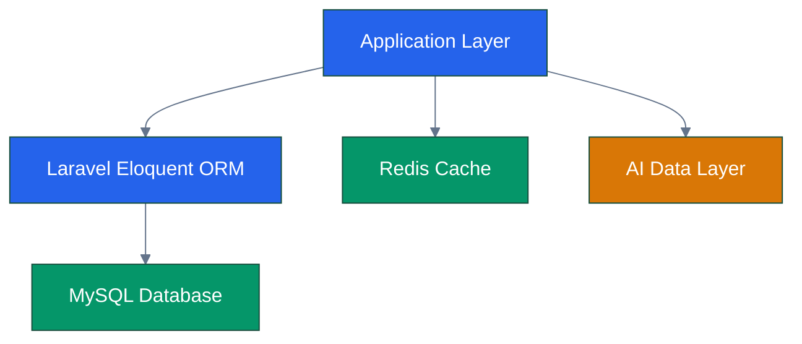

---

# 2.2 Database Architecture Layers


## Application Layer


Responsible for:


- Business logic
- API requests
- Data processing


---

## ORM Layer


Laravel Eloquent provides:


- Object relational mapping
- Query abstraction
- Relationship management


---

## Database Layer


MySQL manages:


- Persistent storage
- Relationships
- Constraints
- Transactions


---

## AI Data Layer


Stores:


- AI model information
- Prediction results
- Recommendation history
- Evaluation metrics


---

# 3. Database Domain Architecture


CareerIQ AI database is divided into functional domains.


---

# 3.1 Domain Overview


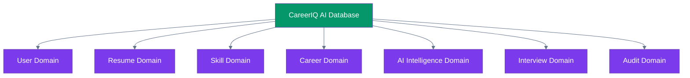

---

# 3.2 User Management Domain


Responsible for:


- Authentication
- User profiles
- Education
- Experience
- Projects


Main tables:


```
users

profiles

educations

experiences

projects

```


---

# 3.3 Resume Intelligence Domain


Responsible for:


- Resume storage
- Resume analysis
- Extracted information


Main tables:


```
resumes

resume_analysis

resume_skills

```


---

# 3.4 Skill Intelligence Domain


Responsible for:


- Skill database
- User skills
- Skill assessment


Main tables:


```
skills

user_skills

skill_assessments

```


---

# 3.5 Career Intelligence Domain


Responsible for:


- Career goals
- Recommendations
- Learning paths


Main tables:


```
career_goals

career_goal_skills

learning_roadmaps

roadmap_progress

```


---

# 3.6 AI Intelligence Domain


Responsible for AI lifecycle management.


Main tables:


```
ai_models

ai_predictions

ai_feedback

```


---

# 3.7 Interview Intelligence Domain


Responsible for:


- Mock interviews
- Questions
- Answers
- Evaluation


Main tables:


```
interview_sessions

interview_questions

interview_answers

```


---

# 3.8 Audit Domain


Tracks important system activities.


Main tables:


```
audit_logs

system_events

```


---

# 4. Database Design Principles


CareerIQ AI follows professional database design principles.


---

# 4.1 Normalization


The database follows:


```
First Normal Form (1NF)

        ↓

Second Normal Form (2NF)

        ↓

Third Normal Form (3NF)

```


---

# First Normal Form (1NF)


Rules:


- Atomic values
- No repeating groups
- Unique records


Example:


Bad:


```
skills:

Python, Java, SQL

```


Good:


```
user_skills


user_id | skill_id

1       | 1

1       | 2

1       | 3

```


---

# Second Normal Form (2NF)


Rules:


- Must satisfy 1NF
- No partial dependency


Example:


Separate:


```
users

+

skills

+

user_skills

```


---

# Third Normal Form (3NF)


Rules:


- No transitive dependency
- Non-key attributes depend only on primary key


Example:


Instead of:


```
users

city

country

country_code

```


Use:


```
users

locations

countries

```


---

# 4.2 Data Integrity


Database integrity is maintained through:


- Primary keys
- Foreign keys
- Unique constraints
- Validation rules
- Transactions


---

# 4.3 Referential Integrity


Example:


```
users

        |

        |

profiles

```


A profile cannot exist without a valid user.


---

# 5. Database Naming Convention


CareerIQ AI follows consistent naming standards.


---

# 5.1 Table Naming Rules


Rules:


```
Use lowercase

Use plural nouns

Use snake_case

Use meaningful names

```


Examples:


Good:


```
users

career_goals

resume_analysis

```


Avoid:


```
UserData

tblUser

data1

```


---

# 5.2 Column Naming Rules


Examples:


Good:


```
created_at

updated_at

user_id

career_goal_id

```


Avoid:


```
date

info

value1

```


---

# 5.3 Primary Key Convention


All tables use:


```
id BIGINT PRIMARY KEY AUTO_INCREMENT

```


Example:


```
users

id

name

email

```


---

# 5.4 Foreign Key Convention


Foreign keys follow:


```
<table_name>_id

```


Examples:


```
user_id

resume_id

model_id

```


---

# 6. Entity Relationship Model


The database relationships represent real-world entities inside CareerIQ AI.


---

# 6.1 High-Level ER Relationship


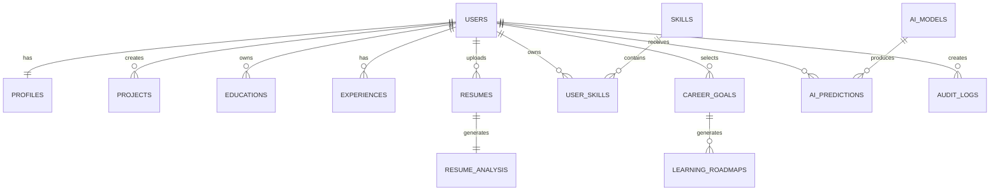

---

---

# 7. Relationship and Cardinality Mapping


CareerIQ AI uses relational mapping to represent relationships between entities.


---

# 7.1 Relationship Overview


| Relationship | Cardinality | Implementation |
|---|---|---|
|User - Profile|1:1|profiles.user_id|
|User - Education|1:N|educations.user_id|
|User - Experience|1:N|experiences.user_id|
|User - Project|1:N|projects.user_id|
|User - Resume|1:N|resumes.user_id|
|Resume - Analysis|1:1|resume_analysis.resume_id|
|User - Skill|M:N|user_skills junction table|
|Career Goal - Skill|M:N|career_goal_skills junction table|
|Career Goal - Roadmap|1:N|learning_roadmaps.career_goal_id|
|User - AI Prediction|1:N|ai_predictions.user_id|
|AI Model - Prediction|1:N|ai_predictions.model_id|
|User - Audit Log|1:N|audit_logs.user_id|


---

# 7.2 User Domain Relationships


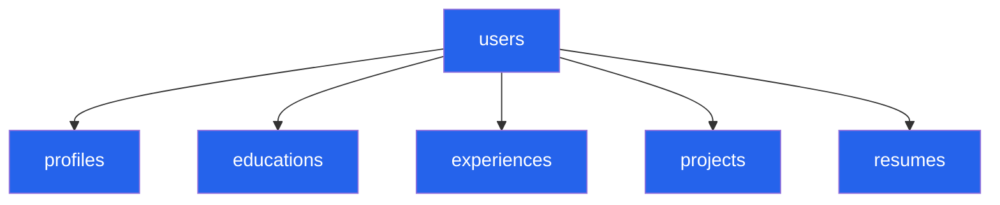

---

# 7.3 Career Intelligence Relationships


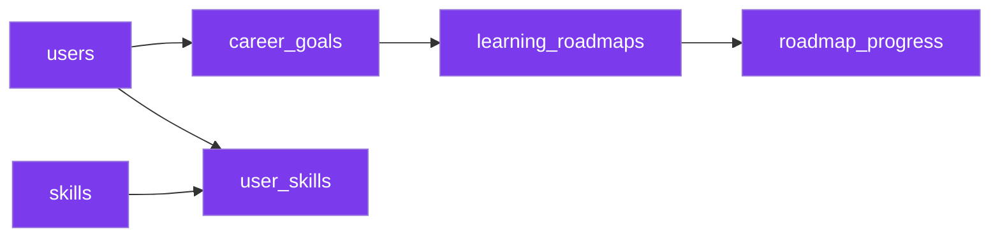

---

# 8. Physical Database Schema Diagram


The following schema represents the physical database structure of CareerIQ AI.


It includes:


- Tables
- Primary keys
- Foreign keys
- Important attributes
- Relationships


---

# 8.1 Complete Database Schema


```mermaid
erDiagram


USERS {

BIGINT id PK

VARCHAR name

VARCHAR email UNIQUE

VARCHAR password

TIMESTAMP created_at

TIMESTAMP updated_at

}


PROFILES {

BIGINT id PK

BIGINT user_id FK

VARCHAR headline

TEXT summary

VARCHAR location

VARCHAR phone

TIMESTAMP created_at

}


EDUCATIONS {

BIGINT id PK

BIGINT user_id FK

VARCHAR institution

VARCHAR degree

VARCHAR field

DATE start_date

DATE end_date

}


EXPERIENCES {

BIGINT id PK

BIGINT user_id FK

VARCHAR company

VARCHAR position

TEXT description

DATE start_date

DATE end_date

}


PROJECTS {

BIGINT id PK

BIGINT user_id FK

VARCHAR title

TEXT description

VARCHAR github_url

VARCHAR project_url

}


RESUMES {

BIGINT id PK

BIGINT user_id FK

VARCHAR file_name

VARCHAR file_path

VARCHAR file_type

TIMESTAMP uploaded_at

}


RESUME_ANALYSIS {

BIGINT id PK

BIGINT resume_id FK

FLOAT score

TEXT strengths

TEXT weaknesses

TEXT recommendations

}


SKILLS {

BIGINT id PK

VARCHAR name UNIQUE

VARCHAR category

}


USER_SKILLS {

BIGINT id PK

BIGINT user_id FK

BIGINT skill_id FK

VARCHAR proficiency

}


CAREER_GOALS {

BIGINT id PK

BIGINT user_id FK

VARCHAR target_role

VARCHAR industry

TEXT description

}


CAREER_GOAL_SKILLS {

BIGINT id PK

BIGINT career_goal_id FK

BIGINT skill_id FK

}


LEARNING_ROADMAPS {

BIGINT id PK

BIGINT career_goal_id FK

VARCHAR title

TEXT description

}


ROADMAP_PROGRESS {

BIGINT id PK

BIGINT roadmap_id FK

BIGINT user_id FK

INT completion_percentage

}


AI_MODELS {

BIGINT id PK

VARCHAR name

VARCHAR version

VARCHAR framework

FLOAT accuracy

TIMESTAMP created_at

}


AI_PREDICTIONS {

BIGINT id PK

BIGINT user_id FK

BIGINT model_id FK

TEXT input_data

TEXT prediction

FLOAT confidence_score

TIMESTAMP created_at

}


AUDIT_LOGS {

BIGINT id PK

BIGINT user_id FK

VARCHAR action

VARCHAR ip_address

TEXT metadata

TIMESTAMP created_at

}


USERS ||--|| PROFILES : has

USERS ||--o{ EDUCATIONS : contains

USERS ||--o{ EXPERIENCES : contains

USERS ||--o{ PROJECTS : creates

USERS ||--o{ RESUMES : uploads


RESUMES ||--|| RESUME_ANALYSIS : generates


USERS ||--o{ USER_SKILLS : owns

SKILLS ||--o{ USER_SKILLS : includes


USERS ||--o{ CAREER_GOALS : defines


CAREER_GOALS ||--o{ CAREER_GOAL_SKILLS : requires

SKILLS ||--o{ CAREER_GOAL_SKILLS : maps


CAREER_GOALS ||--o{ LEARNING_ROADMAPS : generates


LEARNING_ROADMAPS ||--o{ ROADMAP_PROGRESS : tracks


USERS ||--o{ AI_PREDICTIONS : receives

AI_MODELS ||--o{ AI_PREDICTIONS : produces


USERS ||--o{ AUDIT_LOGS : creates

```

---

# 8.2 Schema Explanation


## User Management Tables


The user domain manages identity and career information.


Main entities:


```
users

profiles

educations

experiences

projects

```


---

## Resume Intelligence Tables


Resume processing workflow:


```
Resume Upload

        ↓

Resume Storage

        ↓

AI Analysis

        ↓

Career Recommendation

```


Tables:


```
resumes

resume_analysis

```


---

## Skill Intelligence Tables


Skills use a many-to-many relationship.


Example:


One user:


```
Python

SQL

Machine Learning

```


One skill:


```
Python

```

can belong to many users.


Therefore:


```
users

        +

skills

        +

user_skills

```


---

## AI Intelligence Tables


AI-related data is separated for:


- Model tracking
- Prediction history
- Performance evaluation


Tables:


```
ai_models

ai_predictions

```


---

# 9. Database Entity Summary


|Domain|Main Tables|
|---|---|
|User Management|users, profiles, education, experience|
|Resume Intelligence|resumes, resume_analysis|
|Skill Intelligence|skills, user_skills|
|Career Intelligence|career_goals, roadmaps|
|AI Intelligence|ai_models, ai_predictions|
|Interview Intelligence|interview_sessions|
|Audit System|audit_logs|


---

---

# 10. Data Dictionary


This section defines the structure and purpose of each database table.


The data dictionary provides:


- Column names
- Data types
- Constraints
- Description


---

# 10.1 Users Table


## Purpose


Stores authentication and basic user account information.


Table:


```
users
```


| Column | Data Type | Constraint | Description |
|---|---|---|---|
|id|BIGINT|Primary Key|Unique user identifier|
|name|VARCHAR(255)|NOT NULL|User full name|
|email|VARCHAR(255)|UNIQUE|Login email address|
|password|VARCHAR(255)|NOT NULL|Encrypted password|
|created_at|TIMESTAMP|NULL|Account creation time|
|updated_at|TIMESTAMP|NULL|Last modification time|


---

# 10.2 Profiles Table


## Purpose


Stores additional user information.


Table:


```
profiles
```


| Column | Data Type | Constraint | Description |
|---|---|---|---|
|id|BIGINT|Primary Key|Profile identifier|
|user_id|BIGINT|Foreign Key|Related user|
|headline|VARCHAR(255)|NULL|Professional headline|
|summary|TEXT|NULL|Professional summary|
|location|VARCHAR(255)|NULL|Current location|
|phone|VARCHAR(50)|NULL|Contact information|


Relationship:


```
users

1

|

1

profiles

```


---

# 10.3 Education Table


## Purpose


Stores academic background.


Table:


```
educations
```


| Column | Data Type | Constraint | Description |
|---|---|---|---|
|id|BIGINT|Primary Key|Education identifier|
|user_id|BIGINT|Foreign Key|Owner user|
|institution|VARCHAR(255)|NOT NULL|Educational institute|
|degree|VARCHAR(255)|NOT NULL|Degree name|
|field|VARCHAR(255)|NULL|Study field|
|start_date|DATE|NULL|Beginning date|
|end_date|DATE|NULL|Completion date|


---

# 10.4 Experience Table


## Purpose


Stores professional experience history.


Table:


```
experiences
```


| Column | Data Type | Constraint | Description |
|---|---|---|---|
|id|BIGINT|Primary Key|Experience identifier|
|user_id|BIGINT|Foreign Key|Related user|
|company|VARCHAR(255)|NOT NULL|Company name|
|position|VARCHAR(255)|NOT NULL|Job position|
|description|TEXT|NULL|Job responsibilities|
|start_date|DATE|NULL|Employment start|
|end_date|DATE|NULL|Employment end|


---

# 10.5 Projects Table


## Purpose


Stores user project information.


Table:


```
projects
```


| Column | Data Type | Constraint | Description |
|---|---|---|---|
|id|BIGINT|Primary Key|Project identifier|
|user_id|BIGINT|Foreign Key|Project owner|
|title|VARCHAR(255)|NOT NULL|Project title|
|description|TEXT|NULL|Project details|
|github_url|VARCHAR(500)|NULL|Repository link|
|project_url|VARCHAR(500)|NULL|Deployment link|


---

# 10.6 Resume Table


## Purpose


Stores uploaded resume information.


Table:


```
resumes
```


| Column | Data Type | Constraint | Description |
|---|---|---|---|
|id|BIGINT|Primary Key|Resume identifier|
|user_id|BIGINT|Foreign Key|Resume owner|
|file_name|VARCHAR(255)|NOT NULL|Original filename|
|file_path|VARCHAR(500)|NOT NULL|Storage location|
|file_type|VARCHAR(50)|NOT NULL|PDF/DOCX format|
|uploaded_at|TIMESTAMP|NULL|Upload time|


---

# 10.7 Resume Analysis Table


## Purpose


Stores AI-generated resume evaluation results.


Table:


```
resume_analysis
```


| Column | Data Type | Constraint | Description |
|---|---|---|---|
|id|BIGINT|Primary Key|Analysis identifier|
|resume_id|BIGINT|Foreign Key|Related resume|
|score|FLOAT|NULL|Resume quality score|
|strengths|TEXT|NULL|Identified strengths|
|weaknesses|TEXT|NULL|Improvement areas|
|recommendations|TEXT|NULL|AI suggestions|


Relationship:


```
Resume

1

|

1

Resume Analysis

```


---

# 10.8 Skills Table


## Purpose


Stores available skills in the platform.


Table:


```
skills
```


| Column | Data Type | Constraint | Description |
|---|---|---|---|
|id|BIGINT|Primary Key|Skill identifier|
|name|VARCHAR(255)|UNIQUE|Skill name|
|category|VARCHAR(255)|NULL|Skill category|


Examples:


```
Python

Machine Learning

React

SQL

```


---

# 10.9 User Skills Table


## Purpose


Creates many-to-many relationship between users and skills.


Table:


```
user_skills
```


| Column | Data Type | Constraint | Description |
|---|---|---|---|
|id|BIGINT|Primary Key|Identifier|
|user_id|BIGINT|Foreign Key|User reference|
|skill_id|BIGINT|Foreign Key|Skill reference|
|proficiency|VARCHAR(50)|NULL|Skill level|


Example:


```
User

        +

Python Skill

        +

Advanced Level

```


---

# 10.10 Career Goals Table


## Purpose


Stores user's desired career direction.


Table:


```
career_goals
```


| Column | Data Type | Constraint | Description |
|---|---|---|---|
|id|BIGINT|Primary Key|Career goal identifier|
|user_id|BIGINT|Foreign Key|User reference|
|target_role|VARCHAR(255)|NOT NULL|Desired job role|
|industry|VARCHAR(255)|NULL|Target industry|
|description|TEXT|NULL|Career objective|


---

# 10.11 Learning Roadmaps Table


## Purpose


Stores AI-generated learning paths.


Table:


```
learning_roadmaps
```


| Column | Data Type | Constraint | Description |
|---|---|---|---|
|id|BIGINT|Primary Key|Roadmap identifier|
|career_goal_id|BIGINT|Foreign Key|Career goal|
|title|VARCHAR(255)|NOT NULL|Roadmap title|
|description|TEXT|NULL|Learning plan|


---

# 10.12 AI Models Table ⭐


## Purpose


Tracks AI model versions used by CareerIQ AI.


Table:


```
ai_models
```


| Column | Data Type | Constraint | Description |
|---|---|---|---|
|id|BIGINT|Primary Key|Model identifier|
|name|VARCHAR(255)|NOT NULL|Model name|
|version|VARCHAR(50)|NOT NULL|Model version|
|framework|VARCHAR(100)|NULL|ML framework|
|accuracy|FLOAT|NULL|Evaluation score|
|created_at|TIMESTAMP|NULL|Model creation date|


Example:


```
Career Recommendation Model

Version:

v2.1

Accuracy:

94%

```


---

# 10.13 AI Predictions Table ⭐


## Purpose


Stores AI-generated results.


Table:


```
ai_predictions
```


| Column | Data Type | Constraint | Description |
|---|---|---|---|
|id|BIGINT|Primary Key|Prediction identifier|
|user_id|BIGINT|Foreign Key|User reference|
|model_id|BIGINT|Foreign Key|AI model used|
|input_data|TEXT|NULL|AI input information|
|prediction|TEXT|NULL|Generated result|
|confidence_score|FLOAT|NULL|Prediction confidence|
|created_at|TIMESTAMP|NULL|Generation time|


---

# 10.14 Audit Logs Table ⭐


## Purpose


Tracks important system activities.


Table:


```
audit_logs
```


| Column | Data Type | Constraint | Description |
|---|---|---|---|
|id|BIGINT|Primary Key|Log identifier|
|user_id|BIGINT|Foreign Key|Responsible user|
|action|VARCHAR(255)|NOT NULL|Performed action|
|ip_address|VARCHAR(50)|NULL|User IP|
|metadata|TEXT|NULL|Additional information|
|created_at|TIMESTAMP|NULL|Event time|


Examples:


```
User Login

Resume Upload

Profile Update

AI Request

```


---

# 11. File Storage Database Design


CareerIQ AI stores file metadata separately from physical storage.


Architecture:


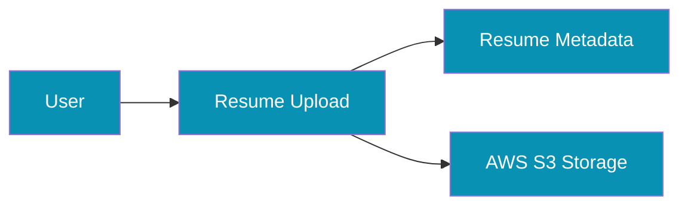

---

# Storage Strategy


Database stores:


```
File Name

File Path

File Type

Upload Time

Owner ID

```


Actual file:


```
AWS S3 Bucket

```


Benefits:


- Better scalability
- Reduced database size
- Secure file access


---

---

# 12. Database Constraints Strategy


Database constraints ensure data consistency, accuracy, and reliability.


CareerIQ AI uses:


- Primary key constraints
- Foreign key constraints
- Unique constraints
- Not-null constraints
- Check constraints


---

# 12.1 Primary Key Strategy


Every table contains a unique identifier.


Standard format:


```sql
id BIGINT PRIMARY KEY AUTO_INCREMENT
```


Example:


```
users

id

1

2

3

```


Benefits:


- Unique record identification
- Faster indexing
- Efficient relationships


---

# 12.2 Foreign Key Strategy


Foreign keys maintain relationships between tables.


Example:


```
users


id = 1


        ↓


profiles


user_id = 1

```


Implementation:


```sql
FOREIGN KEY(user_id)

REFERENCES users(id)

```


---

# 12.3 Foreign Key Rules


CareerIQ AI follows:


|Rule|Description|
|-|-|
|Referential Integrity|Referenced data must exist|
|Cascade Update|Related IDs update automatically|
|Controlled Delete|Prevent accidental data loss|


Example:


Deleting a user:


```
User Deleted

        ↓

Profile Removed

        ↓

Projects Removed

```


---

# 12.4 Unique Constraints


Unique constraints prevent duplicate data.


Examples:


## User Email


```sql
email VARCHAR(255) UNIQUE
```


Prevents:


```
user1@gmail.com

user1@gmail.com

```


---

## Skill Name


```sql
skills.name UNIQUE
```


Prevents duplicate skills:


```
Python

Python

```


---

# 12.5 Not Null Constraints


Required fields cannot contain empty values.


Examples:


Users:


```
name

email

password

```


Resume:


```
file_name

file_path

```


---

# 12.6 Check Constraints


Check constraints validate allowed values.


Example:


Skill proficiency:


```sql
CHECK(

proficiency IN

(
'Beginner',

'Intermediate',

'Advanced',

'Expert'

)

)

```


---

# 12.7 Constraint Summary


|Constraint|Example|Purpose|
|-|-|-|
|Primary Key|users.id|Unique record|
|Foreign Key|profiles.user_id|Relationship|
|Unique|users.email|Prevent duplicates|
|Not Null|password|Required data|
|Check|skill level|Value validation|


---

# 13. Laravel Database Integration


CareerIQ AI uses Laravel Eloquent ORM for database communication.


Eloquent provides:


- Model-based database access
- Relationship handling
- Query abstraction
- Migration support


---

# 13.1 Model Relationship Architecture


---

# 13.2 User Model Example


```php
class User extends Model
{

public function profile()
{
    return $this->hasOne(Profile::class);
}


public function resumes()
{
    return $this->hasMany(Resume::class);
}


public function skills()
{
    return $this->belongsToMany(Skill::class);
}

}
```


---

# 13.3 Resume Model Example


```php
class Resume extends Model
{


public function user()
{
    return $this->belongsTo(User::class);
}


public function analysis()
{
    return $this->hasOne(ResumeAnalysis::class);
}


}
```


---

# 13.4 AI Prediction Model Example


```php
class AiPrediction extends Model
{


public function user()
{
    return $this->belongsTo(User::class);
}


public function model()
{
    return $this->belongsTo(AiModel::class);
}


}
```


---

# 14. Database Migration Strategy


Laravel migrations provide version control for database structure.


Migration workflow:


---

# 14.1 Migration Example


Creating users table:


```bash
php artisan make:migration create_users_table
```


Example:


```php
Schema::create('users', function(Blueprint $table){

$table->id();

$table->string('name');

$table->string('email')
      ->unique();

$table->string('password');

$table->timestamps();

});
```


---

# 14.2 Migration Rules


CareerIQ AI follows:


- Every schema change uses migration
- Migration files are version controlled
- Production changes are reviewed
- Rollback strategy is maintained


---

# 15. Database Seeder Strategy


Seeders provide initial and testing data.


---

# 15.1 Seeder Architecture


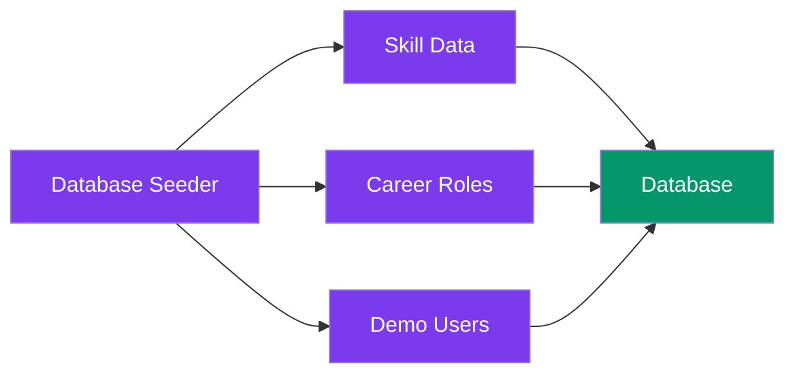

---

# 15.2 Seeder Examples


Default skill data:


```
Python

SQL

Machine Learning

React

Laravel

AWS

```


Career roles:


```
Software Engineer

Data Scientist

AI Engineer

Cloud Engineer

```


---

# 15.3 Seeder Command


```bash
php artisan db:seed
```


---

# 16. Transaction Management


Transactions ensure multiple database operations complete safely.


Example:


Resume processing workflow:


```
Upload Resume

        ↓

Create Resume Record

        ↓

Generate AI Analysis

        ↓

Store Result

```


All operations should succeed together.


---

# 16.1 Transaction Example


```php
DB::transaction(function(){


$resume = Resume::create([
'user_id'=>$user->id,
'file_path'=>$path
]);


ResumeAnalysis::create([
'resume_id'=>$resume->id
]);


});

```


If any operation fails:


```
Rollback

↓

Restore Previous Database State

```


---

# 16.2 Transaction Usage Areas


CareerIQ AI uses transactions for:


|Operation|Reason|
|-|-|
|Resume Processing|Maintain consistency|
|User Registration|Create related records|
|Career Roadmap Generation|Store multiple results|
|AI Prediction Storage|Prevent incomplete data|


---

---

# 17. Indexing Strategy


Indexes improve database query performance by reducing search time.


CareerIQ AI uses indexing for frequently accessed data.


---

# 17.1 Indexing Principles


Indexes are applied to:


- Primary keys
- Foreign keys
- Search fields
- Frequently filtered columns
- Sorting columns


---

# 17.2 Index Examples


## User Email Index


Used during authentication.


```sql
CREATE UNIQUE INDEX idx_users_email

ON users(email);

```


Purpose:


```
Fast login lookup

```


---

## Resume User Index


```sql
CREATE INDEX idx_resume_user

ON resumes(user_id);

```


Purpose:


```
Find all resumes of a user quickly

```


---

## AI Prediction Index


```sql
CREATE INDEX idx_prediction_user

ON ai_predictions(user_id);

```


Purpose:


```
Retrieve user AI history

```


---

# 17.3 Index Strategy Table


|Table|Column|Purpose|
|-|-|-|
|users|email|Login search|
|resumes|user_id|User resume lookup|
|projects|user_id|User projects|
|ai_predictions|user_id|AI history|
|audit_logs|created_at|Activity tracking|


---

# 18. Query Optimization


Database performance depends on efficient queries.


CareerIQ AI applies:


- Query optimization
- Eager loading
- Query indexing
- Pagination
- Caching


---

# 18.1 Eloquent Query Optimization


Avoid:


```php
foreach($users as $user){

echo $user->profile->name;

}

```


Problem:


```
N+1 Query Problem

```


---

Use:


```php
$users = User::with('profile')
             ->get();

```


Benefit:


```
Reduced database queries

Improved performance

```


---

# 18.2 Pagination Strategy


Large datasets are paginated.


Example:


```php
Resume::paginate(20);

```


Instead of:


```php
Resume::all();

```


Benefits:


- Reduced memory usage
- Faster response
- Better user experience


---

# 18.3 Database Caching


Redis is used for frequently accessed data.


Example:


```
Popular Skills

Career Recommendations

User Dashboard Data

```


Architecture:


---

# 19. Database Security


Database security protects sensitive user and AI information.


CareerIQ AI implements:


- Access control
- Encryption
- Secure connections
- Backup protection
- Audit monitoring


---

# 19.1 Database Security Architecture


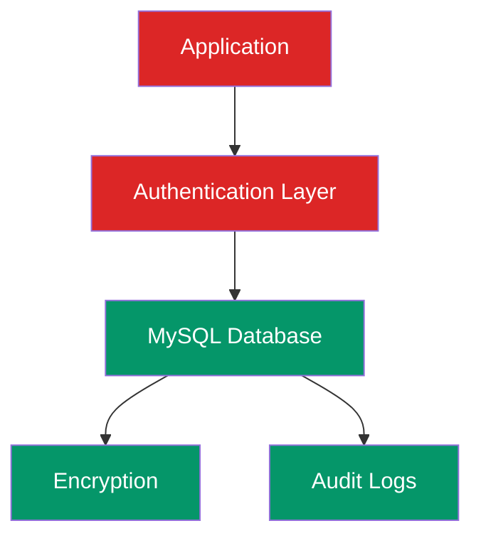

---

# 19.2 Database Security Controls


|Control|Purpose|
|-|-|
|Encrypted Connection|Protect data transfer|
|Password Hashing|Protect credentials|
|Access Control|Limit permissions|
|Prepared Queries|Prevent SQL injection|
|Audit Logs|Track activities|
|Backup Encryption|Protect recovery data|


---

# 20. Backup and Recovery Strategy


Database availability is maintained through backup mechanisms.


---

# 20.1 Backup Architecture


---

# 20.2 Backup Strategy


|Component|Strategy|
|-|-|
|Database|Automated snapshots|
|User Files|AWS S3 backup|
|Configuration|Version control|
|Migrations|Git repository|


---

# 20.3 Recovery Process


```
Database Failure

        ↓

Identify Issue

        ↓

Restore Backup

        ↓

Verify Data Integrity

        ↓

Resume Service

```


---

# 21. Database Scaling Strategy


CareerIQ AI is designed for future growth.


---

# 21.1 Scaling Evolution


## Phase 1: Initial System


```
Single MySQL Instance

+

Redis Cache

```


---

## Phase 2: Read Optimization


```
Primary Database

        +

Read Replicas

```


---

## Phase 3: Large Scale System


```
Database Replication

+

Dedicated Storage

+

Distributed Services

```


---

# 21.2 Database Scaling Architecture


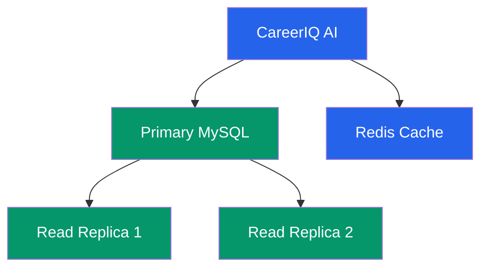

---

# 22. Future Database Evolution


CareerIQ AI can evolve beyond traditional relational storage.


---

# 22.1 Future Storage Technologies


## Vector Database


Used for AI semantic search.


Examples:


```
Resume similarity search

Skill matching

Career recommendation

```


---

## Elasticsearch


Used for:


```
Fast resume search

Skill search

Job matching

```


---

## Data Warehouse


Used for:


```
Analytics

Business intelligence

AI model evaluation

```


---

# 22.2 Future Database Architecture


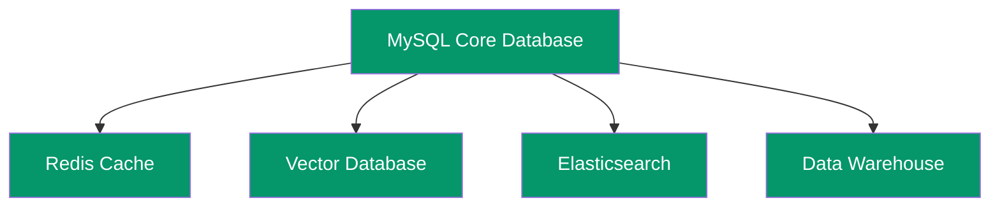

---

# 23. Final Database Architecture


The complete CareerIQ AI database architecture:


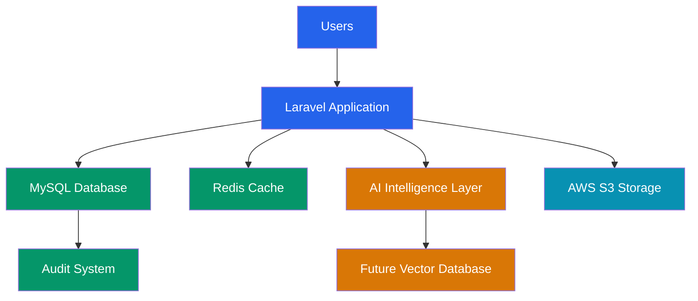

---

# Database Design Summary


CareerIQ AI database provides:


```
Structured Relational Design

        +

AI Data Management

        +

Secure Data Storage

        +

Performance Optimization

        +

Scalable Architecture

```


The database design supports:


- Current application requirements
- AI-powered features
- Future scalability
- Enterprise-level expansion


---

