# API Design Document

# CareerIQ AI

---

# Document Information


| Field | Description |
|-|-|
| Project Name | CareerIQ AI |
| Document Type | API Design Document |
| Version | 1.0 |
| API Architecture | RESTful API |
| Backend Framework | Laravel |
| Programming Language | PHP |
| Frontend Framework | Angular |
| Database | MySQL 8.x |
| AI Service | FastAPI |
| Authentication | Laravel Sanctum |
| API Format | JSON |


---

# Table of Contents


1. API Overview

2. API Architecture

3. API Design Principles

4. Complete API Endpoint Reference

5. Authentication API

6. User Profile API

7. Resume Intelligence API

8. Skill Intelligence API

9. Career Intelligence API

10. AI Service Communication

11. Request and Response Standards

12. Validation Rules

13. Error Handling

14. Security

15. API Testing Strategy

16. Monitoring and Logging

17. Future API Evolution


---

# 1. API Overview


## 1.1 Purpose


This document defines the API architecture and endpoint design for CareerIQ AI.


The API layer provides communication between:


```
Angular Frontend

        |

Laravel REST API

        |

MySQL Database

        |

FastAPI AI Service

```


---

# 1.2 API Responsibilities


The API layer manages:


## User Management

- Registration
- Authentication
- Profile management


## Career Management

- Skills
- Career goals
- Learning roadmap
- Progress tracking


## AI Features

- Resume analysis
- Skill recommendations
- Career suggestions


## System Communication

- Frontend communication
- AI service communication
- Database operations


---

# 1.3 Technology Stack


| Layer | Technology |
|-|-|
| Client | Angular |
| API Server | Laravel |
| Language | PHP |
| Database ORM | Eloquent |
| Database | MySQL 8.x |
| Authentication | Laravel Sanctum |
| AI Backend | FastAPI |
| API Documentation | Swagger/OpenAPI |
| Testing | Postman + PHPUnit |


---

# 2. API Architecture


CareerIQ AI follows a layered API architecture.


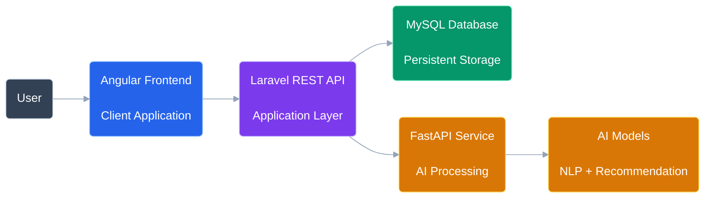

---

# 2.1 Laravel Request Processing Architecture


A request inside Laravel follows a structured flow.


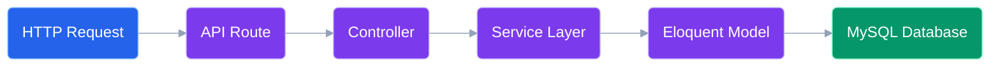

---

# 2.2 API Communication Flow


A normal request lifecycle:


```
1. User performs action

        ↓

2. Angular sends HTTP request

        ↓

3. Laravel API receives request

        ↓

4. Controller validates input

        ↓

5. Service executes business logic

        ↓

6. Database operation occurs

        ↓

7. JSON response returned

        ↓

8. Angular updates interface

```


---

# 2.3 AI Processing Architecture


AI operations are separated from the Laravel backend.


```mermaid
%%{init:{
'theme':'base',
'themeVariables':{
'fontFamily':'Inter',
'lineColor':'#94A3B8'
}
}}%%


flowchart LR


LARAVEL("Laravel Backend")


QUEUE("Redis Queue")


WORKER("Background Worker")


FASTAPI("FastAPI AI Service")


NLP("NLP Processing")


AI("AI Recommendation Model")


RESULT("AI Result Storage")



LARAVEL --> QUEUE

QUEUE --> WORKER

WORKER --> FASTAPI

FASTAPI --> NLP

NLP --> AI

AI --> RESULT



classDef backend fill:#7C3AED,stroke:#C4B5FD,color:#FFFFFF;

classDef queue fill:#D97706,stroke:#FCD34D,color:#FFFFFF;

classDef ai fill:#059669,stroke:#6EE7B7,color:#FFFFFF;

classDef output fill:#0891B2,stroke:#67E8F9,color:#FFFFFF;



class LARAVEL,WORKER backend;

class QUEUE queue;

class FASTAPI,NLP,AI ai;

class RESULT output;

```

---

# 3. API Design Principles


CareerIQ AI follows professional REST API design principles.


---

# 3.1 RESTful Resource Design


Resources are represented as nouns.


Example:


Good:


```
/api/v1/users

/api/v1/resumes

/api/v1/skills

/api/v1/roadmaps

```


Avoid:


```
/api/getUserData

/api/createResume

```


---

# 3.2 API Versioning


All APIs use version numbers.


Example:


```
/api/v1/profile

/api/v1/resumes

/api/v1/career-analysis

```


Benefits:


- Backward compatibility
- Easier maintenance
- Future expansion


---

# 3.3 HTTP Methods


| Method | Purpose |
|-|-|
| GET | Retrieve resources |
| POST | Create resources |
| PUT | Replace resources |
| PATCH | Update partial data |
| DELETE | Remove resources |


Example:


```
GET

/api/v1/profile


POST

/api/v1/resumes/upload


PUT

/api/v1/profile


DELETE

/api/v1/projects/{id}

```


---

# 3.4 JSON Communication


All API communication uses JSON format.


Example request:


```json
{
    "email":"user@example.com",

    "password":"password123"
}
```


Example response:


```json
{
    "status":"success",

    "message":"Operation completed",

    "data":{}
}
```


---

# 4. Complete API Endpoint Reference


This table provides a complete overview of CareerIQ AI APIs.


| Module | Method | Endpoint | Authentication |
|-|-|-|-|
|Authentication|POST|/api/v1/register|No|
|Authentication|POST|/api/v1/login|No|
|Authentication|POST|/api/v1/logout|Yes|
|Profile|GET|/api/v1/profile|Yes|
|Profile|PUT|/api/v1/profile|Yes|
|Education|POST|/api/v1/profile/education|Yes|
|Experience|POST|/api/v1/profile/experience|Yes|
|Projects|POST|/api/v1/profile/projects|Yes|
|Resume|POST|/api/v1/resumes/upload|Yes|
|Resume|GET|/api/v1/resumes|Yes|
|Resume|GET|/api/v1/resumes/{id}/analysis|Yes|
|Skills|GET|/api/v1/skills|Yes|
|Skills|POST|/api/v1/user/skills|Yes|
|Career|GET|/api/v1/career-goals|Yes|
|Career|POST|/api/v1/career-analysis|Yes|
|Roadmap|POST|/api/v1/roadmap/generate|Yes|
|Interview|POST|/api/v1/interview/start|Yes|


---

---

# 5. Authentication API


CareerIQ AI uses Laravel Sanctum for authentication.


Authentication provides:


- User registration
- Login
- Token generation
- Logout
- Protected API access


---

# 5.1 Authentication Flow


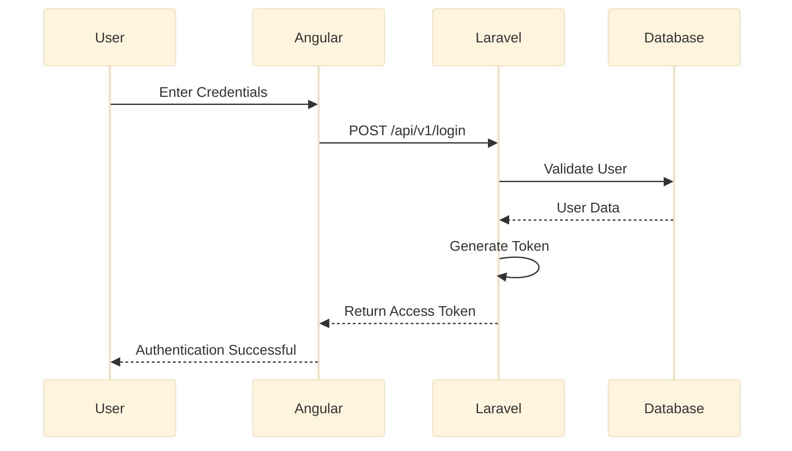

---

# 5.2 Register User


## Endpoint


```
POST /api/v1/register
```


---

## Description


Creates a new CareerIQ AI user account.


---

## Authentication


Required:


```
No

```


---

## Request Body


```json
{
    "name":
    "John Smith",


    "email":
    "john@example.com",


    "password":
    "password123",


    "password_confirmation":
    "password123"
}
```


---

## Validation Rules


| Field | Rules |
|-|-|
|name|required, string, max:255|
|email|required, email, unique|
|password|required, minimum 8 characters|


---

## Successful Response


Status:


```
201 Created

```


Response:


```json
{

"status":

"success",


"message":

"User registered successfully",


"data":{

"user_id":1

}

}
```


---

# 5.3 Login User


## Endpoint


```
POST /api/v1/login
```


---

## Description


Authenticates an existing user.


---

## Request Body


```json
{

"email":

"john@example.com",


"password":

"password123"

}
```


---

## Successful Response


Status:


```
200 OK

```


Response:


```json
{

"status":

"success",


"token":

"eyJhbGciOiJIUzI1Ni...",


"user":{

"id":1,

"name":"John Smith",

"email":"john@example.com"

}

}
```


---

# 5.4 Logout User


## Endpoint


```
POST /api/v1/logout
```


---

## Authentication


Required:


```
Bearer Token

```


---

## Response


```json
{

"status":

"success",


"message":

"Logged out successfully"

}
```


---

# 5.5 Token Lifecycle


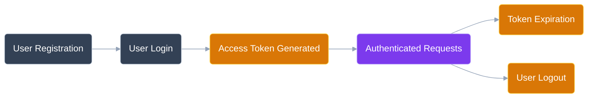

---

# 6. User Profile API


The Profile API manages professional identity information.


Profile contains:


- Personal information
- Education
- Experience
- Projects
- Social links


---

# 6.1 Get User Profile


## Endpoint


```
GET /api/v1/profile
```


---

## Authentication


Required:


```
Bearer Token

```


---

## Response


```json
{

"status":

"success",


"data":{

"name":

"John Smith",


"headline":

"Backend Developer",


"summary":

"Laravel developer with cloud experience",


"location":

"Dhaka"

}

}
```


---

# 6.2 Update Profile


## Endpoint


```
PUT /api/v1/profile
```


---

## Request Body


```json
{

"headline":

"Software Engineer",


"summary":

"Backend and Cloud Developer",


"location":

"Bangladesh"

}
```


---

## Response


```json
{

"status":

"success",


"message":

"Profile updated successfully"

}
```


---

# 6.3 Add Education


## Endpoint


```
POST /api/v1/profile/education
```


---

## Request


```json
{

"institution":

"University Name",


"degree":

"BSc Computer Science",


"field":

"Software Engineering",


"start_date":

"2020-01-01",


"end_date":

"2024-01-01"

}
```


---

## Response


```json
{

"status":

"success",


"message":

"Education added successfully"

}
```


---

# 6.4 Add Professional Experience


## Endpoint


```
POST /api/v1/profile/experience
```


---

## Request


```json
{

"company":

"ABC Software",


"position":

"Junior Developer",


"description":

"Developed Laravel applications"


}
```


---

## Response


```json
{

"status":

"success",


"message":

"Experience added successfully"

}
```


---

# 6.5 Add Project


## Endpoint


```
POST /api/v1/profile/projects
```


---

## Request


```json
{

"title":

"CareerIQ AI",


"description":

"AI powered career platform",


"github_url":

"github.com/project",


"technology_stack":[

"Angular",

"Laravel",

"MySQL",

"AWS"

]

}
```


---

## Response


```json
{

"status":

"success",


"message":

"Project added successfully"

}
```


---

# 7. Profile API Endpoint Summary


| Method | Endpoint | Purpose |
|-|-|-|
|GET|/api/v1/profile|Get profile|
|PUT|/api/v1/profile|Update profile|
|POST|/api/v1/profile/education|Add education|
|POST|/api/v1/profile/experience|Add experience|
|POST|/api/v1/profile/projects|Add project|


---

---

# 8. Resume Intelligence API


The Resume Intelligence module allows users to upload resumes and receive AI-powered career insights.


The system performs:


- Resume storage
- Text extraction
- Skill identification
- Experience analysis
- ATS evaluation
- Improvement suggestions


---

# 8.1 Resume Processing Architecture


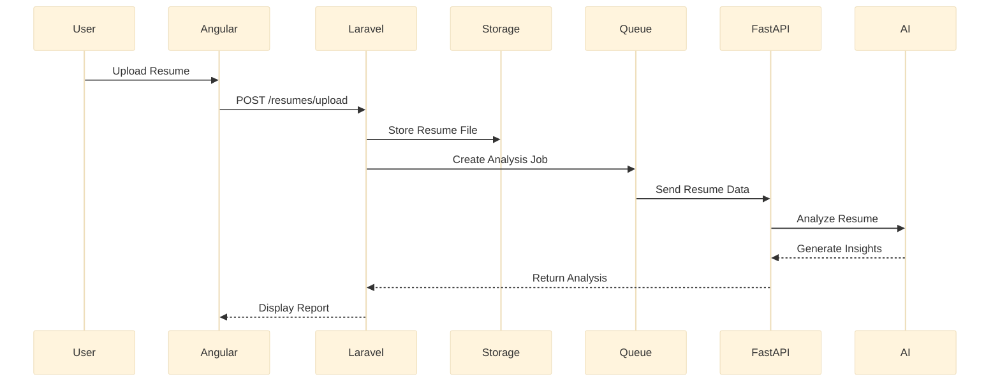

---

# 8.2 Upload Resume


## Endpoint


```
POST /api/v1/resumes/upload
```


---

## Authentication


Required:


```
Bearer Token

```


---

## Request Type


```
multipart/form-data

```


---

## Request Parameters


| Field | Type | Required |
|-|-|-|
|resume|File|Yes|


Supported formats:


```
PDF

DOCX

```


Maximum size:


```
10 MB

```


---

## Successful Response


Status:


```
201 Created

```


Response:


```json
{

"status":

"success",


"message":

"Resume uploaded successfully",


"data":{

"resume_id":125

}

}
```


---

# 8.3 Get User Resumes


## Endpoint


```
GET /api/v1/resumes
```


---

## Response


```json
{

"status":

"success",


"data":[


{

"id":125,


"file_name":

"resume.pdf",


"uploaded_at":

"2026-09-01"

}


]

}
```


---

# 8.4 Get Resume Analysis


## Endpoint


```
GET /api/v1/resumes/{id}/analysis
```


---

## Description


Returns AI-generated resume evaluation.


---

## Response


```json
{

"status":

"success",


"data":{


"ats_score":

85,


"identified_skills":[


"Laravel",

"MySQL",

"Docker"


],


"strengths":[


"Strong backend experience"


],


"weaknesses":[


"Limited cloud experience"


],


"recommendations":[


"Learn AWS fundamentals"

]


}

}
```


---

# 8.5 Delete Resume


## Endpoint


```
DELETE /api/v1/resumes/{id}
```


---

## Response


```json
{

"status":

"success",


"message":

"Resume deleted successfully"

}
```


---

# 9. Skill Intelligence API


The Skill Intelligence module manages:


- Available skills
- User skills
- Proficiency level
- Skill comparison


---

# 9.1 Get Available Skills


## Endpoint


```
GET /api/v1/skills
```


---

## Response


```json
{

"status":

"success",


"data":[


{

"id":1,

"name":

"Laravel",

"category":

"Backend"

},


{

"id":2,

"name":

"AWS",

"category":

"Cloud"

}


]

}
```


---

# 9.2 Add User Skill


## Endpoint


```
POST /api/v1/user/skills
```


---

## Request


```json
{

"skill_id":

1,


"proficiency":

"Intermediate",


"years_experience":

2

}
```


---

## Response


```json
{

"status":

"success",


"message":

"Skill added successfully"

}
```


---

# 9.3 Update User Skill


## Endpoint


```
PUT /api/v1/user/skills/{id}
```


---

## Request


```json
{

"proficiency":

"Advanced"

}
```


---

# 9.4 Remove User Skill


## Endpoint


```
DELETE /api/v1/user/skills/{id}
```


---

# 10. Career Intelligence API


The Career Intelligence module connects:


```
Current User Skills

        +

Target Career

        ↓

Skill Gap Analysis

        ↓

Learning Roadmap

```


---

# 10.1 Get Career Goals


## Endpoint


```
GET /api/v1/career-goals
```


---

## Response


```json
{

"status":

"success",


"data":[


{

"id":1,


"title":

"Backend Engineer"


},


{

"id":2,


"title":

"Cloud Engineer"


}


]

}
```


---

# 10.2 Select Career Goal


## Endpoint


```
POST /api/v1/career-goals/select
```


---

## Request


```json
{

"career_goal_id":

1

}
```


---

# 10.3 Generate Skill Gap Analysis


## Endpoint


```
POST /api/v1/career-analysis
```


---

## Description


Compares:


```
Current User Skills

against

Required Career Skills

```


---

## Request


```json
{

"career_goal_id":

1

}
```


---

## Response


```json
{

"career":

"Backend Engineer",


"skill_match":

72,


"missing_skills":[


"Docker",

"AWS",

"Redis"


],


"recommendations":[


"Complete Docker fundamentals"

]


}
```


---

# Skill Gap Analysis Architecture


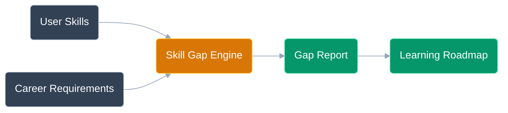

---

# 10.4 Generate Learning Roadmap


## Endpoint


```
POST /api/v1/roadmap/generate
```


---

## Description


Creates a personalized learning plan.


---

## Response


```json
{

"status":

"success",


"roadmap":[


{

"month":

1,


"goal":

"Docker Fundamentals"


},


{

"month":

2,


"goal":

"AWS Cloud Basics"


},


{

"month":

3,


"goal":

"System Design"

}


]

}
```


---

# 10.5 Get User Roadmap


## Endpoint


```
GET /api/v1/roadmap
```


---

## Response


```json
{

"roadmap":[


{

"task":

"Learn Docker",

"status":

"In Progress"


}


]

}
```


---

# 10.6 Update Roadmap Progress


## Endpoint


```
PUT /api/v1/roadmap/progress/{id}
```


---

## Request


```json
{

"status":

"Completed"

}
```


---

# Career API Summary


| Method | Endpoint | Purpose |
|-|-|-|
|GET|/career-goals|Get available careers|
|POST|/career-goals/select|Select career|
|POST|/career-analysis|Analyze skill gap|
|POST|/roadmap/generate|Generate roadmap|
|GET|/roadmap|View roadmap|
|PUT|/roadmap/progress/{id}|Update progress|


---

---

# 11. AI Service Communication API


CareerIQ AI separates artificial intelligence processing from the Laravel application layer.


The AI service is implemented using:


```
FastAPI

+

Python Machine Learning Services

+

LLM Integration

```


The Laravel backend communicates with the AI service internally.


---

# 11.1 AI Service Architecture


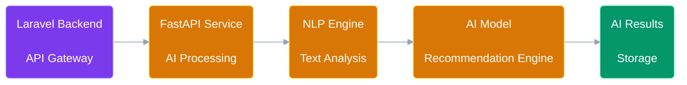

---

# 11.2 Resume Analysis Internal API


## Endpoint


```
POST /internal/v1/resume/analyze
```


---

## Purpose


Analyzes resume information using AI.


---

## Request


```json
{

"user_id":

123,


"resume_text":

"Experienced Laravel developer with AWS knowledge"


}
```


---

## Response


```json
{

"skills":[


"Laravel",

"AWS",

"MySQL"


],


"experience_level":

"Intermediate",


"recommendations":[


"Improve Kubernetes knowledge"


]

}
```


---

# 11.3 Career Recommendation API


## Endpoint


```
POST /internal/v1/career/recommend
```


---

## Request


```json
{

"skills":[


"PHP",

"Laravel",

"MySQL"


],


"target_role":

"Backend Engineer"

}
```


---

## Response


```json
{

"recommended_skills":[


"Docker",

"Redis",

"AWS"


],


"learning_priority":[


"Docker",

"AWS"

]

}
```


---

# 12. API Request and Response Standards


CareerIQ AI follows a consistent API response structure.


---

# 12.1 Success Response Format


```json
{

"status":

"success",


"message":

"Operation completed successfully",


"data":{

}

}
```


---

# 12.2 Error Response Format


```json
{

"status":

"error",


"message":

"Validation failed",


"errors":{


"email":[

"Email is required"

]

}

}
```


---

# 12.3 Pagination Standard


Large datasets use pagination.


Example:


```json
{

"status":

"success",


"data":[

],


"pagination":{


"current_page":

1,


"total_pages":

10,


"total_records":

250


}

}
```


---

# 13. API Validation Rules


All incoming requests are validated before processing.


---

# 13.1 Authentication Validation


Example:


```php
$request->validate([


'name'=>'required|string|max:255',


'email'=>'required|email|unique:users',


'password'=>'required|min:8'


]);

```


---

# 13.2 Resume Upload Validation


Rules:


| Field | Validation |
|-|-|
|resume|required|
|file type|pdf, docx|
|maximum size|10MB|


Example:


```php
$request->validate([


'resume'=>

'required|mimes:pdf,docx|max:10240'


]);

```

---

# 13.3 Skill Validation


Example:


```php
$request->validate([


'skill_id'=>

'required|exists:skills,id',


'proficiency'=>

'required'


]);

```

---

# 14. Error Handling Strategy


CareerIQ AI uses centralized error handling.


---

# 14.1 Error Flow


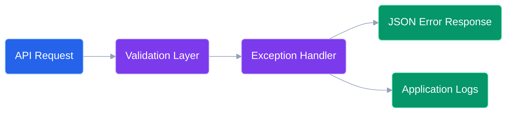

---

# 14.2 HTTP Status Code Standards


| Code | Meaning | Usage |
|-|-|-|
|200|OK|Successful request|
|201|Created|Resource created|
|204|No Content|Successful deletion|
|400|Bad Request|Invalid request|
|401|Unauthorized|Authentication failed|
|403|Forbidden|Access denied|
|404|Not Found|Resource unavailable|
|422|Validation Error|Invalid input|
|429|Too Many Requests|Rate limit exceeded|
|500|Server Error|Unexpected failure|


---

# 15. API Security Architecture


Security is implemented at multiple levels.


---

# 15.1 Authentication Security


Technology:


```
Laravel Sanctum

+

Bearer Token Authentication

```


Example:


```
Authorization:

Bearer access_token

```


---

# 15.2 Authorization


The system uses:


- Middleware
- Laravel Policies
- Role-based permissions


Example:


```
User

↓

Access own profile


Administrator

↓

Manage platform resources

```


---

# 15.3 SQL Injection Protection


Protection:


- Eloquent ORM
- Prepared statements
- Query parameter binding


Example:


```php
User::where(

'email',

$email

)->first();

```

---

# 15.4 File Upload Security


Resume upload protection:


- File extension validation
- MIME validation
- Size restriction
- Secure storage
- Malware scanning


---

# 16. API Rate Limiting


Rate limiting prevents:


- Abuse
- Automated attacks
- Excessive AI usage


---

# Example Policy


```
Normal APIs:

100 requests/minute


AI APIs:

20 requests/minute

```


Laravel implementation:


```php
Route::middleware(

'throttle:100,1'

)->group(function(){


});

```

---

# 17. API Documentation


CareerIQ AI uses:


```
Swagger / OpenAPI

```


Benefits:


- Interactive API testing
- Developer collaboration
- Automatic documentation


---

# Swagger Example


```yaml
paths:


 /api/v1/profile:


   get:


    summary:

      Retrieve user profile


    security:


      - bearerAuth: []

```

---

# 18. API Testing Strategy


API quality is maintained using automated and manual testing.


---

# 18.1 Postman Testing


Used for:


- Endpoint verification
- Authentication testing
- Response validation


---

# 18.2 Laravel Feature Testing


Example:


```php
public function test_user_can_login()

{


$response = $this->post(

'/api/v1/login',

[


'email'=>'test@example.com',


'password'=>'password'


]


);


$response->assertStatus(200);


}

```

---

# 18.3 API Testing Coverage


| Module | Testing |
|-|-|
|Authentication|Login/Register Tests|
|Profile|CRUD Testing|
|Resume|Upload Testing|
|Skills|Relationship Testing|
|Career Analysis|Business Logic Testing|
|AI Service|Integration Testing|


---

# 19. Monitoring and Logging


Production APIs require continuous monitoring.


---

# Monitoring Architecture


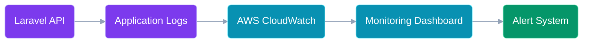

---

# 20. Future API Evolution


As CareerIQ AI grows, the API can evolve into a microservice architecture.


---

# Current Architecture


```
Angular

    |

Laravel API

    |

MySQL

    |

FastAPI AI Service

```


---

# Future Architecture


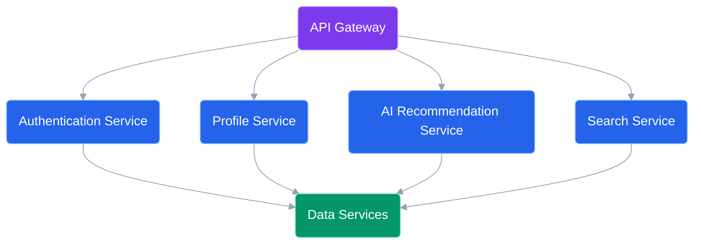

---

# Final Summary


CareerIQ AI API design provides:


## Scalability

Through:

- REST architecture
- API versioning
- Service separation


## Security

Through:

- Token authentication
- Validation
- Authorization
- Rate limiting


## Maintainability

Through:

- Swagger documentation
- Standard responses
- Automated testing


## AI Integration

Through:

- Independent AI services
- Background processing
- Recommendation pipelines


---

# End of Document