# Backend Development Plan

# CareerIQ AI


---

# Document Information


| Field | Description |
|---|---|
| Project Name | CareerIQ AI |
| Document Type | Backend Development Plan |
| Version | 2.0 |
| Backend Framework | Laravel 11+ |
| Programming Language | PHP 8.x |
| Database | MySQL 8.x |
| API Architecture | REST API |
| Authentication | Laravel Sanctum |
| AI Communication | FastAPI |
| Queue System | Laravel Queue |
| Containerization | Docker |
| Cloud Platform | AWS |


---

# Document Purpose


This document defines the backend architecture and development strategy for CareerIQ AI.


The purpose is to establish:


- Scalable backend architecture
- Clean code organization
- API development standards
- Database communication strategy
- AI service integration
- Security practices
- Testing approach
- Deployment strategy


This document guides:


- Backend implementation
- Code reviews
- API development
- System maintenance


---

# 1. Backend Overview


## 1.1 Introduction


CareerIQ AI backend is a Laravel-based application responsible for managing:


- User authentication
- Career profiles
- Resume processing
- Skill analysis
- Career recommendations
- Learning roadmap management
- AI service communication


The backend acts as the central communication layer between:


```
Frontend Application

        |

Laravel Backend

        |

Database + AI Services

```


---

# 1.2 Backend Responsibilities


The backend handles:


## Business Logic


Responsible for:


- Career recommendation rules
- Skill gap calculation
- Resume analysis workflow
- User progress tracking


---

## Data Management


Responsible for:


- Database operations
- Data relationships
- Data validation
- Data persistence


---

## API Management


Responsible for:


- REST API endpoints
- Authentication
- Authorization
- Response formatting


---

## AI Integration


Responsible for:


- Sending data to AI services
- Receiving AI results
- Processing background tasks


---

# 1.3 Backend Technology Stack


| Layer | Technology |
|---|---|
| Framework | Laravel 11+ |
| Language | PHP 8.x |
| Database | MySQL 8.x |
| ORM | Eloquent ORM |
| Authentication | Laravel Sanctum |
| API Format | REST + JSON |
| Queue | Laravel Queue |
| Cache | Redis |
| AI Service | FastAPI |
| Testing | PHPUnit |
| Container | Docker |
| Deployment | AWS |


---

# 2. Backend Architecture


CareerIQ AI follows a layered backend architecture.


The architecture separates:


- Request handling
- Business logic
- Data access
- External integrations


---

# 2.1 High-Level Backend Architecture


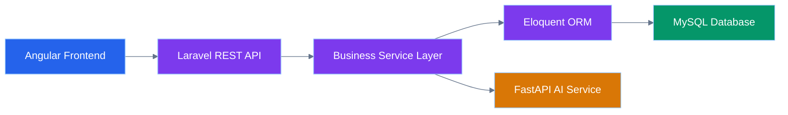

---

# 2.2 Backend Layer Responsibilities


| Layer | Responsibility |
|---|---|
|Route Layer|Define API endpoints|
|Controller Layer|Handle HTTP requests|
|Service Layer|Implement business logic|
|Repository Layer|Manage data access|
|Model Layer|Database interaction|
|Database Layer|Store persistent data|


---

# 2.3 Request Lifecycle


Every API request follows:


```
Client Request

        ↓

Laravel Route

        ↓

Controller

        ↓

Service Layer

        ↓

Repository

        ↓

Eloquent Model

        ↓

MySQL Database

        ↓

API Response

```


---

# 2.4 Backend Request Flow Diagram


---

# 3. Modern Laravel Architecture


CareerIQ AI follows a modular and maintainable Laravel structure.


Instead of organizing only by technical files:


```
Controllers

Models

Services

```

the project follows feature-based organization.


---

# 3.1 Feature-Based Backend Architecture


The application is divided into business modules:


```
Authentication

User Profile

Resume Intelligence

Skill Intelligence

Career Recommendation

Learning Roadmap

Interview System

```


---

# 3.2 Feature Architecture Diagram


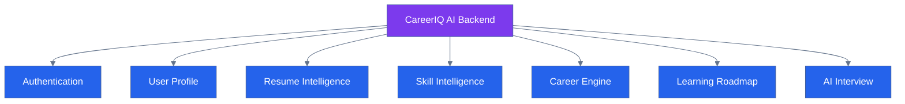

---

# 4. Backend Folder Structure


CareerIQ AI uses a scalable Laravel structure.


```
backend/


app/


├── Modules/


│
├── Authentication/

│   ├── Controllers/

│   ├── Services/

│   ├── Models/

│   └── Routes/


│
├── Resume/

│   ├── Controllers/

│   ├── Services/

│   ├── Jobs/

│   ├── Models/

│   └── Resources/


│
├── Career/

│

├── Skills/

│

├── Roadmap/


├── Interview/


├── Core/


│   ├── Exceptions/

│   ├── Middleware/

│   └── Helpers/


├── Database/


├── Tests/


└── Config/


```

---

# 4.1 Folder Responsibilities


| Folder | Purpose |
|---|---|
|Modules|Business features|
|Controllers|HTTP request handling|
|Services|Business logic|
|Models|Database entities|
|Jobs|Background processing|
|Resources|API response formatting|
|Core|Shared backend functionality|
|Tests|Automated testing|


---

---

# 5. Laravel MVC Architecture


CareerIQ AI follows the Model-View-Controller (MVC) architecture pattern.


Laravel MVC separates:


- Request handling
- Business logic
- Data management
- Response generation


---

# 5.1 MVC Architecture Overview


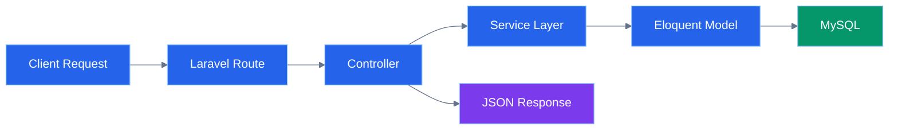

---

# 5.2 Model Layer


The Model layer represents database entities.


Responsibilities:


- Database communication
- Relationships
- Data casting
- Query operations


Examples:


```
User Model

Resume Model

Skill Model

Career Model

Roadmap Model

```


Example:


```php
class Resume extends Model

{


protected $fillable = [

'user_id',

'file_path',

'score'

];


}

```

---

# 5.3 Controller Layer


Controllers handle HTTP requests and responses.


Responsibilities:


- Receive API requests
- Validate input
- Call services
- Return responses


Controllers should not contain complex business logic.


---

# Controller Example


```php
class ResumeController extends Controller

{


public function upload(

Request $request

){


$result =

$this->resumeService

->upload($request);


return response()->json(

$result

);


}


}

```

---

# 6. Service Layer Architecture


CareerIQ AI uses a Service Layer pattern.


The service layer contains business logic.


Benefits:


- Cleaner controllers
- Better testing
- Reusable business rules
- Easier maintenance


---

# 6.1 Service Layer Flow


---

# 6.2 Service Example


Example:


```php
class ResumeService

{


public function analyzeResume(

Resume $resume

){


$data =

$this->aiService

->analyze($resume);


return $data;


}


}

```

---

# 7. Repository Pattern


CareerIQ AI uses Repository Pattern to separate database logic from business logic.


Without Repository:


```
Controller

    |

Database Query

```


With Repository:


```
Controller

    |

Service

    |

Repository

    |

Database

```


---

# 7.1 Repository Architecture


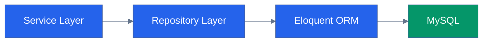

---

# 7.2 Repository Example


Interface:


```php
interface ResumeRepositoryInterface

{


public function findByUser(

int $userId

);


}

```


Implementation:


```php
class ResumeRepository

implements ResumeRepositoryInterface

{


public function findByUser(

int $userId

){


return Resume::where(

'user_id',

$userId

)->get();


}


}

```

---

# 8. Database Integration


CareerIQ AI uses MySQL 8.x as the primary database.


Laravel communicates with MySQL using:


```
Laravel

    |

Eloquent ORM

    |

MySQL

```


---

# 8.1 Database Architecture


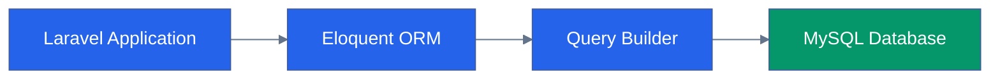

---

# 8.2 Eloquent Relationships


CareerIQ AI uses relationships between entities.


Example:


```
User

 |

hasMany

 |

Resume


User

 |

hasMany

 |

Skills


Career

 |

hasMany

 |

Roadmap Tasks

```


---

# Relationship Example


```php
class User extends Model

{


public function resumes()

{


return $this->hasMany(

Resume::class

);


}


}

```

---

# 9. Authentication Architecture


CareerIQ AI uses Laravel Sanctum for authentication.


Authentication provides:


- Secure API access
- Token management
- User sessions
- Protected endpoints


---

# 9.1 Authentication Flow


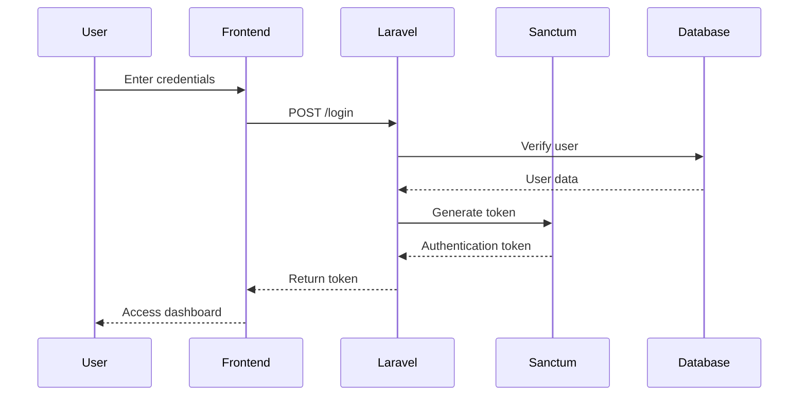

---

# 9.2 Authentication Structure


```
app/


Modules/


Authentication/


├── Controllers/

├── Services/

├── Models/

├── Middleware/

└── Requests/

```

---

# 10. Authorization System


Authentication verifies identity.


Authorization verifies permissions.


CareerIQ AI supports:


- User roles
- Feature permissions
- Protected resources


---

# 10.1 Authorization Flow


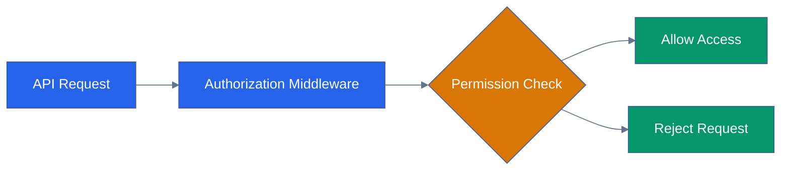

---

# 10.2 Middleware Example


```php
public function handle(

$request,

Closure $next

)

{


if(

!auth()->check()

){


return response()->json(

['message'=>'Unauthorized'],

401

);


}


return $next($request);


}

```

---

---

# 11. REST API Architecture


CareerIQ AI exposes backend functionality through REST APIs.


The API layer provides communication between:


```
Angular Frontend

        ↓

Laravel REST API

        ↓

Database / AI Services

```


---

# 11.1 API Architecture


---

# 11.2 API Route Organization


CareerIQ AI separates APIs by feature.


Example:


```
routes/


api.php


/api/auth

/api/users

/api/resumes

/api/skills

/api/careers

/api/roadmaps

/api/interviews

```


---

# 11.3 REST Endpoint Examples


## Authentication


```
POST /api/register

POST /api/login

POST /api/logout

```


---

## Resume Management


```
POST /api/resumes/upload

GET /api/resumes/{id}

GET /api/resumes/{id}/analysis

```


---

## Career Intelligence


```
GET /api/careers

POST /api/career-analysis

GET /api/roadmap

```


---

# 11.4 API Response Standard


All API responses follow a consistent structure.


Example:


```json
{

"success": true,

"message": "Resume analyzed successfully",

"data": {

"score": 85,

"skills": [

"Laravel",

"PHP"

]

}

}

```

---

# 12. API Resource Layer


Laravel API Resources transform database models into clean responses.


Benefits:


- Consistent API output
- Hide unnecessary fields
- Better frontend integration


---

# 12.1 Resource Flow


---

# 12.2 Resource Example


```php
class ResumeResource extends JsonResource

{


public function toArray(

$request

){


return [

'id'=>$this->id,

'score'=>$this->score,

'skills'=>$this->skills

];


}


}

```

---

# 13. Validation Strategy


Input validation protects application data integrity.


CareerIQ AI uses:


- Laravel Form Requests
- Custom validation rules
- API validation responses


---

# 13.1 Validation Flow


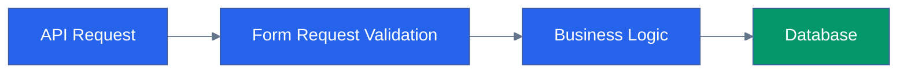

---

# 13.2 Validation Example


```php
class ResumeUploadRequest extends FormRequest

{


public function rules()

{


return [

'resume'=>'required|file|mimes:pdf,docx|max:10240'

];


}


}

```

---

# 14. Exception Handling


CareerIQ AI implements centralized exception handling.


Goals:


- Consistent error responses
- Easier debugging
- Better monitoring


---

# 14.1 Exception Architecture


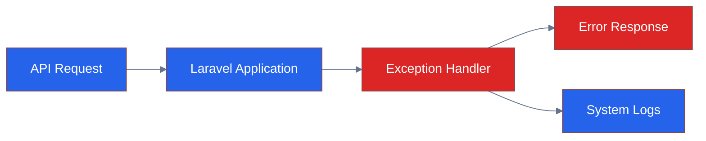

---

# 14.2 Error Response Example


```json
{

"success": false,

"message": "Validation failed",

"errors": {

"email":[

"Email is required"

]

}

}

```

---

# 15. Logging and Monitoring


Backend monitoring helps identify:


- Application failures
- Performance issues
- Security events


---

# 15.1 Logging Architecture


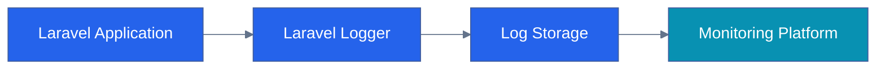

---

# 15.2 Monitoring Tools


Possible integrations:


- AWS CloudWatch
- Laravel Telescope
- Sentry
- Application logs


---

# 16. Queue and Background Processing


AI processing tasks can require significant time.


CareerIQ AI uses Laravel Queues for:


- Resume analysis
- AI processing
- Report generation
- Email notifications


---

# 16.1 Queue Architecture


---

# 16.2 Queue Example


```php
class AnalyzeResumeJob implements ShouldQueue

{


public function handle()

{


$this->resumeService

->analyze();


}


}

```

---

# 17. AI Service Integration


CareerIQ AI separates AI processing from the Laravel backend.


Architecture:


```
Laravel Backend

        |

FastAPI AI Service

        |

Machine Learning Models

        |

AI Results

```


---

# 17.1 Laravel and FastAPI Communication


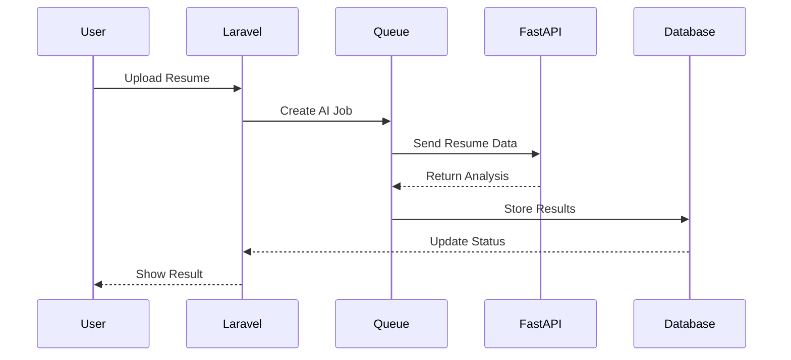

---

# 18. Resume Processing Backend Flow


Resume intelligence is one of the core backend modules.


Processing steps:


```
Upload Resume

        ↓

Store File

        ↓

Create Processing Job

        ↓

Extract Information

        ↓

AI Analysis

        ↓

Save Results

        ↓

Display Report

```

---

# 18.1 Resume Processing Architecture


---

---

# 19. Skill Intelligence Backend


The Skill Intelligence module analyzes and manages user professional skills.


Responsibilities:


- Skill extraction
- Skill categorization
- Skill level estimation
- Skill gap identification


---

# 19.1 Skill Intelligence Architecture


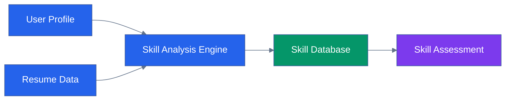

---

# 19.2 Skill Processing Flow


```
User Data

    ↓

Extract Skills

    ↓

Normalize Skills

    ↓

Compare With Skill Database

    ↓

Calculate Skill Level

    ↓

Generate Assessment

```

---

# 20. Career Recommendation Engine


The Career Recommendation Engine helps users identify suitable career paths.


The system analyzes:


- Current skills
- Experience
- Education
- Career goals
- Market requirements


---

# 20.1 Career Recommendation Architecture


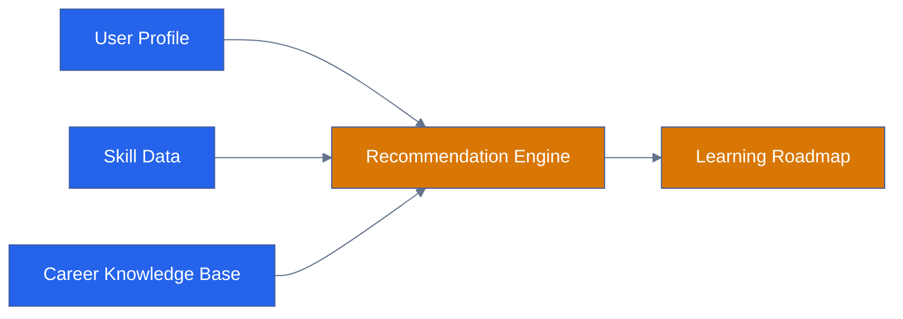

---

# 20.2 Recommendation Process


```
Collect User Data

        ↓

Analyze Current Skills

        ↓

Compare Target Career

        ↓

Identify Missing Skills

        ↓

Generate Learning Roadmap

```

---

# 21. File Storage Management


CareerIQ AI manages:


- Resume files
- Certificates
- Profile documents
- AI generated reports


---

# 21.1 Storage Architecture


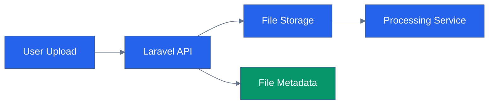

---

# 21.2 Storage Strategy


Development:


```
Local Storage

```


Production:


```
AWS S3

```

Benefits:


- Scalability
- Secure access
- Backup support
- CDN integration


---

# 22. Caching Strategy


Caching improves backend performance.


CareerIQ AI uses caching for:


- Frequently accessed data
- Career recommendations
- Skill information
- User dashboard data


---

# 22.1 Cache Architecture


```mermaid
%%{init:{
"theme":"base",
"themeVariables":{
"primaryColor":"#2563EB",
"primaryTextColor":"#FFFFFF",
"lineColor":"#64748B"
}
}}%%


flowchart LR


REQUEST["API Request"]


LARAVEL["Laravel Application"]


CACHE["Redis Cache"]


DATABASE["MySQL"]


RESPONSE["API Response"]


REQUEST --> LARAVEL

LARAVEL --> CACHE

CACHE --> DATABASE

DATABASE --> RESPONSE


classDef backend fill:#2563EB,color:white;

classDef database fill:#059669,color:white;


class REQUEST,LARAVEL,CACHE backend;

class DATABASE database;

class RESPONSE backend;

```

---

# 22.2 Caching Examples


Cached data:


```
Career Recommendations

Skill Database

Dashboard Statistics

User Preferences

```

---

# 23. Backend Security Architecture


Security is a critical part of CareerIQ AI.


Implemented security:


- Authentication
- Authorization
- Input validation
- Data encryption
- Secure API communication


---

# 23.1 Security Architecture


```mermaid
%%{init:{
"theme":"base",
"themeVariables":{
"primaryColor":"#2563EB",
"primaryTextColor":"#FFFFFF",
"lineColor":"#64748B"
}
}}%%


flowchart LR


CLIENT["Frontend"]


API["Laravel API"]


AUTH["Authentication"]


MIDDLEWARE["Security Middleware"]


DATABASE["Protected Database"]


CLIENT --> API

API --> AUTH

AUTH --> MIDDLEWARE

MIDDLEWARE --> DATABASE


classDef frontend fill:#2563EB,color:white;

classDef backend fill:#7C3AED,color:white;

classDef database fill:#059669,color:white;


class CLIENT frontend;

class API,AUTH,MIDDLEWARE backend;

class DATABASE database;

```

---

# 23.2 Security Practices


## SQL Injection Prevention


Using:


- Eloquent ORM
- Prepared statements


---

## XSS Prevention


Using:


- Input sanitization
- Output escaping


---

## CSRF Protection


Using:


- Laravel CSRF middleware


---

## Password Security


Using:


- Secure hashing
- Laravel authentication tools


---

# 24. Performance Optimization


Backend performance is improved through:


- Database indexing
- Query optimization
- Caching
- Queue processing
- API optimization


---

# 24.1 Performance Architecture


```mermaid
%%{init:{
"theme":"base",
"themeVariables":{
"primaryColor":"#2563EB",
"primaryTextColor":"#FFFFFF",
"lineColor":"#64748B"
}
}}%%


flowchart LR


REQUEST["API Request"]


CACHE["Cache Layer"]


OPTIMIZED["Optimized Queries"]


DATABASE["MySQL"]


RESPONSE["Fast Response"]


REQUEST --> CACHE

CACHE --> OPTIMIZED

OPTIMIZED --> DATABASE

DATABASE --> RESPONSE


classDef backend fill:#2563EB,color:white;

classDef database fill:#059669,color:white;


class REQUEST,CACHE,OPTIMIZED backend;

class DATABASE database;

class RESPONSE backend;

```

---

# 25. Backend Testing Strategy


Testing ensures backend reliability.


Testing levels:


```
Unit Testing

        ↓

Feature Testing

        ↓

API Testing

        ↓

Integration Testing

```

---

# 25.1 Testing Architecture


```mermaid
%%{init:{
"theme":"base",
"themeVariables":{
"primaryColor":"#2563EB",
"primaryTextColor":"#FFFFFF",
"lineColor":"#64748B"
}
}}%%


flowchart LR


CODE["Laravel Code"]


UNIT["Unit Tests"]


FEATURE["Feature Tests"]


API["API Tests"]


CI["CI Pipeline"]


CODE --> UNIT

CODE --> FEATURE

CODE --> API


UNIT --> CI

FEATURE --> CI

API --> CI


classDef backend fill:#2563EB,color:white;

classDef test fill:#059669,color:white;


class CODE backend;

class UNIT,FEATURE,API test;

class CI fill:#7C3AED,color:white;

```

---

# 25.2 Testing Tools


| Testing Type | Tool |
|---|---|
|Unit Testing|PHPUnit|
|Feature Testing|Laravel Test Framework|
|API Testing|Postman|
|Database Testing|Laravel Database Testing|
|Performance Testing|JMeter|


---

# 26. CI/CD Pipeline


Backend deployment is automated through GitHub Actions.


---

# 26.1 Backend Deployment Flow


```mermaid
%%{init:{
"theme":"base",
"themeVariables":{
"primaryColor":"#2563EB",
"primaryTextColor":"#FFFFFF",
"lineColor":"#64748B"
}
}}%%


flowchart LR


PUSH["Git Push"]


TEST["Run Tests"]


BUILD["Build Docker Image"]


DEPLOY["Deploy Backend"]


AWS["AWS Infrastructure"]


PUSH --> TEST

TEST --> BUILD

BUILD --> DEPLOY

DEPLOY --> AWS


classDef backend fill:#2563EB,color:white;

classDef cloud fill:#0891B2,color:white;


class PUSH,TEST,BUILD,DEPLOY backend;

class AWS cloud;

```

---

# 27. Docker Deployment Architecture


CareerIQ AI uses containerized deployment.


---

# 27.1 Docker Architecture


```mermaid
%%{init:{
"theme":"base",
"themeVariables":{
"primaryColor":"#2563EB",
"primaryTextColor":"#FFFFFF",
"lineColor":"#64748B"
}
}}%%


flowchart LR


DOCKER["Docker Environment"]


LARAVEL["Laravel Container"]


MYSQL["MySQL Container"]


REDIS["Redis Container"]


FASTAPI["FastAPI Container"]


DOCKER --> LARAVEL

DOCKER --> MYSQL

DOCKER --> REDIS

DOCKER --> FASTAPI


classDef backend fill:#2563EB,color:white;

classDef database fill:#059669,color:white;

classDef ai fill:#D97706,color:white;


class LARAVEL,REDIS backend;

class MYSQL database;

class FASTAPI ai;

```

---

# 28. AWS Deployment Architecture


Production deployment uses AWS services.


Architecture:


```mermaid
%%{init:{
"theme":"base",
"themeVariables":{
"primaryColor":"#2563EB",
"primaryTextColor":"#FFFFFF",
"lineColor":"#64748B"
}
}}%%


flowchart LR


USER["Users"]


ALB["Load Balancer"]


EC2["Laravel EC2 Instance"]


RDS["MySQL RDS"]


S3["AWS S3"]


AI["FastAPI Service"]


USER --> ALB

ALB --> EC2

EC2 --> RDS

EC2 --> S3

EC2 --> AI


classDef cloud fill:#0891B2,color:white;

classDef backend fill:#2563EB,color:white;

classDef database fill:#059669,color:white;


class USER,ALB,EC2 cloud;

class RDS database;

class S3,AI backend;

```

---

# 29. Backend Development Roadmap


## Phase 1: Foundation


Tasks:


- Laravel setup
- Database configuration
- Authentication


---

## Phase 2: Core Modules


Develop:


- User profile
- Resume management
- Skill system


---

## Phase 3: AI Integration


Develop:


- FastAPI communication
- Resume analysis
- Recommendation engine


---

## Phase 4: Optimization


Develop:


- Queue system
- Caching
- Monitoring


---

## Phase 5: Production Deployment


Develop:


- Docker deployment
- AWS infrastructure
- CI/CD pipeline


---

# Final Backend Architecture


```mermaid
%%{init:{
"theme":"base",
"themeVariables":{
"primaryColor":"#2563EB",
"primaryTextColor":"#FFFFFF",
"lineColor":"#64748B"
}
}}%%


flowchart TB


FRONTEND["Angular Frontend"]


API["Laravel REST API"]


SERVICE["Service Layer"]


QUEUE["Queue Workers"]


AI["FastAPI AI Service"]


DATABASE["MySQL Database"]


CACHE["Redis Cache"]


CLOUD["AWS Cloud"]


FRONTEND --> API

API --> SERVICE

SERVICE --> QUEUE

SERVICE --> DATABASE

SERVICE --> CACHE

QUEUE --> AI

API --> CLOUD


classDef frontend fill:#2563EB,color:white;

classDef backend fill:#7C3AED,color:white;

classDef database fill:#059669,color:white;

classDef cloud fill:#0891B2,color:white;

classDef ai fill:#D97706,color:white;


class FRONTEND frontend;

class API,SERVICE,QUEUE,CACHE backend;

class DATABASE database;

class CLOUD cloud;

class AI ai;

```

---

