# Backend Development Plan

# CareerIQ AI

---

# Document Information


| Field | Description |
|-|-|
| Project Name | CareerIQ AI |
| Document Type | Backend Development Plan |
| Version | 1.0 |
| Backend Framework | Laravel |
| Programming Language | PHP |
| Database | MySQL 8.x |
| ORM | Laravel Eloquent |
| API Style | REST API |
| Authentication | Laravel Sanctum |


---

# Table of Contents


1. Backend Overview

2. Laravel Backend Architecture

3. Backend Folder Structure

4. Application Layer Design

5. MVC Architecture

6. Service Layer Pattern

7. Repository Pattern

8. Model Design

9. Controller Design

10. Authentication Implementation

11. Database Migration Workflow

12. API Development Workflow

13. Background Jobs and Queues

14. Event Driven Architecture

15. AI Service Integration

16. File Processing System

17. Notification System

18. Exception Handling

19. Logging Strategy

20. Security Practices

21. Coding Standards

22. Backend Development Roadmap


---

# 1. Backend Overview


## 1.1 Purpose


The backend of CareerIQ AI provides the core application logic responsible for:


- User authentication
- Career profile management
- Resume processing
- Skill intelligence
- Career recommendation
- Learning roadmap generation
- AI communication
- Database operations


---

# 1.2 Backend Technology Stack


| Component | Technology |
|-|-|
| Framework | Laravel |
| Language | PHP 8.x |
| API | Laravel REST API |
| ORM | Eloquent ORM |
| Authentication | Laravel Sanctum |
| Database | MySQL 8.x |
| Queue System | Laravel Queue + Redis |
| Testing | PHPUnit |
| Documentation | Swagger/OpenAPI |


---

# 1.3 Backend Responsibilities


The Laravel backend acts as the central application layer.


It manages:


```
Angular Frontend

        |

Laravel Backend

        |

-----------------------

|                     |

MySQL              FastAPI AI

Database           Service

```

---

# 2. Laravel Backend Architecture


CareerIQ AI follows a modular layered architecture.


The architecture separates:


- HTTP handling
- Business logic
- Database operations
- External services


---

# 2.1 High-Level Backend Architecture


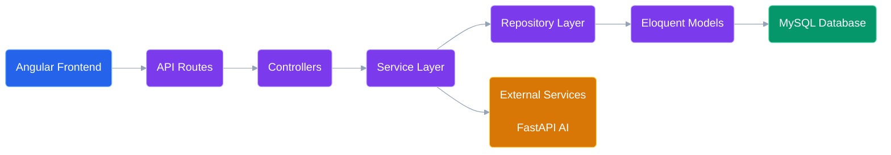

---

# 2.2 Architecture Principles


The backend follows:


## Separation of Concerns


Each layer has a specific responsibility.


Example:


Controller:


```
Receive Request

Validate Input

Return Response

```


Service:


```
Business Logic

Decision Making

External Communication

```


Repository:


```
Database Operations

Query Management

```


Model:


```
Database Representation

Relationships

```


---

# 3. Backend Folder Structure


CareerIQ AI follows a scalable Laravel structure.


```
backend/

│

├── app/

│

├── Http/

│   ├── Controllers/

│   ├── Requests/

│   ├── Resources/

│   └── Middleware/

│

├── Models/

│

├── Services/

│

├── Repositories/

│

├── Jobs/

│

├── Events/

│

├── Listeners/

│

├── Notifications/

│

├── Exceptions/

│

├── Policies/


├── database/

│

├── migrations/

├── seeders/


├── routes/

│

└── api.php


├── tests/

│

├── Feature/

└── Unit/

```

---

# 3.1 Folder Responsibilities


| Folder | Responsibility |
|-|-|
|Controllers|Handle HTTP requests|
|Requests|Validate incoming data|
|Resources|Format API responses|
|Models|Database entities|
|Services|Business logic|
|Repositories|Database abstraction|
|Jobs|Background processing|
|Events|Application events|
|Listeners|Event handlers|
|Policies|Authorization rules|
|Tests|Automated testing|


---

# 4. Application Layer Design


CareerIQ AI backend follows a layered approach.


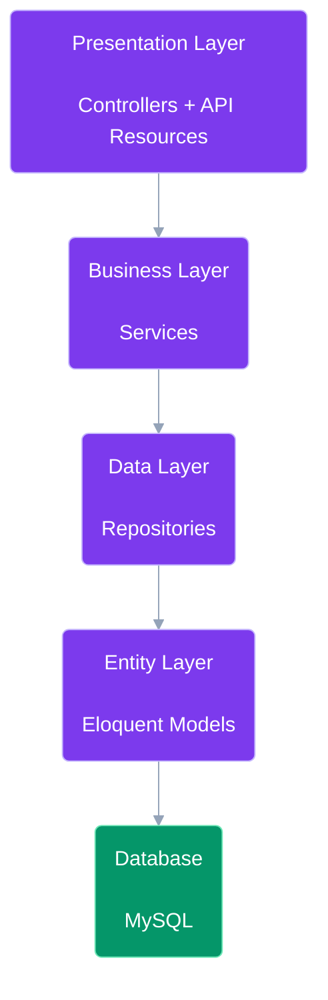

---

# 5. MVC Architecture


Laravel follows the MVC pattern.


MVC means:


```
Model

View

Controller

```


For API applications:


```
Model

+

Controller

+

JSON Response

```


---

# 5.1 MVC Flow


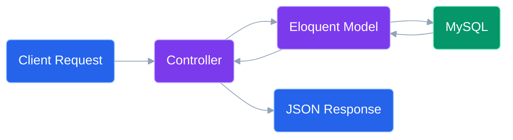

---

# 6. Service Layer Pattern


CareerIQ AI avoids putting business logic directly inside controllers.


Bad approach:


```php
public function uploadResume()
{

// 500 lines of logic

}

```


Better approach:


```
Controller

      |

ResumeService

      |

ResumeRepository

      |

Database

```


---

# 6.1 Example Service Structure


```
app/

Services/

    ResumeService.php

    SkillService.php

    CareerService.php

    AIService.php

```


---

# 6.2 Resume Service Example


```php
class ResumeService
{


public function analyzeResume($resume)

{

    // Store file

    // Extract text

    // Send to AI service

    // Save analysis


}


}

```


---

# Benefits


Service layer provides:


- Cleaner controllers
- Reusable business logic
- Easier testing
- Better scalability


---

---

# 7. Repository Pattern


CareerIQ AI uses the Repository Pattern to separate database operations from business logic.


Without Repository Pattern:


```
Controller

     |

Eloquent Query

     |

Database

```


With Repository Pattern:


```
Controller

     |

Service Layer

     |

Repository Layer

     |

Eloquent Model

     |

Database

```


---

# 7.1 Repository Architecture


```mermaid
%%{init:{
'theme':'base',
'themeVariables':{
'fontFamily':'Inter',
'lineColor':'#94A3B8'
}
}}%%


flowchart LR


CONTROLLER("Controller")


SERVICE("Service Layer")


INTERFACE("Repository Interface")


REPOSITORY("Repository Implementation")


MODEL("Eloquent Model")


DATABASE("MySQL Database")



CONTROLLER --> SERVICE

SERVICE --> INTERFACE

INTERFACE --> REPOSITORY

REPOSITORY --> MODEL

MODEL --> DATABASE



classDef backend fill:#7C3AED,stroke:#C4B5FD,color:#FFFFFF;

classDef database fill:#059669,stroke:#6EE7B7,color:#FFFFFF;



class CONTROLLER,SERVICE,INTERFACE,REPOSITORY,MODEL backend;

class DATABASE database;

```

---

# 7.2 Repository Folder Structure


```
app/

Repositories/


├── Interfaces/

│

├── UserRepositoryInterface.php

├── ResumeRepositoryInterface.php

├── SkillRepositoryInterface.php


├── UserRepository.php

├── ResumeRepository.php

└── SkillRepository.php

```


---

# 7.3 Repository Example


## Interface


```php
interface ResumeRepositoryInterface
{


public function create(array $data);


public function findById($id);


public function delete($id);


}

```


---

## Implementation


```php
class ResumeRepository implements ResumeRepositoryInterface
{


public function create(array $data)

{

    return Resume::create($data);

}


public function findById($id)

{

    return Resume::findOrFail($id);

}


public function delete($id)

{

    return Resume::destroy($id);

}


}

```

---

# Repository Benefits


The Repository Pattern provides:


- Database abstraction
- Cleaner services
- Easier testing
- Better maintainability
- Future database flexibility


---

# 8. Eloquent Model Design


Laravel Eloquent models represent database entities.


CareerIQ AI models:


```
User

Profile

Education

Experience

Project

Skill

Resume

ResumeAnalysis

CareerGoal

LearningRoadmap

InterviewSession

```


---

# 8.1 Model Relationship Design


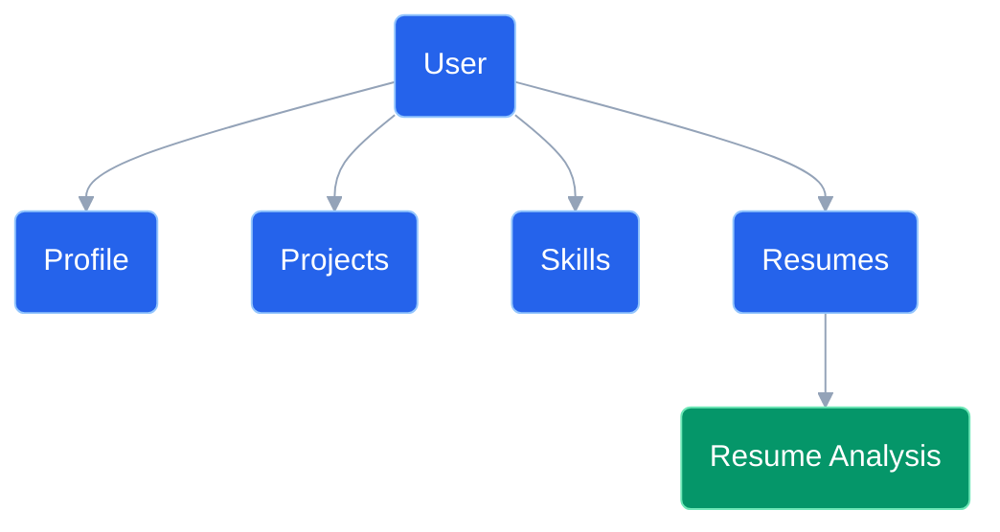

---

# 8.2 User Model Example


```php
class User extends Authenticatable
{


protected $fillable = [

'name',

'email',

'password'

];


public function profile()

{

return $this->hasOne(Profile::class);

}


public function skills()

{

return $this->belongsToMany(Skill::class);

}


public function resumes()

{

return $this->hasMany(Resume::class);

}


}

```

---

# 8.3 Resume Model Example


```php
class Resume extends Model
{


protected $fillable = [

'user_id',

'file_name',

'file_path'

];


public function user()

{

return $this->belongsTo(User::class);

}


public function analysis()

{

return $this->hasOne(
ResumeAnalysis::class
);

}


}

```

---

# 9. Controller Design


Controllers are responsible for:


- Receiving requests
- Calling services
- Returning responses


Controllers should NOT contain:


- Complex business logic
- Database queries
- AI processing


---

# 9.1 Controller Structure


```
app/

Http/

Controllers/


AuthController.php

ProfileController.php

ResumeController.php

SkillController.php

CareerController.php

RoadmapController.php

```


---

# 9.2 Controller Flow


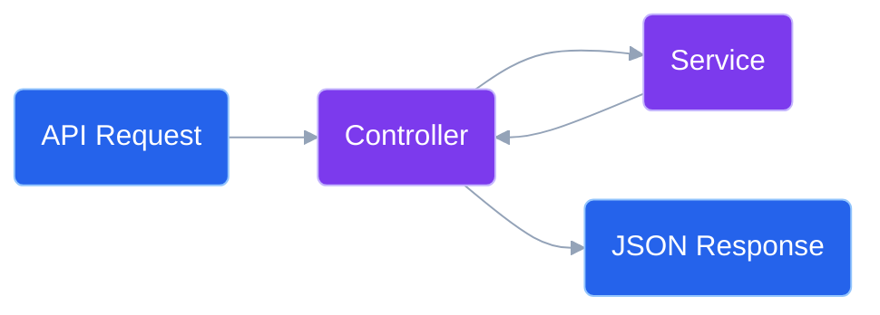

---

# 9.3 Resume Controller Example


```php
class ResumeController extends Controller

{


public function __construct(

private ResumeService $resumeService

)

{}


public function upload(
Request $request
)

{


$result =

$this->resumeService
->upload($request);


return response()->json([

'status'=>'success',

'data'=>$result

]);


}


}

```

---

# 10. API Resource Layer


Laravel API Resources transform models into JSON responses.


Example:


```
Database Model

        |

API Resource

        |

JSON Response

```


---

# 10.1 Resource Example


```php
class ResumeResource extends JsonResource
{


public function toArray($request)

{

return [


'id'=>$this->id,


'file_name'=>$this->file_name,


'uploaded_at'=>$this->created_at


];


}


}

```

---

# 11. Authentication Implementation


CareerIQ AI uses:


```
Laravel Sanctum

+

Bearer Token Authentication

```


---

# 11.1 Authentication Flow


```mermaid
%%{init:{
'theme':'base',
'themeVariables':{
'fontFamily':'Inter'
}
}}%%


sequenceDiagram


participant User

participant API

participant Sanctum

participant Database


User->>API:
Login Request


API->>Database:
Verify Credentials


Database-->>API:
User Found


API->>Sanctum:
Generate Token


Sanctum-->>API:
Access Token


API-->>User:
Return Token


```

---

# 11.2 Protected Route Example


```php
Route::middleware(
'auth:sanctum'
)

->group(function(){


Route::get(
'/profile',
[ProfileController::class,'show']
);


});

```

---

# Authentication Benefits


Provides:


- Secure API access
- Token management
- Stateless authentication
- Mobile application support


---

---

# 12. Background Jobs and Queue System


CareerIQ AI contains several operations that require significant processing time.


Examples:


- Resume parsing
- AI analysis
- Skill extraction
- Career recommendation generation
- Report generation


These operations should not block normal API requests.


---

# 12.1 Queue Architecture


Instead of:


```
User Upload Resume

        |

API waits

        |

AI Processing

        |

Response

```


CareerIQ AI uses asynchronous processing:


```
User Upload Resume

        |

Laravel API

        |

Create Queue Job

        |

Redis Queue

        |

Background Worker

        |

AI Processing

        |

Database Update

        |

Notification

```


---

# 12.2 Queue Processing Diagram


```mermaid
%%{init:{
'theme':'base',
'themeVariables':{
'fontFamily':'Inter',
'lineColor':'#94A3B8'
}
}}%%


flowchart LR


USER("User")


API("Laravel API")


QUEUE("Redis Queue")


WORKER("Queue Worker")


FASTAPI("FastAPI AI Service")


DATABASE("MySQL Database")


NOTIFICATION("Notification System")



USER --> API

API --> QUEUE

QUEUE --> WORKER

WORKER --> FASTAPI

FASTAPI --> DATABASE

DATABASE --> NOTIFICATION



classDef user fill:#334155,stroke:#CBD5E1,color:#FFFFFF;

classDef backend fill:#7C3AED,stroke:#C4B5FD,color:#FFFFFF;

classDef queue fill:#D97706,stroke:#FCD34D,color:#FFFFFF;

classDef database fill:#059669,stroke:#6EE7B7,color:#FFFFFF;

classDef output fill:#0891B2,stroke:#67E8F9,color:#FFFFFF;



class USER user;

class API,WORKER backend;

class QUEUE queue;

class DATABASE database;

class FASTAPI,NOTIFICATION output;

```

---

# 12.3 Laravel Queue Configuration


CareerIQ AI uses:


```
Laravel Queue

+

Redis

```


Environment:


```env
QUEUE_CONNECTION=redis
```


---

# 12.4 Job Structure


Jobs are stored:


```
app/

Jobs/


AnalyzeResumeJob.php

GenerateRoadmapJob.php

CalculateSkillGapJob.php

```


---

# 12.5 Resume Analysis Job Example


```php
class AnalyzeResumeJob implements ShouldQueue

{


public function __construct(

public Resume $resume

)

{}


public function handle()

{


// Extract resume text


// Send data to AI service


// Store AI response


}


}

```

---

# 12.6 Dispatching Jobs


Example:


```php
AnalyzeResumeJob::dispatch($resume);

```


The API immediately returns:


```json
{

"message":

"Resume analysis started"

}

```


The heavy processing happens in the background.

---

# 13. Event Driven Architecture


CareerIQ AI uses events for loosely coupled communication.


Example:


When a resume is analyzed:


```
ResumeAnalyzed Event

          |

---------------------

|                   |

Save Result     Notify User

```


---

# 13.1 Event Architecture


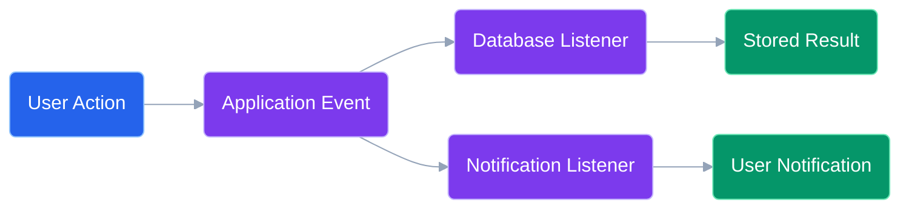

---

# 13.2 Event Examples


CareerIQ AI events:


| Event | Purpose |
|-|-|
|ResumeUploaded|Start resume processing|
|ResumeAnalyzed|Store AI result|
|SkillUpdated|Recalculate career score|
|RoadmapCompleted|Update progress analytics|


---

# 13.3 Event Example


```php
class ResumeAnalyzed

{


public function __construct(

public Resume $resume

)

{}


}

```

---

# 14. AI Service Integration


CareerIQ AI separates AI logic from Laravel.


Architecture:


```
Laravel Backend

        |

REST Communication

        |

FastAPI AI Service

        |

Machine Learning Models

```


---

# 14.1 AI Integration Flow


```mermaid
%%{init:{
'theme':'base',
'themeVariables':{
'fontFamily':'Inter',
'lineColor':'#94A3B8'
}
}}%%


sequenceDiagram


participant User

participant Laravel

participant Queue

participant FastAPI

participant AI

participant MySQL


User->>Laravel:
Upload Resume


Laravel->>Queue:
Create Analysis Job


Queue->>FastAPI:
Send Resume Data


FastAPI->>AI:
Analyze Content


AI-->>FastAPI:
Return Insights


FastAPI-->>Laravel:
Analysis Result


Laravel->>MySQL:
Store Result


Laravel-->>User:
Notify Completion


```

---

# 14.2 AI Service Client


Laravel communicates using an API client.


Example:


```
app/

Services/


AIService.php

```


---

Example:


```php
class AIService

{


public function analyzeResume($text)

{


$response = Http::post(

config('services.ai.url'),

[

'text'=>$text

]

);


return $response->json();


}


}

```

---

# 15. File Processing System


CareerIQ AI handles user uploaded files securely.


Supported files:


```
PDF

DOCX

```


---

# 15.1 File Processing Flow


---

# 15.2 File Storage Strategy


Development:


```
Local Storage

```


Production:


```
AWS S3

```


Architecture:


```
Laravel

    |

Storage Service

    |

AWS S3 Bucket

```


---

# 16. Notification System


Users receive notifications for:


- Resume analysis completion
- Skill gap report generation
- Learning milestone completion


---

# 16.1 Notification Channels


| Channel | Usage |
|-|-|
|Database|Application notifications|
|Email|Important updates|
|Push Notification|Future mobile application|


---

# Notification Example


```php
class ResumeAnalysisCompleted extends Notification

{


public function via($notifiable)

{


return [

'database',

'mail'

];


}


}

```

---

---

# 17. Exception Handling


CareerIQ AI uses centralized exception handling to provide:


- Consistent API responses
- Better debugging
- Improved user experience
- Easier maintenance


---

# 17.1 Exception Handling Architecture


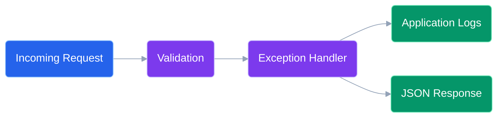

---

# 17.2 Custom Exception Example


Example:


```php
class ResumeProcessingException extends Exception

{


public function report()

{


Log::error(

$this->message

);


}


}

```

---

# 17.3 API Exception Response


Example:


```json
{

"status":

"error",


"message":

"Resume processing failed",


"code":

"RESUME_ERROR"

}

```

---

# 18. Logging Strategy


Production applications require proper monitoring and debugging.


CareerIQ AI uses:


```
Laravel Logging

+

AWS CloudWatch

+

Application Monitoring

```


---

# 18.1 Logging Architecture


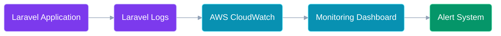

---

# 18.2 Logging Levels


Laravel logging levels:


| Level | Usage |
|-|-|
|Emergency|System unavailable|
|Critical|Major failures|
|Error|Application errors|
|Warning|Potential problems|
|Info|Important events|
|Debug|Development information|


---

# 18.3 Important Events to Log


CareerIQ AI logs:


- User authentication failures
- Resume processing failures
- AI service errors
- Database exceptions
- API performance issues


---

# 19. Security Practices


Security is implemented throughout the backend.


---

# 19.1 Authentication Security


Implemented using:


```
Laravel Sanctum

+

Secure Token Authentication

```


Features:


- Token expiration
- Protected routes
- Secure logout


---

# 19.2 Authorization


CareerIQ AI uses:


- Middleware
- Policies
- Gates


Example:


```
User

↓

Can access own profile


Admin

↓

Can manage platform

```


---

# 19.3 Database Security


Protection:


- Prepared statements
- Eloquent ORM
- Input validation
- Least privilege database users


---

# 19.4 Password Security


Passwords are stored using:


```
bcrypt

or

Argon2 hashing

```


Example:


```php
Hash::make($password);

```

---

# 19.5 File Security


Resume files are protected through:


- File type validation
- File size restriction
- Secure storage
- Access control


---

# 20. Testing Integration


Backend development follows a test-driven approach.


---

# 20.1 Testing Architecture


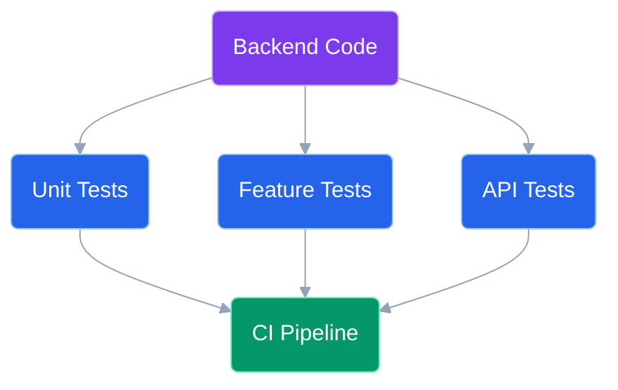

---

# 20.2 Testing Types


## Unit Testing


Tests individual components.


Examples:


- Services
- Helper classes
- Business logic


---

## Feature Testing


Tests complete workflows.


Examples:


```
User Login

Resume Upload

Career Analysis

```


---

## Integration Testing


Tests:


```
Laravel

+

FastAPI

+

Database

```

---

# 21. Coding Standards


CareerIQ AI follows professional PHP standards.


---

# 21.1 PHP Standards


Follow:


```
PSR-12 Coding Standard

```


---

# 21.2 Naming Convention


## Classes


PascalCase:


```php
ResumeService

CareerController

```


---

## Functions


camelCase:


```php
generateRoadmap()

calculateSkillGap()

```


---

## Database


snake_case:


```
user_skills

career_goals

resume_analysis

```


---

# 21.3 SOLID Principles


CareerIQ AI follows SOLID principles.


---

## Single Responsibility Principle


A class should have one responsibility.


Example:


Bad:


```
ResumeController

- Upload file
- Analyze AI
- Save database

```


Good:


```
ResumeController

        |

ResumeService

        |

AIService

        |

Repository

```

---

## Dependency Injection


Example:


```php
public function __construct(

ResumeService $service

)

{

$this->service=$service;

}

```

---

# 22. Backend Development Roadmap


Backend implementation will follow incremental development phases.


---

# Phase 1: Laravel Foundation


Tasks:


- Install Laravel
- Configure MySQL
- Setup environment
- Setup authentication
- Create project structure


---

# Phase 2: Core User Module


Develop:


- Registration
- Login
- Profile
- Education
- Experience
- Projects


---

# Phase 3: Skill Intelligence Module


Develop:


- Skill database
- User skills
- Skill assessment


---

# Phase 4: Resume Intelligence Module


Develop:


- Resume upload
- File storage
- Text extraction
- AI communication


---

# Phase 5: Career Intelligence Module


Develop:


- Career goals
- Skill gap analysis
- Roadmap generation


---

# Phase 6: Advanced Features


Develop:


- AI interview simulator
- Notifications
- Analytics dashboard


---

# Phase 7: Production Preparation


Implement:


- Testing
- Docker
- CI/CD
- AWS deployment
- Monitoring


---

# Final Backend Architecture


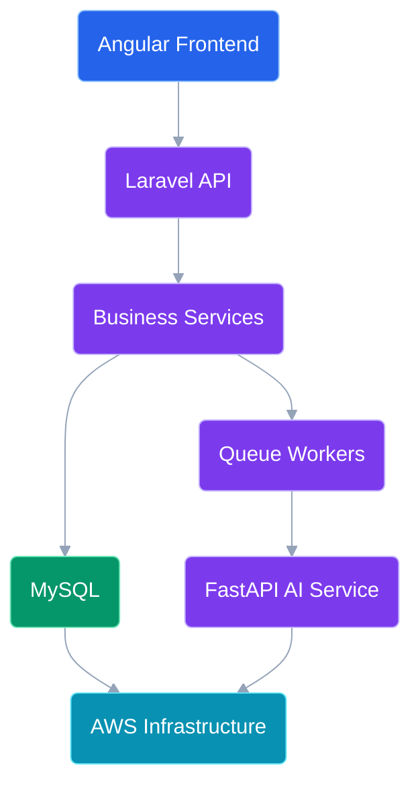

---

# End of Document