# Frontend Development Plan

# CareerIQ AI

---

# Document Information


| Field | Description |
|---|---|
| Project Name | CareerIQ AI |
| Document Type | Frontend Development Plan |
| Version | 3.0 |
| Frontend Framework | Angular 18+ |
| Programming Language | TypeScript |
| Styling Framework | Tailwind CSS |
| UI Component Library | Angular Material |
| Component Architecture | Standalone Components |
| State Management | Angular Signals + RxJS |
| API Communication | Angular HttpClient |
| Testing Tools | Jasmine, Karma, Cypress |
| Deployment | AWS S3 + CloudFront |


---

# Document Purpose


This document defines the frontend architecture and development strategy for CareerIQ AI.


The purpose of this document is to establish:


- Scalable Angular application architecture
- Modern component organization
- State management approach
- API communication strategy
- UI development standards
- Testing practices
- Deployment preparation


This document will guide:


- Frontend implementation
- Code reviews
- Feature development
- Testing activities


---

# 1. Frontend Overview


## 1.1 Introduction


CareerIQ AI frontend is a modern Angular-based Single Page Application (SPA).


The frontend provides an intelligent user interface for:


- Career profile management
- Resume analysis
- Skill intelligence
- Career recommendations
- Learning roadmap tracking
- AI interview preparation


---

# 1.2 Frontend Responsibilities


The frontend application manages three major layers.


## Presentation Layer


Responsible for:


- Pages
- Components
- Forms
- Navigation
- Data visualization


---

## Application Layer


Responsible for:


- User interactions
- State management
- Data transformation
- Business workflows


---

## Communication Layer


Responsible for:


- REST API communication
- Authentication
- Error handling
- Backend integration


---

# 1.3 Frontend Technology Stack


| Layer | Technology |
|---|---|
| Framework | Angular 18+ |
| Language | TypeScript |
| Styling | Tailwind CSS |
| UI Components | Angular Material |
| State Management | Angular Signals + RxJS |
| Forms | Reactive Forms |
| API Client | Angular HttpClient |
| Testing | Jasmine, Karma, Cypress |
| Build Tool | Angular CLI |
| Deployment | AWS S3 + CloudFront |


---

# 2. Angular Architecture


CareerIQ AI follows a modern Angular architecture based on:


- Standalone Components
- Feature-based organization
- Dependency Injection
- Reactive state management
- Lazy-loaded features


---

# 2.1 High-Level Frontend Architecture


```mermaid
%%{init:{
"theme":"base",
"themeVariables":{
"primaryColor":"#2563EB",
"primaryTextColor":"#FFFFFF",
"primaryBorderColor":"#93C5FD",
"lineColor":"#64748B",
"secondaryColor":"#7C3AED",
"tertiaryColor":"#059669"
}
}}%%

flowchart LR

USER["User"]

COMPONENT["Angular Components"]

STATE["State Management<br/>Signals + RxJS"]

SERVICE["Angular Services"]

HTTP["HttpClient"]

API["Laravel REST API"]

AI["FastAPI AI Service"]


USER --> COMPONENT
COMPONENT --> STATE
STATE --> SERVICE
SERVICE --> HTTP
HTTP --> API
API --> AI


classDef blue fill:#2563EB,color:white,stroke:#93C5FD;
classDef purple fill:#7C3AED,color:white,stroke:#C4B5FD;
classDef green fill:#059669,color:white,stroke:#6EE7B7;
classDef orange fill:#D97706,color:white,stroke:#FCD34D;


class USER,COMPONENT,STATE,SERVICE,HTTP blue;
class API purple;
class AI orange;
```

---

# 2.2 Frontend Request Lifecycle


Every user interaction follows:


```
User Action

        ↓

Angular Component

        ↓

State Management

        ↓

Angular Service

        ↓

HTTP Request

        ↓

Backend API

        ↓

State Update

        ↓

UI Refresh
```


---

# 2.3 Layered Frontend Architecture


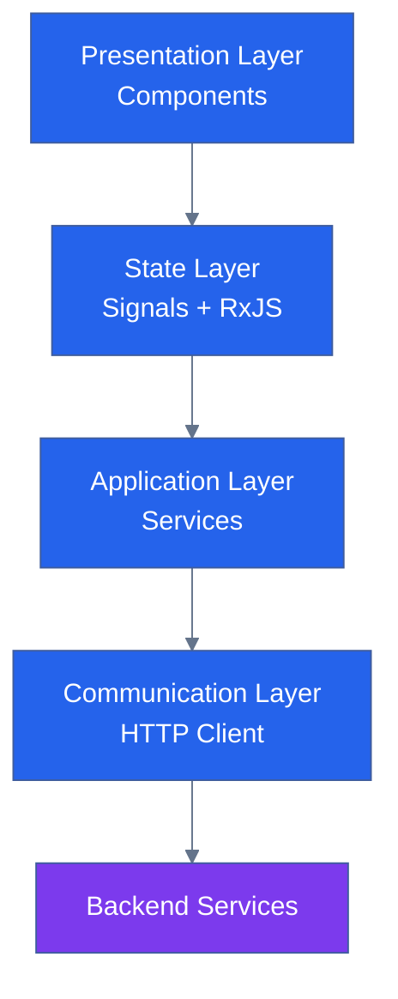

---

# 3. Standalone Component Architecture


Angular 18+ recommends Standalone Components instead of large module-based structures.


CareerIQ AI uses:


```
Standalone Components

+

Feature Organization

+

Lazy Loading
```


Benefits:


- Less boilerplate
- Easier dependency management
- Better scalability
- Cleaner architecture


---

# 3.1 Traditional Angular vs Modern Angular


## Traditional Approach


```
NgModule

    ↓

Components

    ↓

Services

```


Problems:


- More configuration
- Larger module files
- Difficult scaling


---

## Modern Angular Approach


```
Standalone Component

        ↓

Service

        ↓

API

```


Advantages:


- Simpler structure
- Better lazy loading
- Easier testing


---

# 3.2 Standalone Component Example


```typescript
@Component({

selector: 'app-dashboard',

standalone: true,

imports: [

CommonModule

],

templateUrl: './dashboard.html'

})


export class DashboardComponent {


}

```

---

# 3.3 Standalone Component Architecture


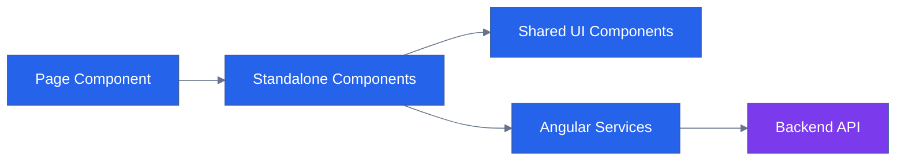

---

# 4. Frontend Folder Structure


CareerIQ AI follows a scalable feature-based folder structure.


```
frontend/

src/

app/

├── core/

│   ├── auth/

│   ├── guards/

│   ├── interceptors/

│   └── services/


├── shared/

│   ├── components/

│   ├── directives/

│   └── pipes/


├── features/

│

│   ├── auth/

│

│   ├── dashboard/

│

│   ├── profile/

│

│   ├── resume/

│

│   ├── skills/

│

│   ├── career/

│

│   └── interview/


├── layouts/


├── models/


├── store/


├── environments/


├── app.routes.ts


└── app.config.ts

```

---

# 4.1 Folder Responsibilities


| Folder | Purpose |
|---|---|
|core|Application-wide services and security|
|shared|Reusable UI components|
|features|Business modules|
|layouts|Page structures|
|models|TypeScript interfaces|
|store|Application state|
|environments|Environment configuration|


---

---

# 5. Feature-Based Architecture


CareerIQ AI follows a feature-based frontend architecture.


Instead of organizing code by technical type:


```
components/

services/

models/

```


the application is organized by business functionality:


```
Authentication

Dashboard

Profile

Resume Intelligence

Skill Intelligence

Career Intelligence

Interview System

```


Benefits:


- Better scalability
- Easier maintenance
- Clear ownership
- Independent feature development


---

# 5.1 Feature Architecture


Each feature contains:


```
feature-name/


├── components/

├── pages/

├── services/

├── models/

├── store/

└── routes/

```


Example:


```
resume/


├── pages/

├── components/

├── resume.service.ts

├── resume.model.ts

└── resume.routes.ts

```


---

# 5.2 Application Feature Map


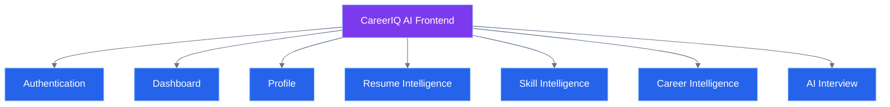

---

# 5.3 Feature Responsibilities


| Feature | Responsibility |
|---|---|
|Authentication|Login, registration, session management|
|Dashboard|Career overview and analytics|
|Profile|Education, experience, projects|
|Resume|Upload and AI analysis|
|Skills|Skill tracking and assessment|
|Career|Career path recommendation|
|Interview|AI interview simulation|


---

# 6. Design System Architecture


CareerIQ AI uses a reusable design system to maintain:


- Visual consistency
- Faster development
- Better user experience
- Easier maintenance


The design system contains:


- Buttons
- Cards
- Forms
- Charts
- Modals
- Notifications
- Loading components


---

# 6.1 Design System Structure


```
shared/


components/


├── button/

├── card/

├── modal/

├── input/

├── dropdown/

├── chart/

├── loader/

└── notification/

```


---

# 6.2 Design System Architecture


```mermaid
%%{init:{
"theme":"base",
"themeVariables":{
"primaryColor":"#059669",
"primaryTextColor":"#FFFFFF",
"primaryBorderColor":"#6EE7B7",
"lineColor":"#64748B"
}
}}%%


flowchart TB


FEATURE["Feature Components"]


SHARED["Shared UI Components"]


DESIGN["Design System"]


TAILWIND["Tailwind CSS"]


MATERIAL["Angular Material"]


FEATURE --> SHARED

SHARED --> DESIGN

DESIGN --> TAILWIND

DESIGN --> MATERIAL


classDef feature fill:#2563EB,color:white;

classDef system fill:#7C3AED,color:white;

classDef style fill:#059669,color:white;


class FEATURE feature;

class SHARED,DESIGN system;

class TAILWIND,MATERIAL style;

```

---

# 6.3 Reusable Component Example


Instead of creating separate components:


```
Resume Card

Skill Card

Career Card

```


CareerIQ AI uses reusable components:


```html
<app-card>

    Resume Analysis

</app-card>

```


Advantages:


- Reduced duplicate code
- Consistent UI
- Faster feature development


---

# 7. Component Architecture


CareerIQ AI follows three component layers.


---

# 7.1 Page Components


Page components handle:


- Routing
- Feature initialization
- Page layout


Examples:


```
DashboardPageComponent

ResumePageComponent

CareerPageComponent

```


---

# 7.2 Container Components


Container components handle:


- Data loading
- State communication
- Business interaction


Example:


```
ResumeAnalysisContainer

```


---

# 7.3 Presentational Components


Presentational components handle:


- UI rendering
- User interaction


Examples:


```
SkillCardComponent

ScoreCardComponent

ProgressBarComponent

```


---

# 7.4 Component Communication Architecture


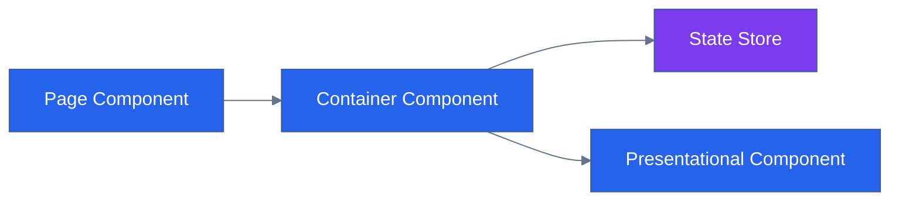

---

# 8. Routing Architecture


Angular Router manages navigation between application features.


Responsibilities:


- URL management
- Feature loading
- Route protection
- Navigation control


---

# 8.1 Route Structure


CareerIQ AI routes:


```
/

├── login

├── register

├── dashboard

├── profile

├── resume

├── skills

├── career

├── roadmap

└── interview

```


---

# 8.2 Routing Flow


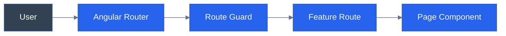

---

# 8.3 Route Configuration Example


```typescript
export const routes: Routes = [

{

path:'dashboard',

loadComponent:()=>


import('./dashboard.component')

.then(

m => m.DashboardComponent

),


canActivate:[AuthGuard]

}

];

```

---

# 9. Lazy Loading Strategy


Large applications should not load all features at startup.


CareerIQ AI uses lazy loading.


---

# 9.1 Lazy Loading Comparison


## Without Lazy Loading


```
Application Start

        ↓

Load Everything

        ↓

Display Page

```


## With Lazy Loading


```
Application Start

        ↓

Load Required Feature

        ↓

Display Page

```


---

# 9.2 Lazy Loading Architecture


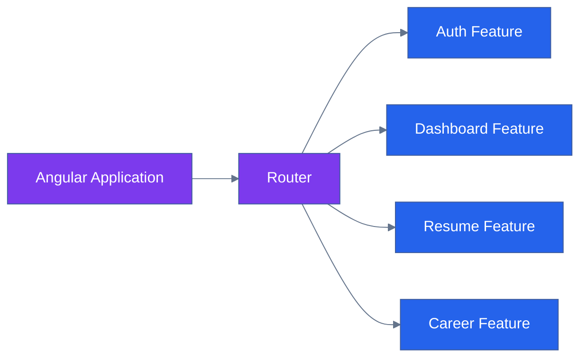

---

# 10. Authentication Flow


CareerIQ AI authentication uses:


```
Angular

+

Laravel Sanctum

+

Secure Authentication Token

```


---

# 10.1 Authentication Sequence


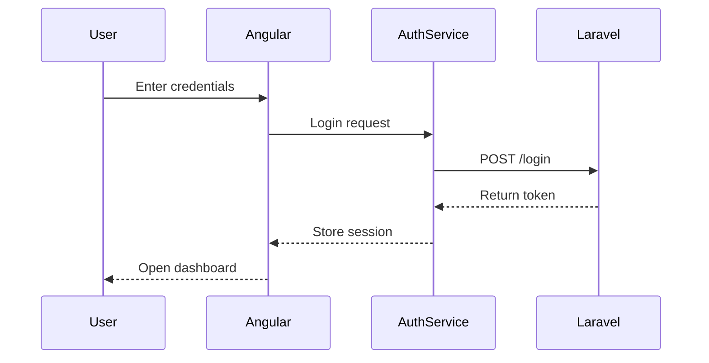

---

# 11. Route Guards


Route guards protect private application pages.


Protected routes:


- Dashboard
- Profile
- Resume Analysis
- Career Roadmap


---

# 11.1 Guard Decision Flow


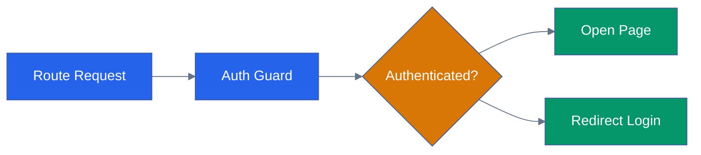

---

# 12. HTTP Interceptors


HTTP interceptors handle common API operations.


Responsibilities:


- Attach authentication tokens
- Handle errors
- Manage loading indicators


---

# 12.1 Interceptor Architecture


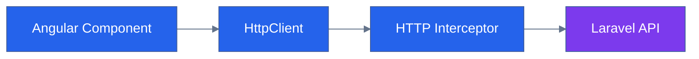

---

---

# 13. State Management Strategy


CareerIQ AI uses a hybrid state management approach:


```
Angular Signals

        +

RxJS Observables

```


The purpose is to maintain:


- Reactive UI updates
- Predictable application state
- Efficient data flow
- Scalable architecture


---

# 13.1 State Management Decision


Different data types use different approaches.


| Data Type | Technology |
|---|---|
|Component Local State|Angular Signals|
|Authentication State|Signal Store|
|UI State|Signals|
|API Streams|RxJS Observables|
|Complex Async Operations|RxJS|


---

# 13.2 State Management Architecture


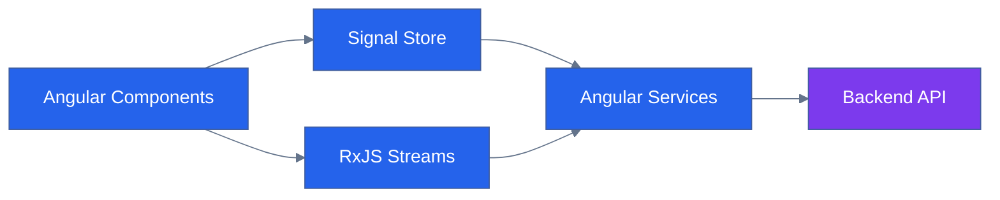

---

# 13.3 Authentication State Example


Authentication information is shared across the application.


Example:


```typescript
@Injectable({

providedIn:'root'

})


export class AuthStore {


currentUser = signal<User | null>(null);


isAuthenticated = computed(

()=> this.currentUser() !== null

);


setUser(user:User){

this.currentUser.set(user);

}


logout(){

this.currentUser.set(null);

}


}

```

---

# 13.4 Dashboard Data Flow


Example:


```
Dashboard Component

        ↓

Dashboard Store

        ↓

Dashboard Service

        ↓

Laravel API

        ↓

Update State

        ↓

Refresh UI

```

---

# 14. Angular Service Layer


Services separate business communication from UI components.


Components should not directly communicate with APIs.


---

# 14.1 Service Architecture


---

# 14.2 Service Structure


```
core/


services/


├── auth.service.ts

├── user.service.ts

├── resume.service.ts

├── skill.service.ts

├── career.service.ts

├── roadmap.service.ts

└── notification.service.ts

```

---

# 14.3 Resume Service Example


```typescript
@Injectable({

providedIn:'root'

})


export class ResumeService {


private apiUrl =
'/api/resumes';


constructor(

private http:HttpClient

){}


uploadResume(file:File){


const formData =
new FormData();


formData.append(

'resume',

file

);


return this.http.post(

this.apiUrl,

formData

);


}


}

```

---

# 15. API Integration


CareerIQ AI communicates with Laravel through REST APIs.


Communication:


```
Angular

    ↓

HttpClient

    ↓

REST API

    ↓

Laravel Backend

    ↓

MySQL / AI Service

```

---

# 15.1 API Communication Flow


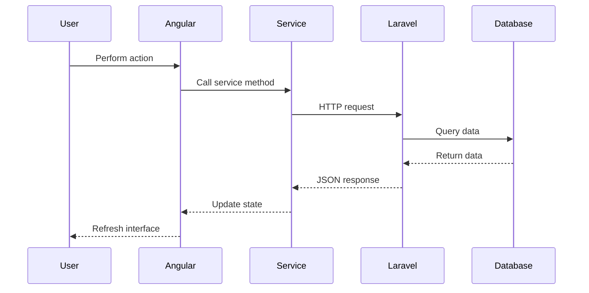

---

# 15.2 API Model Definition


TypeScript interfaces define API contracts.


Example:


```typescript
export interface ResumeAnalysis {


id:number;


score:number;


skills:string[];


recommendations:string[];


}

```

---

# 16. Environment Configuration


Frontend environments separate development and production settings.


Structure:


```
src/


environments/


├── environment.ts

└── environment.prod.ts

```

---

# 16.1 Development Environment


Example:


```typescript
export const environment = {


production:false,


apiUrl:

'http://localhost:8000/api'


};

```

---

# 16.2 Production Environment


Example:


```typescript
export const environment = {


production:true,


apiUrl:

'https://api.careeriq.com'


};

```

---

# 17. Dashboard Architecture


The dashboard is the main workspace of CareerIQ AI.


It provides:


- Career readiness score
- Resume score
- Skill progress
- Learning progress
- Recommendations


---

# 17.1 Dashboard Structure


```
dashboard/


├── pages/


│   └── dashboard-page/


├── components/


│   ├── career-score-card/

│   ├── skill-progress-chart/

│   ├── resume-score-card/

│   ├── roadmap-widget/

│   └── recommendation-card/


└── dashboard.service.ts

```

---

# 17.2 Dashboard Architecture


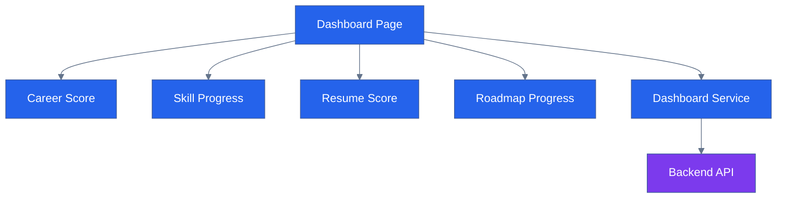

---

# 18. Resume Intelligence Interface


The Resume module provides AI-powered resume analysis.


Features:


- Resume upload
- Resume processing status
- Skill extraction
- Resume scoring
- Improvement suggestions


---

# 18.1 Resume Processing Flow


---

# 19. Career Intelligence Interface


The Career module helps users identify:


- Suitable career paths
- Missing skills
- Required improvements
- Learning plans


---

# 19.1 Career Analysis Flow


---

# 20. Learning Roadmap Interface


The roadmap module visualizes personalized career improvement plans.


Displays:


- Learning tasks
- Completion status
- Milestones
- Progress tracking


---

# 20.1 Roadmap Structure


```
roadmap/


├── pages/


├── roadmap-card/


├── milestone-item/


├── progress-tracker/


└── roadmap.service.ts

```

---

# 21. Reactive Forms


CareerIQ AI uses Angular Reactive Forms.


Benefits:


- Strong validation
- Better testing
- Predictable state
- Dynamic form handling


---

# 21.1 Reactive Form Architecture


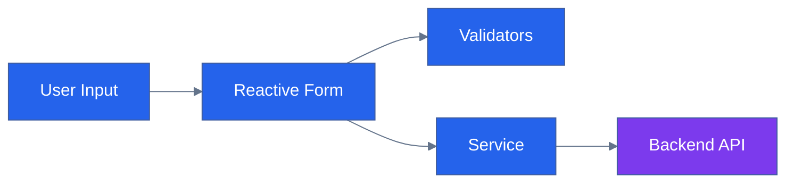

---

# 21.2 Example Reactive Form


```typescript
profileForm = this.fb.group({


name:[

'',

Validators.required

],


email:[

'',

Validators.email

]


});

```

---

---

# 22. Error Handling


A production application must handle errors gracefully.


CareerIQ AI implements centralized frontend error handling for:


- API failures
- Network errors
- Authentication failures
- Validation errors
- Unexpected application errors


---

# 22.1 Error Handling Architecture


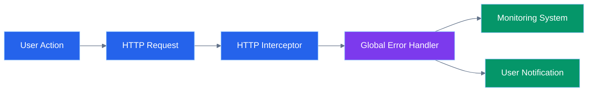

---

# 22.2 Error Response Handling


Frontend converts technical errors into understandable messages.


Example:


```typescript
catchError(error => {


this.notificationService.showError(

"Something went wrong"

);


return throwError(() => error);


})

```

---

# 22.3 Error Categories


| Error Code | Handling |
|---|---|
|401 Unauthorized|Redirect to Login|
|403 Forbidden|Access denied message|
|404 Not Found|Resource unavailable|
|422 Validation Error|Display form errors|
|500 Server Error|Retry notification|


---

# 23. Loading State Management


CareerIQ AI contains AI-based operations that may require processing time.


Examples:


- Resume analysis
- Skill evaluation
- Career recommendation generation


The frontend provides visual feedback during these operations.


---

# 23.1 Loading State Flow


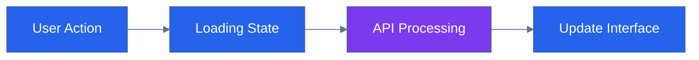

---

# 23.2 Loading Components


Reusable components:


```
shared/components/


├── spinner/

├── skeleton-loader/

├── progress-bar/

└── ai-processing-loader/

```

---

# 24. Performance Optimization


CareerIQ AI focuses on fast and responsive user experience.


Optimization techniques:


- Lazy loading
- Code splitting
- OnPush change detection
- Angular Signals
- Bundle optimization
- Image optimization


---

# 24.1 Performance Architecture


```mermaid
%%{init:{
"theme":"base",
"themeVariables":{
"primaryColor":"#2563EB",
"primaryTextColor":"#FFFFFF",
"lineColor":"#64748B"
}
}}%%


flowchart LR


APP["Angular Application"]

LAZY["Lazy Loading"]

CACHE["Browser Cache"]

OPT["Rendering Optimization"]

USER["Fast User Experience"]


APP --> LAZY

APP --> CACHE

APP --> OPT

LAZY --> USER

CACHE --> USER

OPT --> USER


classDef frontend fill:#2563EB,color:white;

classDef output fill:#059669,color:white;


class APP,LAZY,CACHE,OPT frontend;

class USER output;

```

---

# 24.2 Angular Optimization Techniques


## OnPush Change Detection


Reduces unnecessary component rendering.


Example:


```typescript
@Component({

changeDetection:

ChangeDetectionStrategy.OnPush

})

```

---

## TrackBy Functions


Improves list rendering performance.


Example:


```typescript
trackById(

index:number,

item:any

){

return item.id;

}

```

---

# 25. Frontend Security Practices


Frontend security works together with backend security.


CareerIQ AI implements:


- Protected routes
- Secure authentication
- Input validation
- XSS protection
- HTTPS communication
- Secure API requests


---

# 25.1 Security Architecture


```mermaid
%%{init:{
"theme":"base",
"themeVariables":{
"primaryColor":"#2563EB",
"primaryTextColor":"#FFFFFF",
"lineColor":"#64748B"
}
}}%%


flowchart LR


USER["User"]

ANGULAR["Angular Security Layer"]

TOKEN["Authentication Token"]

BACKEND["Laravel Security Layer"]


USER --> ANGULAR

ANGULAR --> TOKEN

TOKEN --> BACKEND


classDef frontend fill:#2563EB,color:white;

classDef backend fill:#7C3AED,color:white;


class USER,ANGULAR,TOKEN frontend;

class BACKEND backend;

```

---

# 25.2 XSS Prevention


Angular provides built-in protection against:


```
Cross-Site Scripting (XSS)

```


Practices:


- Avoid unsafe HTML rendering
- Sanitize external content
- Avoid direct DOM manipulation


---

# 26. Accessibility


CareerIQ AI follows accessibility principles to provide an inclusive experience.


---

# 26.1 Accessibility Practices


Implemented:


- Semantic HTML
- Keyboard navigation
- Screen reader support
- Proper labels
- Color contrast
- Alternative text


---

# 26.2 Accessibility Testing


Tools:


```
Google Lighthouse

+

Axe DevTools

+

Angular Accessibility Rules

```

---

# 27. Monitoring and Error Tracking


Production systems require continuous monitoring.


CareerIQ AI uses:


- Error tracking
- Performance monitoring
- Application health monitoring


---

# 27.1 Monitoring Architecture


```mermaid
%%{init:{
"theme":"base",
"themeVariables":{
"primaryColor":"#0891B2",
"primaryTextColor":"#FFFFFF",
"lineColor":"#64748B"
}
}}%%


flowchart LR


USER["User Browser"]

ANGULAR["Angular Application"]

ERROR["Error Handler"]

MONITOR["Monitoring Service"]

CLOUD["Cloud Monitoring"]


USER --> ANGULAR

ANGULAR --> ERROR

ERROR --> MONITOR

MONITOR --> CLOUD


classDef frontend fill:#2563EB,color:white;

classDef cloud fill:#0891B2,color:white;


class USER,ANGULAR,ERROR frontend;

class MONITOR,CLOUD cloud;

```

---

# 28. Frontend Testing Strategy


Testing ensures reliability and maintainability.


Testing levels:


```
Unit Testing

        ↓

Component Testing

        ↓

End-to-End Testing

```

---

# 28.1 Testing Architecture


```mermaid
%%{init:{
"theme":"base",
"themeVariables":{
"primaryColor":"#2563EB",
"primaryTextColor":"#FFFFFF",
"lineColor":"#64748B"
}
}}%%


flowchart LR


CODE["Angular Code"]

UNIT["Unit Tests"]

COMPONENT["Component Tests"]

E2E["Cypress E2E Tests"]

CI["CI Pipeline"]


CODE --> UNIT

CODE --> COMPONENT

CODE --> E2E


UNIT --> CI

COMPONENT --> CI

E2E --> CI


classDef code fill:#7C3AED,color:white;

classDef test fill:#2563EB,color:white;

classDef ci fill:#059669,color:white;


class CODE code;

class UNIT,COMPONENT,E2E test;

class CI ci;

```

---

# 28.2 Testing Tools


| Testing Type | Tool |
|---|---|
|Unit Testing|Jasmine|
|Component Testing|Angular Testing Library|
|Browser Testing|Karma|
|E2E Testing|Cypress|
|Performance Testing|Lighthouse|


---

# 29. CI/CD Pipeline


Frontend deployment is automated using GitHub Actions.


---

# 29.1 Frontend Deployment Flow


```mermaid
%%{init:{
"theme":"base",
"themeVariables":{
"primaryColor":"#2563EB",
"primaryTextColor":"#FFFFFF",
"lineColor":"#64748B"
}
}}%%


flowchart LR


PUSH["Git Push"]

INSTALL["Install Dependencies"]

TEST["Run Tests"]

BUILD["Angular Build"]

S3["AWS S3"]

CDN["CloudFront"]

USER["Users"]


PUSH --> INSTALL

INSTALL --> TEST

TEST --> BUILD

BUILD --> S3

S3 --> CDN

CDN --> USER


classDef frontend fill:#2563EB,color:white;

classDef cloud fill:#0891B2,color:white;

classDef output fill:#059669,color:white;


class PUSH,INSTALL,TEST,BUILD frontend;

class S3,CDN cloud;

class USER output;

```

---

# 30. Coding Standards


CareerIQ AI follows:


```
Angular Style Guide

+

TypeScript Best Practices

+

Clean Code Principles

```

---

# 30.1 Naming Convention


Components:


```
dashboard.component.ts

resume-card.component.ts

skill-chart.component.ts

```


Services:


```
auth.service.ts

resume.service.ts

career.service.ts

```


Interfaces:


```
user.model.ts

resume.model.ts

career.model.ts

```

---

# 30.2 Code Quality Rules


The project follows:


- Strict TypeScript mode
- ESLint rules
- Consistent formatting
- Reusable components
- Clear naming conventions


---

# 31. Frontend Development Roadmap


## Phase 1: Project Setup


Tasks:


- Initialize Angular project
- Configure Tailwind CSS
- Setup routing
- Configure environments


---

## Phase 2: Authentication


Develop:


- Login
- Registration
- Authentication service
- Route protection


---

## Phase 3: User Profile


Develop:


- Personal information
- Education
- Experience
- Projects


---

## Phase 4: Dashboard


Develop:


- Career score
- Skill visualization
- Progress tracking


---

## Phase 5: Resume Intelligence


Develop:


- Resume upload
- AI processing
- Analysis dashboard


---

## Phase 6: Career Intelligence


Develop:


- Career selection
- Skill gap analysis
- Learning roadmap


---

## Phase 7: Advanced Features


Develop:


- AI interview simulator
- Notifications
- Analytics
- PWA support


---

# Final Frontend Architecture


```mermaid
%%{init:{
"theme":"base",
"themeVariables":{
"primaryColor":"#2563EB",
"primaryTextColor":"#FFFFFF",
"lineColor":"#64748B"
}
}}%%


flowchart TB


USER["User"]


ANGULAR["Angular Frontend"]


STATE["Signals + RxJS"]


SERVICE["Angular Services"]


API["Laravel API"]


DATABASE["MySQL Database"]


AI["FastAPI AI Service"]


CLOUD["AWS Cloud"]


USER --> ANGULAR

ANGULAR --> STATE

STATE --> SERVICE

SERVICE --> API

API --> DATABASE

API --> AI

ANGULAR --> CLOUD


classDef frontend fill:#2563EB,color:white;

classDef backend fill:#7C3AED,color:white;

classDef database fill:#059669,color:white;

classDef cloud fill:#0891B2,color:white;


class USER,ANGULAR,STATE,SERVICE frontend;

class API,AI backend;

class DATABASE database;

class CLOUD cloud;

```

---

 Document