# Test Plan

# CareerIQ AI


---

# Document Information


| Field | Description |
|---|---|
| Project Name | CareerIQ AI |
| Document Type | Software Test Plan |
| Version | 2.0 |
| Testing Scope | Frontend, Backend, AI Engine |
| Testing Approach | Automated + Manual Testing |
| Frontend Testing | Jasmine, Karma, Cypress |
| Backend Testing | PHPUnit, Laravel Testing |
| API Testing | Postman, Newman |
| Performance Testing | Apache JMeter |
| Security Testing | OWASP Testing |
| CI/CD Testing | GitHub Actions |


---

# Document Purpose


This document defines the complete testing strategy for CareerIQ AI.


The purpose is to ensure:


- Functional correctness
- System reliability
- AI output quality
- Application security
- Performance stability
- Maintainable software quality


This document covers testing for:


```
Frontend Application

        +

Laravel Backend

        +

FastAPI AI Engine

        +

Database Layer

```


---

# 1. Testing Overview


## 1.1 Introduction


CareerIQ AI is an AI-powered career intelligence platform.


Due to its multi-layer architecture, testing must validate:


- User interface behavior
- API communication
- Database operations
- AI-generated outputs
- System performance


The testing strategy follows a layered approach:


```
Component Testing

        ↓

Integration Testing

        ↓

System Testing

        ↓

Acceptance Testing

```


---

# 1.2 Testing Scope


The testing scope includes:


## Frontend Testing


Testing:


- Angular components
- Forms
- Routing
- State management
- User interactions
- Responsive UI


---

## Backend Testing


Testing:


- REST APIs
- Authentication
- Authorization
- Business logic
- Database operations


---

## AI Engine Testing


Testing:


- Input processing
- Resume analysis
- Skill extraction
- Career recommendations
- Response quality


---

# 1.3 Testing Scope Architecture


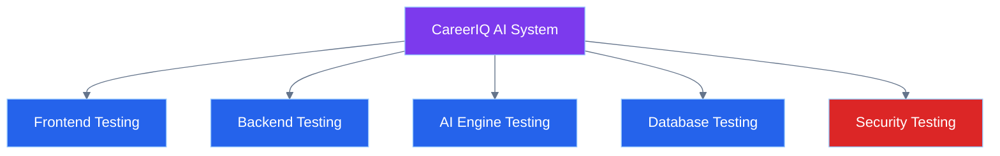

---

# 2. Quality Objectives


The primary quality goals are:


| Quality Area | Objective |
|---|---|
|Correctness|System produces expected results|
|Reliability|System works consistently|
|Security|User data remains protected|
|Performance|System responds efficiently|
|Usability|Users can easily operate the platform|
|Maintainability|Code remains testable and scalable|
|AI Quality|Recommendations are meaningful and accurate|


---

# 2.1 Quality Goals


CareerIQ AI aims for:


```
High Test Coverage

+

Low Defect Rate

+

Reliable AI Results

+

Fast Response Time

+

Secure User Experience

```


---

# 3. Testing Strategy


CareerIQ AI follows a comprehensive testing strategy combining:


- Manual testing
- Automated testing
- Continuous testing
- Risk-based testing


---

# 3.1 Testing Approach


---

# 3.2 Testing Principles


CareerIQ AI follows:


## Early Testing


Testing begins during development.


## Continuous Testing


Tests run automatically through CI/CD.


## Risk-Based Testing


Critical features receive higher testing priority.


## Automation First


Repeated tests are automated whenever possible.


---

# 4. Test Architecture


CareerIQ AI uses a multi-layer testing architecture.


Testing is performed across:


```
Frontend Layer

        ↓

Backend Layer

        ↓

AI Layer

        ↓

Infrastructure Layer

```


---

# 4.1 Complete Testing Architecture


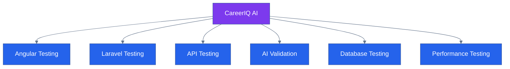

---

# 5. Testing Pyramid


CareerIQ AI follows the testing pyramid model.


The majority of tests should be fast and automated.


---

# 5.1 Testing Pyramid


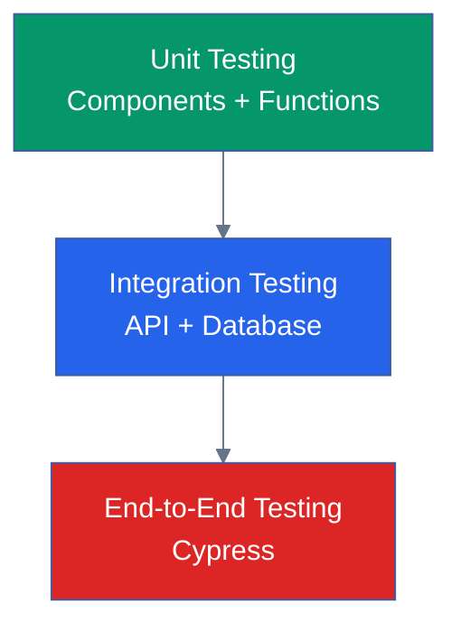

---

# 5.2 Testing Distribution


Recommended distribution:


| Testing Type | Percentage |
|---|---|
|Unit Testing|70%|
|Integration Testing|20%|
|End-to-End Testing|10%|


---

# 6. Test Environment


CareerIQ AI uses multiple environments for reliable testing.


---

# 6.1 Environment Strategy


---

# 6.2 Test Environment Components


| Component | Technology |
|---|---|
|Frontend|Angular Test Environment|
|Backend|Laravel Testing Environment|
|Database|MySQL Test Database|
|AI Service|FastAPI Testing Instance|
|Automation|GitHub Actions|


---

# 7. Testing Levels


CareerIQ AI follows four major testing levels.


---

# 7.1 Unit Testing


Purpose:


- Test individual functions
- Verify isolated components
- Detect early defects


Examples:


```
Angular Component Test

Laravel Service Test

AI Utility Function Test

```


---

# 7.2 Integration Testing


Purpose:


- Verify communication between modules


Examples:


```
Frontend + API

Laravel + Database

Laravel + FastAPI AI

```


---

# 7.3 System Testing


Purpose:


Validate the complete application workflow.


Examples:


```
User Registration

Resume Upload

AI Analysis

Career Recommendation

```


---

# 7.4 Acceptance Testing


Purpose:


Ensure the system satisfies user requirements.


Performed by:


- Project stakeholders
- End users
- QA team


---

---

# 8. Functional Testing Strategy


Functional testing verifies that CareerIQ AI features work according to requirements.


The main objective is to validate:


- User workflows
- Business rules
- System responses
- Feature correctness


---

# 8.1 Functional Testing Scope


Functional testing covers:


| Module | Testing Focus |
|---|---|
|Authentication|Registration, login, logout|
|Profile|User information management|
|Resume Intelligence|Upload, analysis, reports|
|Skills|Skill extraction and tracking|
|Career Engine|Recommendations|
|Roadmap|Learning progress|
|Interview System|AI interview workflow|


---

# 8.2 Functional Testing Architecture


---

# 9. Authentication Testing


Authentication is a critical security feature.


Testing includes:


- Registration
- Login
- Logout
- Password management
- Session handling
- Token validation


---

# 9.1 Login Test Scenarios


## Positive Test Cases


| Test Case | Expected Result |
|---|---|
|Valid email and password|User successfully logs in|
|Correct credentials with active account|Dashboard displayed|
|Remember session enabled|Session maintained|


---

## Negative Test Cases


| Test Case | Expected Result |
|---|---|
|Wrong password|Error message displayed|
|Invalid email format|Validation error|
|Empty fields|Required field message|
|Inactive account|Access denied|


---

# 9.2 Authentication Flow Testing


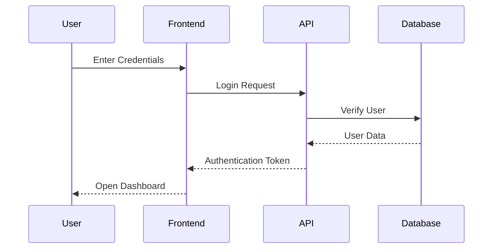

---

# 10. User Profile Testing


The profile module stores user career information.


Testing areas:


- Personal information
- Education history
- Experience
- Skills
- Projects


---

# 10.1 Profile Test Scenario


Scenario:


```
User updates education information.


Given:

User is logged in.


When:

User changes university information.


Then:

Updated data should be stored.


And:

Profile page should show new information.

```


---

# 10.2 Profile Validation Tests


| Input | Expected Result |
|---|---|
|Valid education details|Data saved|
|Missing required field|Validation error|
|Invalid date format|Error displayed|
|Duplicate information|Handled correctly|


---

# 11. Resume Intelligence Testing


Resume Intelligence is one of the core AI features of CareerIQ AI.


Testing focuses on:


- File upload
- Resume processing
- Data extraction
- AI analysis
- Report generation


---

# 11.1 Resume Processing Test Flow


---

# 11.2 Resume Upload Test Cases


| Test Case | Expected Result |
|---|---|
|Upload PDF resume|File accepted|
|Upload DOCX resume|File processed|
|Upload unsupported format|Error message|
|Upload corrupted file|Rejected|
|Upload oversized file|Validation error|
|Upload empty file|Rejected|


---

# 11.3 AI Resume Analysis Tests


The AI output should be tested for:


- Extracted skills
- Experience recognition
- Education extraction
- Recommendation quality


Example:


```
Input:

Software Engineer Resume


Expected:

Programming skills identified

Relevant experience extracted

Career suggestions generated

```


---

# 12. Career Recommendation Testing


The Career Engine recommends suitable career paths based on user information.


Testing validates:


- Recommendation relevance
- Skill matching
- Learning roadmap generation


---

# 12.1 Career Recommendation Flow


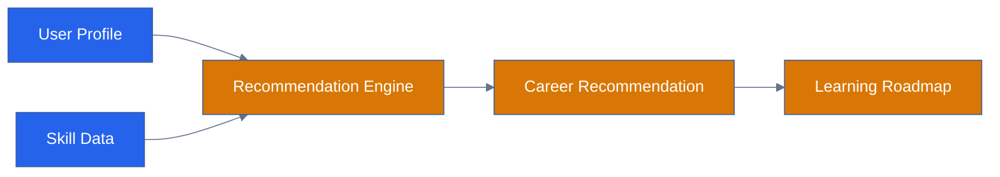

---

# 12.2 Career Recommendation Test Cases


| Scenario | Expected Result |
|---|---|
|Complete profile|Relevant careers suggested|
|Missing skills|Skill gaps identified|
|Different career goal|Recommendation changes|
|No experience|Entry-level suggestions provided|


---

# 13. Frontend Testing Strategy


Frontend testing validates Angular application behavior.


Testing includes:


- Component testing
- UI testing
- Form testing
- Routing testing
- State testing


---

# 13.1 Angular Testing Architecture


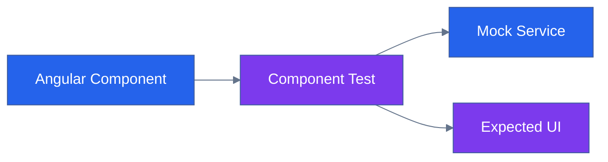

---

# 13.2 Frontend Testing Areas


| Area | Testing |
|---|---|
|Components|Rendering and interaction|
|Forms|Validation and submission|
|Routing|Navigation behavior|
|State|Data updates|
|UI|Responsive behavior|


---

# 14. Backend Testing Strategy


Backend testing validates Laravel application behavior.


Testing includes:


- Controllers
- Services
- Models
- APIs
- Database operations


---

# 14.1 Laravel Testing Flow


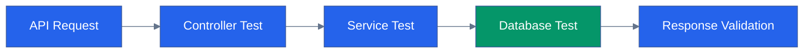

---

# 15. API Testing Strategy


API testing ensures communication between frontend and backend works correctly.


Tools:


- Postman
- Newman
- Automated API tests


---

# 15.1 API Testing Flow


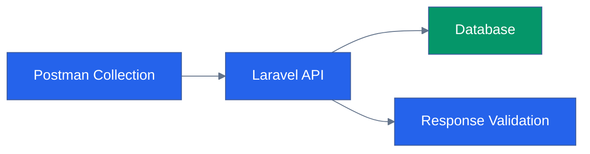

---

---

# 16. Database Testing Strategy


Database testing ensures that stored information is accurate, consistent, and secure.


CareerIQ AI database testing covers:


- Data integrity
- Relationships
- Transactions
- Migration testing
- Query performance


---

# 16.1 Database Testing Architecture


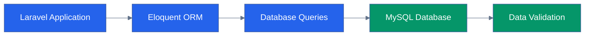

---

# 16.2 Database Testing Areas


| Area | Testing Objective |
|---|---|
|Schema Testing|Verify tables and relationships|
|Migration Testing|Ensure database changes work correctly|
|Constraint Testing|Validate foreign keys and restrictions|
|CRUD Testing|Verify create, read, update, delete operations|
|Performance Testing|Check query efficiency|


---

# 16.3 Database Test Examples


## User-Resume Relationship


Scenario:


```
Given:

A user account exists.


When:

A resume is uploaded.


Then:

Resume record should be linked to the correct user.

```


---

## Data Integrity Test


| Test | Expected Result |
|-|-|
|Delete user|Related data handled correctly|
|Duplicate email|Rejected|
|Invalid foreign key|Database error prevented|


---

# 17. AI Model Testing Strategy


AI testing is a critical part of CareerIQ AI.


Unlike traditional software, AI systems must validate:


- Input quality
- Output accuracy
- Model consistency
- Recommendation relevance


---

# 17.1 AI Testing Architecture


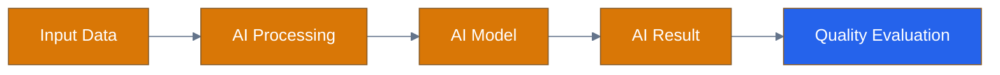

---

# 17.2 AI Testing Categories


## Input Validation Testing


Testing:


- Empty resume
- Corrupted document
- Unsupported format
- Incomplete profile
- Incorrect user information


---

## Output Validation Testing


Testing:


- Skill extraction accuracy
- Career recommendation relevance
- Learning roadmap quality
- Response consistency


---

# 17.3 AI Evaluation Metrics


| Metric | Purpose |
|---|---|
|Precision|Measures correctness of predictions|
|Recall|Measures coverage of relevant results|
|F1 Score|Balances precision and recall|
|Latency|Measures response time|
|Consistency|Checks output stability|


---

# 18. Resume Intelligence Testing


Resume Intelligence converts uploaded documents into career insights.


Testing focuses on:


- Document processing
- Information extraction
- Skill identification
- AI recommendations


---

# 18.1 Resume AI Testing Pipeline


---

# 18.2 Resume Test Scenarios


## Valid Resume


Input:


```
Software Engineer Resume

5 years experience

Python + Django skills

```


Expected:


```
Skills detected

Experience extracted

Relevant career paths generated

```


---

## Edge Cases


| Scenario | Expected Behavior |
|---|---|
|Blank resume|Reject request|
|Image-only PDF|Request OCR processing|
|Very large file|Show size limitation|
|Multiple languages|Handle or notify limitation|


---

# 19. Career Recommendation Testing


The Career Engine generates personalized career suggestions.


Testing validates:


- Recommendation accuracy
- Skill gap identification
- Roadmap generation


---

# 19.1 Recommendation Evaluation Flow


---

# 19.2 Recommendation Test Cases


| Scenario | Expected Result |
|---|---|
|Matching skills|Relevant career suggested|
|Missing skills|Skill gap displayed|
|Different goal selected|Recommendations updated|
|Insufficient data|Request more information|


---

# 20. Security Testing Strategy


Security testing ensures protection of:


- User information
- Authentication tokens
- Uploaded files
- API endpoints


---

# 20.1 Security Testing Architecture


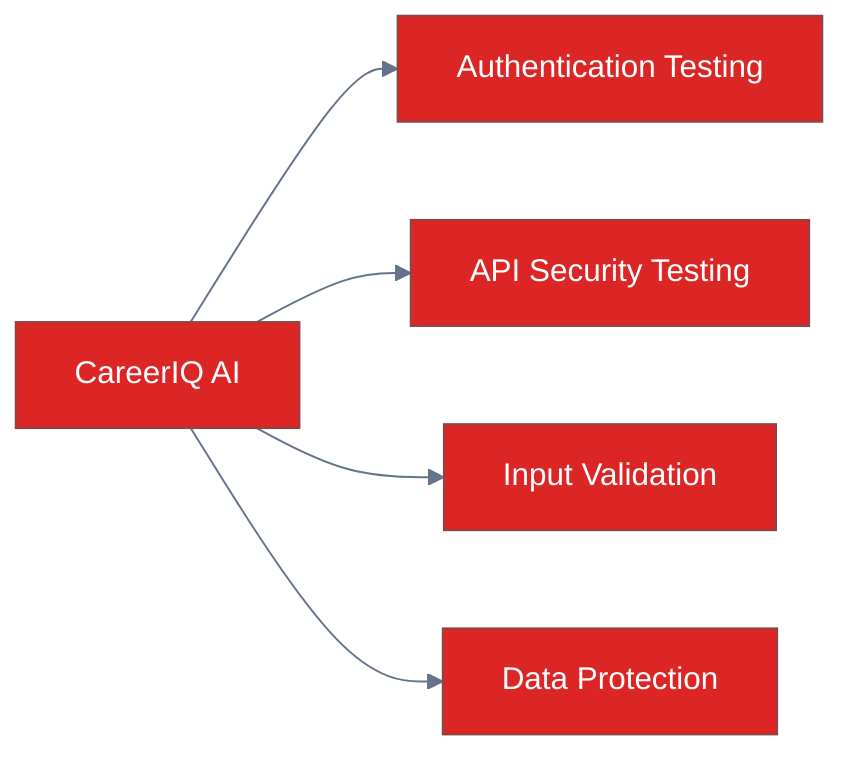

---

# 20.2 OWASP Security Testing


CareerIQ AI follows OWASP security principles.


| Vulnerability | Testing Approach |
|---|---|
|SQL Injection|Malicious input testing|
|Cross-Site Scripting|Script injection testing|
|Broken Authentication|Token validation testing|
|CSRF|Request verification|
|File Upload Vulnerability|Malicious file testing|
|Access Control Issues|Permission testing|


---

# 20.3 File Upload Security Testing


Resume upload requires:


Testing:


- File extension validation
- File size validation
- Malware scanning
- Storage permission testing


---

# 21. Performance Testing Strategy


Performance testing validates system behavior under different workloads.


Testing areas:


- Response time
- Throughput
- Concurrent users
- Resource usage


---

# 21.1 Performance Testing Architecture


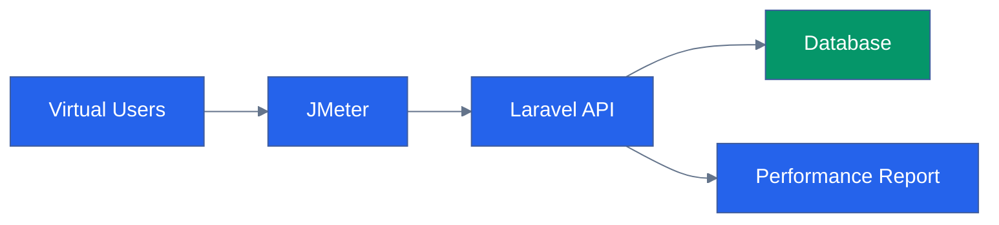

---

# 21.2 Performance Test Types


## Load Testing


Purpose:


Verify normal expected traffic.


Example:


```
1000 users accessing dashboard simultaneously

```


---

## Stress Testing


Purpose:


Identify system breaking points.


Example:


```
Increasing users until failure occurs

```


---

## Endurance Testing


Purpose:


Check long-term stability.


Example:


```
Running application workload for several hours

```


---

# 21.3 Performance Metrics


| Metric | Target |
|---|---|
|API Response Time|Fast response|
|Error Rate|Minimum failures|
|CPU Usage|Within acceptable range|
|Memory Usage|Stable|
|Database Response|Optimized|


---

---

# 22. Test Automation Strategy


Automation is an essential part of CareerIQ AI testing.


The objective is to:


- Reduce repetitive manual testing
- Increase test reliability
- Enable continuous testing
- Detect defects early


---

# 22.1 Automation Testing Architecture


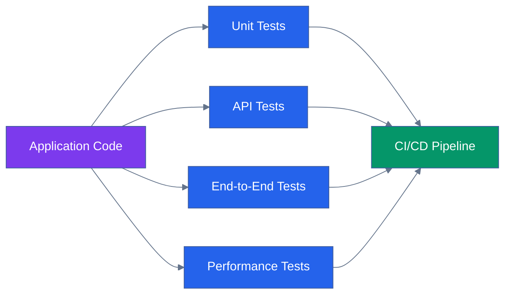

---

# 22.2 Automation Tools


| Testing Area | Tool |
|---|---|
|Frontend Unit Testing|Jasmine|
|Angular Component Testing|Karma|
|Frontend E2E Testing|Cypress|
|Backend Testing|PHPUnit|
|API Automation|Postman + Newman|
|Performance Testing|JMeter|
|Security Testing|OWASP ZAP|
|CI Automation|GitHub Actions|


---

# 22.3 Automated Testing Workflow


```
Developer Commit

        ↓

GitHub Actions Trigger

        ↓

Install Dependencies

        ↓

Run Automated Tests

        ↓

Generate Reports

        ↓

Deploy If Successful

```

---

# 23. Test Case Management


Test cases provide a structured way to verify system behavior.


Each test case contains:


- Test ID
- Feature name
- Test scenario
- Test steps
- Expected result
- Actual result
- Status


---

# 23.1 Test Case Template


| Field | Description |
|---|---|
|Test ID|Unique identifier|
|Module|Feature being tested|
|Scenario|Testing objective|
|Precondition|Required setup|
|Steps|Execution procedure|
|Expected Result|Desired outcome|
|Actual Result|Observed behavior|
|Status|Pass/Fail|


---

# 23.2 Example Test Case


## TC-RES-001: Resume Upload


| Field | Description |
|---|---|
|Module|Resume Intelligence|
|Scenario|Upload valid resume|
|Precondition|User is authenticated|
|Steps|Upload PDF file|
|Expected Result|Resume stored and processing starts|
|Status|Pass|


---

# 24. Requirement Traceability Matrix


Requirement Traceability ensures that every requirement has corresponding tests.


---

# 24.1 Traceability Example


| Requirement ID | Requirement | Test Cases | Test Type |
|---|---|---|---|
|REQ-AUTH-01|User Login|TC-AUTH-001 to TC-AUTH-005|Functional|
|REQ-RES-01|Resume Upload|TC-RES-001 to TC-RES-008|Functional|
|REQ-AI-01|AI Resume Analysis|TC-AI-001 to TC-AI-010|AI Validation|
|REQ-CAR-01|Career Recommendation|TC-CAR-001 to TC-CAR-006|Integration|


---

# 24.2 Requirement Validation Flow


---

# 25. Bug Management Lifecycle


A structured bug lifecycle ensures efficient defect resolution.


---

# 25.1 Bug Lifecycle Flow


```mermaid
%%{init:{
"theme":"base",
"themeVariables":{
"primaryColor":"#DC2626",
"primaryTextColor":"#FFFFFF",
"lineColor":"#64748B"
}
}}%%


flowchart LR


FOUND["Bug Found"]


REPORT["Bug Report"]


ASSIGN["Developer Assigned"]


FIX["Fix Implemented"]


RETEST["QA Retesting"]


CLOSE["Bug Closed"]


FOUND --> REPORT

REPORT --> ASSIGN

ASSIGN --> FIX

FIX --> RETEST

RETEST --> CLOSE


classDef bug fill:#DC2626,color:white;


class FOUND,REPORT,ASSIGN,FIX,RETEST,CLOSE bug;

```

---

# 25.2 Bug Severity Classification


| Severity | Example |
|---|---|
|Critical|Application crash|
|High|Login failure|
|Medium|Incorrect recommendation|
|Low|UI inconsistency|


---

# 26. CI/CD Testing Pipeline


Testing is integrated into the deployment pipeline.


---

# 26.1 Continuous Testing Architecture


```mermaid
%%{init:{
"theme":"base",
"themeVariables":{
"primaryColor":"#2563EB",
"primaryTextColor":"#FFFFFF",
"lineColor":"#64748B"
}
}}%%


flowchart LR


COMMIT["Code Commit"]


BUILD["Build Application"]


TEST["Automated Tests"]


REPORT["Test Report"]


DEPLOY["Deployment"]


COMMIT --> BUILD

BUILD --> TEST

TEST --> REPORT

REPORT --> DEPLOY


classDef process fill:#2563EB,color:white;

classDef output fill:#059669,color:white;


class COMMIT,BUILD,TEST process;

class REPORT,DEPLOY output;

```

---

# 26.2 CI Pipeline Testing Steps


```
1. Checkout Code

2. Install Dependencies

3. Run Unit Tests

4. Run Integration Tests

5. Run Security Checks

6. Generate Reports

7. Deploy Application

```

---

# 27. Quality Metrics


Quality metrics help measure software health.


---

# 27.1 Test Coverage Metrics


| Metric | Purpose |
|---|---|
|Code Coverage|Percentage of tested code|
|Requirement Coverage|Requirements validated|
|Test Pass Rate|Successful tests percentage|
|Automation Coverage|Automated test percentage|


---

# 27.2 Defect Metrics


| Metric | Purpose |
|---|---|
|Defect Density|Defects per module|
|Defect Leakage|Issues found after release|
|Resolution Time|Average fixing duration|
|Regression Rate|Repeated failures|


---

# 27.3 Performance Metrics


| Metric | Purpose |
|---|---|
|Response Time|System speed|
|Throughput|Requests handled|
|Error Rate|Failure percentage|
|Resource Usage|CPU and memory usage|


---

# 28. Testing Tools Summary


| Category | Tools |
|---|---|
|Frontend Testing|Jasmine, Karma, Cypress|
|Backend Testing|PHPUnit|
|API Testing|Postman, Newman|
|Database Testing|Laravel Database Testing|
|Performance Testing|JMeter|
|Security Testing|OWASP ZAP|
|CI/CD|GitHub Actions|


---

# 29. Final Testing Architecture


```mermaid
%%{init:{
"theme":"base",
"themeVariables":{
"primaryColor":"#2563EB",
"primaryTextColor":"#FFFFFF",
"lineColor":"#64748B"
}
}}%%


flowchart TB


SYSTEM["CareerIQ AI"]


FRONTEND["Angular Testing"]

BACKEND["Laravel Testing"]

API["API Testing"]

DATABASE["Database Testing"]

AI["AI Validation"]

SECURITY["Security Testing"]

PERFORMANCE["Performance Testing"]

CI["Continuous Testing Pipeline"]


SYSTEM --> FRONTEND

SYSTEM --> BACKEND

SYSTEM --> API

SYSTEM --> DATABASE

SYSTEM --> AI

SYSTEM --> SECURITY

SYSTEM --> PERFORMANCE


FRONTEND --> CI

BACKEND --> CI

API --> CI

DATABASE --> CI

AI --> CI

SECURITY --> CI

PERFORMANCE --> CI


classDef system fill:#7C3AED,color:white;

classDef testing fill:#2563EB,color:white;

classDef pipeline fill:#059669,color:white;


class SYSTEM system;

class FRONTEND,BACKEND,API,DATABASE,AI,SECURITY,PERFORMANCE testing;

class CI pipeline;

```

---

