# Deployment Plan

# CareerIQ AI


---

# Document Information


| Field | Description |
|---|---|
| Project Name | CareerIQ AI |
| Document Type | Deployment Plan |
| Version | 2.0 |
| Deployment Strategy | Cloud-Based Production Deployment |
| Cloud Platform | Amazon Web Services (AWS) |
| Containerization | Docker |
| Infrastructure Management | Terraform |
| CI/CD Platform | GitHub Actions |
| Backend Deployment | Laravel |
| Frontend Deployment | Angular |
| AI Service Deployment | FastAPI |
| Database | MySQL RDS |


---

# Document Purpose


This document defines the deployment strategy for CareerIQ AI.


The purpose is to describe:


- Production infrastructure
- Cloud architecture
- Deployment workflow
- Environment management
- Security configuration
- Monitoring strategy
- Scaling approach
- Disaster recovery


The document provides guidance for:


- Developers
- DevOps engineers
- System administrators
- Future maintenance teams


---

# 1. Deployment Overview


## 1.1 Introduction


CareerIQ AI is a full-stack AI-powered career intelligence platform.


The system consists of:


```
Angular Frontend

        +

Laravel Backend API

        +

FastAPI AI Engine

        +

MySQL Database

        +

Cloud Infrastructure

```


The deployment architecture is designed to provide:


- High availability
- Scalability
- Security
- Maintainability
- Automated delivery


---

# 1.2 Deployment Goals


The main deployment objectives are:


| Goal | Description |
|---|---|
|Reliability|Ensure stable application availability|
|Scalability|Support increasing users and workloads|
|Security|Protect user data and services|
|Automation|Reduce manual deployment effort|
|Maintainability|Enable easy updates and monitoring|
|Performance|Provide fast user experience|


---

# 1.3 Deployment Philosophy


CareerIQ AI follows a modern DevOps approach:


```
Develop

   ↓

Test

   ↓

Build

   ↓

Deploy

   ↓

Monitor

   ↓

Improve

```


---

# 2. Production Deployment Strategy


CareerIQ AI uses a cloud-native deployment strategy.


The deployment approach includes:


- Containerized services
- Automated CI/CD pipeline
- Infrastructure as Code
- Managed database services
- Continuous monitoring


---

# 2.1 Production Architecture Overview


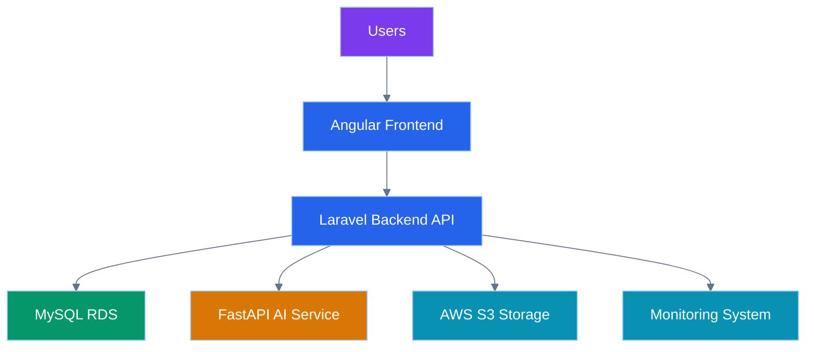

---

# 2.2 Deployment Components


| Component | Technology | Purpose |
|---|---|---|
|Frontend|Angular|User interface|
|Backend|Laravel|Business logic and APIs|
|AI Engine|FastAPI|Machine learning processing|
|Database|MySQL RDS|Persistent data storage|
|Storage|AWS S3|Resume and document storage|
|Compute|AWS EC2|Application hosting|
|CDN|CloudFront|Content delivery|
|CI/CD|GitHub Actions|Automation|


---

# 3. AWS Infrastructure Design


CareerIQ AI uses AWS services to build a scalable production environment.


---

# 3.1 AWS Architecture Overview


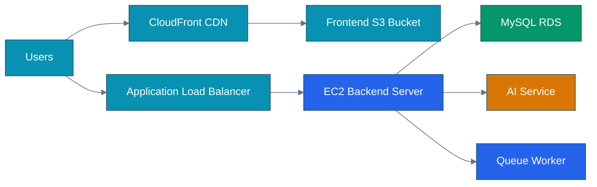

---

# 3.2 AWS Service Selection


| AWS Service | Purpose |
|---|---|
|EC2|Run Laravel backend|
|RDS|Managed MySQL database|
|S3|Store frontend files and documents|
|CloudFront|Global content delivery|
|IAM|Access management|
|CloudWatch|Monitoring|
|Secrets Manager|Secure configuration storage|


---

# 4. Environment Management


CareerIQ AI maintains separate environments to reduce deployment risk.


---

# 4.1 Environment Strategy


---

# 4.2 Environment Description


| Environment | Purpose |
|---|---|
|Local|Developer implementation|
|Development|Feature integration|
|Testing|Automated and manual testing|
|Staging|Production-like validation|
|Production|Live user environment|


---

# 4.3 Environment Configuration


Each environment maintains separate:


- Database credentials
- API keys
- Storage configuration
- AI service configuration
- Application settings


Example:


```
.env.local

.env.testing

.env.staging

.env.production

```

---

---

# 5. Infrastructure as Code (IaC)


Infrastructure as Code allows CareerIQ AI infrastructure to be created and managed through code instead of manual configuration.


The project uses:


```
Terraform

+

AWS Infrastructure

+

Automated Provisioning

```


Benefits:


- Repeatable infrastructure
- Version-controlled configuration
- Faster environment creation
- Reduced configuration errors


---

# 5.1 Terraform Architecture


---

# 5.2 Terraform Managed Resources


Terraform manages:


```
AWS EC2 Instances

AWS RDS Database

AWS S3 Buckets

Security Groups

IAM Roles

Load Balancers

Network Configuration

```


---

# 5.3 Infrastructure Repository Structure


Example:


```
infrastructure/


├── terraform/


│
├── main.tf

├── variables.tf

├── outputs.tf

├── provider.tf

└── modules/


    ├── ec2/

    ├── rds/

    ├── s3/

    └── networking/

```

---

# 6. Containerization Strategy


CareerIQ AI uses Docker to provide consistent deployment environments.


Docker ensures:


- Same environment across development and production
- Easy service management
- Simplified deployment


---

# 6.1 Docker Architecture


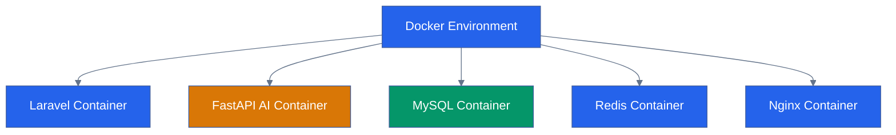

---

# 6.2 Container Responsibilities


| Container | Responsibility |
|---|---|
|Laravel|Backend API and business logic|
|FastAPI|AI processing service|
|MySQL|Database storage|
|Redis|Cache and queue management|
|Nginx|Reverse proxy and web server|


---

# 6.3 Docker Compose Architecture


Development environment uses Docker Compose.


Example:


```yaml
services:


 backend:

  image: careeriq-laravel

  ports:

   - "8000:8000"


 ai-service:

  image: careeriq-fastapi

  ports:

   - "9000:9000"


 database:

  image: mysql:8


 redis:

  image: redis

```

---

# 7. Backend Deployment


The Laravel backend is deployed as a containerized service.


Deployment responsibilities:


- API hosting
- Authentication
- Business logic
- Queue processing
- Database communication


---

# 7.1 Laravel Deployment Flow


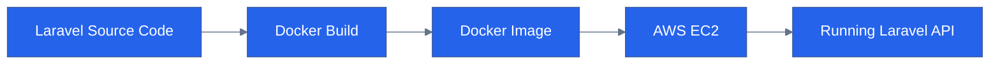

---

# 7.2 Laravel Production Configuration


Production configuration includes:


```
APP_ENV=production

APP_DEBUG=false

Database credentials

Cache configuration

Queue configuration

Storage configuration

```


---

# 7.3 Queue Worker Deployment


AI processing requires background workers.


Architecture:


---

# 8. Frontend Deployment


The Angular frontend is deployed as a static web application.


Deployment process:


```
Angular Source Code

        ↓

Production Build

        ↓

Static Files

        ↓

AWS S3

        ↓

CloudFront CDN

```


---

# 8.1 Angular Deployment Architecture


---

# 8.2 Frontend Deployment Steps


Steps:


```
1. Install dependencies

2. Run production build

3. Generate optimized files

4. Upload to S3

5. Configure CloudFront

6. Invalidate cache

```


---

# 9. Database Deployment


CareerIQ AI uses MySQL through AWS RDS.


Benefits:


- Managed database service
- Automated backups
- High availability
- Security controls


---

# 9.1 Database Deployment Architecture


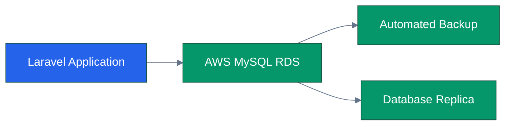

---

# 9.2 Database Migration Strategy


Laravel migrations are used for database version control.


Deployment:


```
Deploy Application

        ↓

Run Migration

        ↓

Verify Schema

        ↓

Start Application

```


Example:


```bash
php artisan migrate --force
```

---

# 10. AI Service Deployment


The AI engine is deployed separately using FastAPI.


Reasons:


- Independent scaling
- Model isolation
- Easier maintenance


---

# 10.1 AI Deployment Architecture


---

---

# 11. CI/CD Pipeline


CareerIQ AI uses Continuous Integration and Continuous Deployment (CI/CD) to automate software delivery.


The CI/CD pipeline ensures:


- Code quality
- Automated testing
- Reliable deployment
- Faster release cycles


---

# 11.1 CI/CD Architecture


---

# 11.2 CI/CD Workflow


The deployment pipeline follows:


```
Code Commit

      ↓

Pull Request

      ↓

Code Review

      ↓

Automated Tests

      ↓

Build Docker Image

      ↓

Deploy Application

      ↓

Health Check

```


---

# 11.3 GitHub Actions Pipeline Stages


| Stage | Purpose |
|---|---|
|Checkout|Retrieve source code|
|Install|Install dependencies|
|Testing|Run automated tests|
|Build|Create production artifacts|
|Security Scan|Check vulnerabilities|
|Deployment|Release application|
|Verification|Check application health|


---

# 11.4 Backend Deployment Pipeline


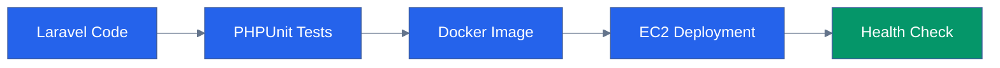

---

# 11.5 Frontend Deployment Pipeline


---

# 12. Configuration Management


Production applications require secure configuration handling.


CareerIQ AI separates configuration from application code.


---

# 12.1 Configuration Architecture


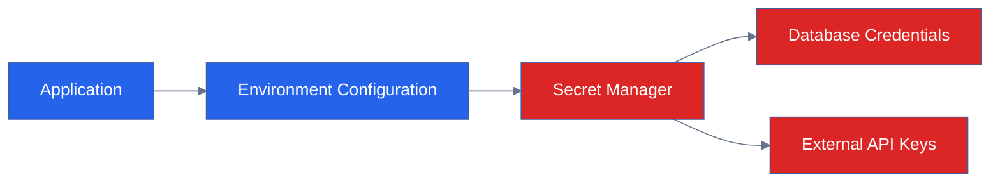

---

# 12.2 Environment Variables


Example:


```
APP_ENV=production

APP_DEBUG=false


DB_HOST=database-server

DB_DATABASE=careeriq


AI_SERVICE_URL=https://ai-service.com


AWS_BUCKET=resume-storage

```


---

# 13. Security Configuration


Security is a critical part of production deployment.


CareerIQ AI implements:


- HTTPS communication
- Secure authentication
- Network protection
- Access management
- Secret protection


---

# 13.1 Security Architecture


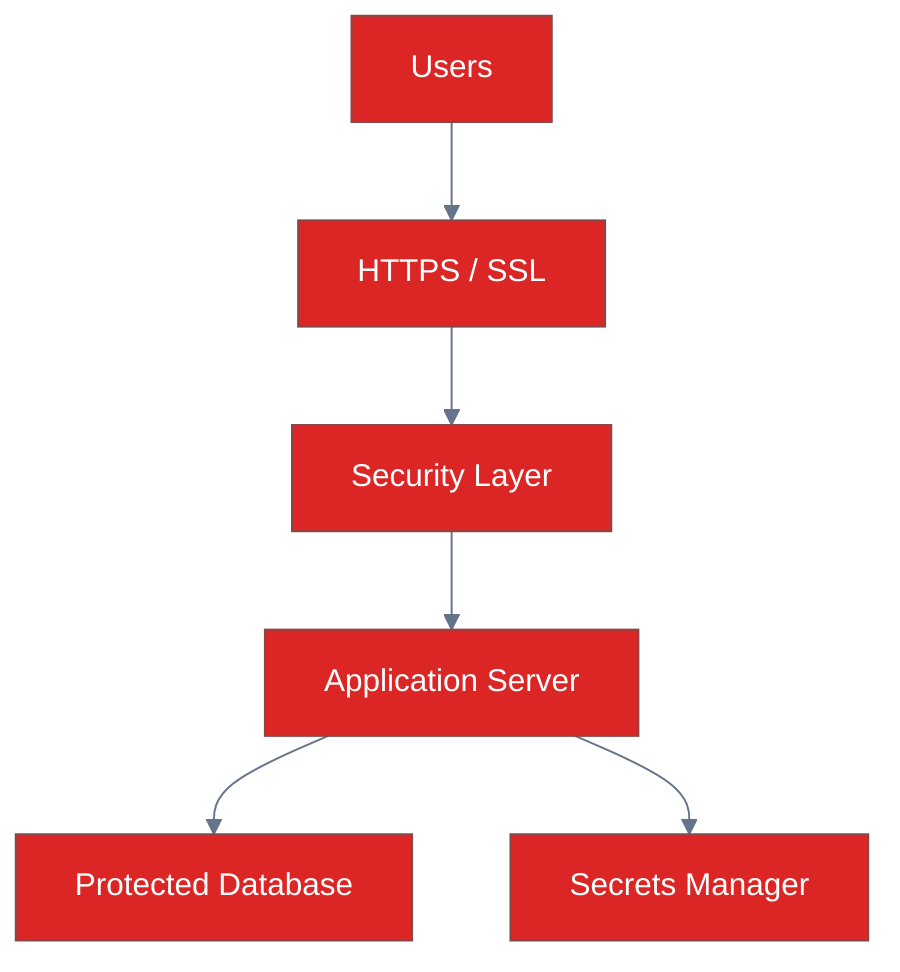

---

# 13.2 HTTPS and SSL Configuration


Production environment requires:


- SSL certificate
- HTTPS communication
- Secure API requests


Flow:


```
User Request

        ↓

HTTPS Encryption

        ↓

Application Server

        ↓

Secure Response

```

---

# 13.3 IAM Access Control


AWS Identity and Access Management controls resource access.


Example roles:


| Role | Permission |
|---|---|
|Developer|Development resources|
|Backend Service|API resources|
|Database Admin|Database management|
|Deployment Bot|CI/CD deployment|


---

# 14. Secrets Management


Sensitive information should never be stored inside:


```
Source Code

Git Repository

Docker Images

```


---

# 14.1 Secrets Management Flow


---

# 15. Monitoring and Observability


Deployment does not end after releasing the application.


CareerIQ AI continuously monitors:


- Application health
- Server performance
- Errors
- Database performance
- AI service availability


---

# 15.1 Observability Architecture


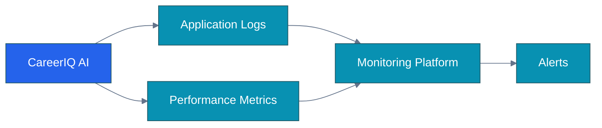

---

# 15.2 Monitoring Tools


Possible production tools:


| Tool | Purpose |
|---|---|
|AWS CloudWatch|Infrastructure monitoring|
|Laravel Telescope|Backend debugging|
|Sentry|Application error tracking|
|CloudWatch Logs|Centralized logging|
|Health Checks|Service availability|


---

# 15.3 Application Health Checks


Example:


```
GET /api/health


Response:


{

"status":"healthy",

"database":"connected",

"ai_service":"available"

}

```

---

---

# 16. Scaling Strategy


CareerIQ AI is designed to support increasing numbers of users and AI workloads.


The scaling strategy focuses on:


- Application scalability
- Database scalability
- AI workload scalability
- Infrastructure efficiency


---

# 16.1 Scaling Architecture


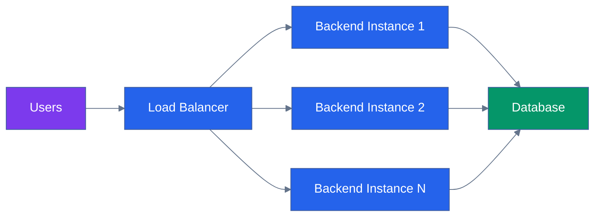

---

# 16.2 Horizontal Scaling


Horizontal scaling increases capacity by adding more servers.


Example:


```
Single Server


       ↓


Multiple Backend Instances


       ↓


Load Balanced Application

```


Benefits:


- Higher availability
- Better performance
- Fault tolerance


---

# 16.3 Vertical Scaling


Vertical scaling improves performance by increasing server resources.


Examples:


```
Increase:

CPU

Memory

Storage

```


Used for:


- Database optimization
- AI processing workloads


---

# 16.4 Auto Scaling Strategy


AWS Auto Scaling adjusts resources automatically.


Flow:


---

# 17. Deployment Strategies


CareerIQ AI supports safe production deployments.


The deployment strategy minimizes downtime and deployment risks.


---

# 17.1 Blue-Green Deployment


Two production environments are maintained.


```
Blue Environment

(Current Version)


        ↓


Traffic Switch


        ↓


Green Environment

(New Version)

```


Advantages:


- Zero downtime
- Easy rollback
- Safer releases


---

# 17.2 Blue-Green Architecture


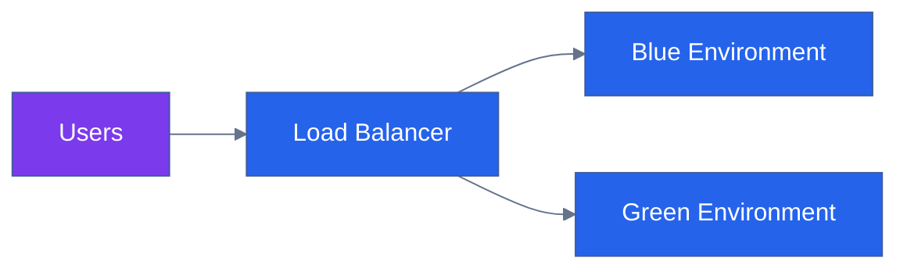

---

# 17.3 Rolling Deployment


Rolling deployment updates servers gradually.


Process:


```
Update Server 1

        ↓

Verify

        ↓

Update Server 2

        ↓

Complete Deployment

```


Advantages:


- Reduced downtime
- Continuous availability


---

# 18. Backup and Disaster Recovery


A production system requires reliable recovery mechanisms.


CareerIQ AI protects:


- Database data
- User uploaded files
- Application configuration
- Infrastructure setup


---

# 18.1 Backup Architecture


```mermaid
%%{init:{
"theme":"base",
"themeVariables":{
"primaryColor":"#059669",
"primaryTextColor":"#FFFFFF",
"lineColor":"#64748B"
}
}}%%
 
 
flowchart LR


DATABASE["MySQL RDS"]


SNAPSHOT["Database Snapshots"]


STORAGE["AWS S3 Files"]


VERSION["S3 Versioning"]


RECOVERY["Recovery System"]


DATABASE --> SNAPSHOT

STORAGE --> VERSION

SNAPSHOT --> RECOVERY

VERSION --> RECOVERY


classDef database fill:#059669,color:white;

classDef recovery fill:#2563EB,color:white;


class DATABASE,SNAPSHOT,STORAGE,VERSION database;

class RECOVERY recovery;

```

---

# 18.2 Backup Strategy


| Component | Backup Method |
|---|---|
|Database|Automated RDS snapshots|
|Resume Files|S3 versioning|
|Application Code|Git repository|
|Infrastructure|Terraform configuration|
|Secrets|AWS Secrets Manager|


---

# 18.3 Disaster Recovery Plan


Recovery process:


```
System Failure

        ↓

Identify Problem

        ↓

Restore Infrastructure

        ↓

Restore Database

        ↓

Verify Services

        ↓

Resume Operation

```


---

# 18.4 Recovery Objectives


Important metrics:


| Metric | Purpose |
|---|---|
|RTO (Recovery Time Objective)|Maximum acceptable downtime|
|RPO (Recovery Point Objective)|Maximum acceptable data loss|


---

# 19. Cost Optimization


Cloud resources should be optimized to control operational costs.


---

# 19.1 Cost Optimization Strategies


## Compute Optimization


Use:


- Auto scaling
- Right-sized EC2 instances
- Reserved instances when required


---

## Storage Optimization


Use:


- S3 lifecycle policies
- Appropriate storage classes
- File compression


---

## Database Optimization


Use:


- Query optimization
- Indexing
- Efficient resource allocation


---

# 19.2 Cost Management Architecture


```mermaid
%%{init:{
"theme":"base",
"themeVariables":{
"primaryColor":"#0891B2",
"primaryTextColor":"#FFFFFF",
"lineColor":"#64748B"
}
}}%%
 
 
flowchart LR


AWS["AWS Resources"]


MONITOR["Cost Monitoring"]


OPTIMIZE["Optimization Strategy"]


SAVING["Reduced Cost"]


AWS --> MONITOR

MONITOR --> OPTIMIZE

OPTIMIZE --> SAVING


classDef cloud fill:#0891B2,color:white;


class AWS,MONITOR,OPTIMIZE,SAVING cloud;

```

---

# 20. Production Readiness Checklist


Before releasing CareerIQ AI to production:


## Application


```
☑ Application builds successfully

☑ Automated tests passed

☑ API endpoints verified

☑ AI service tested

```


---

## Security


```
☑ HTTPS enabled

☑ Secrets secured

☑ Authentication verified

☑ Permissions configured

```


---

## Infrastructure


```
☑ Database backup enabled

☑ Monitoring configured

☑ Health checks available

☑ Recovery plan prepared

```


---

## Deployment


```
☑ CI/CD pipeline working

☑ Docker images tested

☑ Rollback strategy available

☑ Production environment verified

```


---

# 21. Final Deployment Architecture


```mermaid
%%{init:{
"theme":"base",
"themeVariables":{
"primaryColor":"#2563EB",
"primaryTextColor":"#FFFFFF",
"lineColor":"#64748B"
}
}}%%
 
 
flowchart TB


USERS["Users"]


CDN["CloudFront CDN"]


FRONTEND["Angular Frontend<br/>S3"]


LB["Load Balancer"]


BACKEND["Laravel Backend<br/>EC2"]


QUEUE["Queue Workers<br/>Redis"]


AI["FastAPI AI Service"]


DATABASE["MySQL RDS"]


STORAGE["AWS S3 Storage"]


MONITOR["CloudWatch Monitoring"]


SECRETS["AWS Secrets Manager"]


USERS --> CDN

CDN --> FRONTEND

USERS --> LB

LB --> BACKEND

BACKEND --> QUEUE

BACKEND --> DATABASE

BACKEND --> STORAGE

QUEUE --> AI

BACKEND --> MONITOR

BACKEND --> SECRETS


classDef user fill:#7C3AED,color:white;

classDef frontend fill:#2563EB,color:white;

classDef backend fill:#2563EB,color:white;

classDef database fill:#059669,color:white;

classDef cloud fill:#0891B2,color:white;

classDef ai fill:#D97706,color:white;

classDef security fill:#DC2626,color:white;


class USERS user;

class FRONTEND,LB,BACKEND,QUEUE frontend;

class DATABASE database;

class STORAGE,MONITOR cloud;

class AI ai;

class SECRETS security;

```

---

