# Maintenance and Support Plan

# CareerIQ AI


---

# Document Information


| Field | Description |
|---|---|
| Project Name | CareerIQ AI |
| Document Type | Maintenance and Support Plan |
| Version | 2.0 |
| System Type | AI-Powered Career Intelligence Platform |
| Maintenance Approach | Continuous Improvement |
| Monitoring Strategy | SRE-Based Monitoring |
| AI Management | Model Lifecycle Management |
| Support Model | Incident + Service Management |


---

# Document Purpose


This document defines the maintenance and operational strategy for CareerIQ AI after deployment.


The purpose is to ensure:


- System reliability
- Continuous improvement
- Security maintenance
- Performance optimization
- AI model quality
- User support
- Long-term sustainability


This document covers maintenance activities for:


```
Frontend Application

        +

Backend Services

        +

Database System

        +

AI Engine

        +

Cloud Infrastructure

```


---

# 1. Maintenance Overview


## 1.1 Introduction


CareerIQ AI is a continuously evolving AI-powered platform.


After production deployment, the system requires regular maintenance to ensure:


- Availability
- Security
- Performance
- Accuracy
- Scalability


Maintenance is not limited to fixing problems.


It also includes:


- Feature improvements
- Technology updates
- AI model improvement
- Infrastructure optimization


---

# 1.2 Maintenance Goals


The primary maintenance goals are:


| Goal | Description |
|---|---|
|Reliability|Keep services available and stable|
|Security|Protect users and system resources|
|Performance|Maintain fast response times|
|Quality|Reduce defects and improve features|
|AI Accuracy|Maintain recommendation quality|
|Scalability|Support future growth|


---

# 1.3 Maintenance Scope


CareerIQ AI maintenance covers:


## Frontend Maintenance


Includes:


- Angular updates
- UI improvements
- Browser compatibility
- Dependency updates


---

## Backend Maintenance


Includes:


- Laravel updates
- API improvements
- Performance optimization
- Security patches


---

## Database Maintenance


Includes:


- Query optimization
- Backup verification
- Migration management
- Data consistency


---

## AI System Maintenance


Includes:


- Model monitoring
- Data quality checks
- Model evaluation
- Retraining


---

## Infrastructure Maintenance


Includes:


- AWS resource monitoring
- Server updates
- Network configuration
- Cost optimization


---

# 2. Maintenance Objectives


CareerIQ AI follows these operational objectives:


```text
Maintain Reliability

        ↓

Detect Problems Early

        ↓

Resolve Issues Quickly

        ↓

Improve System Quality

        ↓

Deliver Better User Experience

```


---

# 2.1 Reliability Objectives


The system aims to maintain:


| Metric | Objective |
|---|---|
|Application Availability|High availability|
|API Response Time|Fast response|
|Error Rate|Minimum failures|
|AI Processing Success|Reliable results|
|Database Stability|Consistent operation|


---

# 3. Maintenance Strategy


CareerIQ AI follows four standard software maintenance categories.


---

# 3.1 Corrective Maintenance


Corrective maintenance focuses on fixing existing problems.


Examples:


- Bug fixes
- Error resolution
- Production issue correction
- Data correction


Example workflow:


```
Issue Detected

        ↓

Bug Analysis

        ↓

Fix Implementation

        ↓

Testing

        ↓

Deployment

```


---

# 3.2 Adaptive Maintenance


Adaptive maintenance updates the system according to environmental changes.


Examples:


- New browser versions
- AWS service updates
- PHP/Laravel updates
- AI framework changes


---

# 3.3 Perfective Maintenance


Perfective maintenance improves existing functionality.


Examples:


- Better user interface
- Faster API responses
- Improved recommendations
- New career features


---

# 3.4 Preventive Maintenance


Preventive maintenance prevents future problems.


Examples:


- Security updates
- Code refactoring
- Database optimization
- Dependency updates


---

# 3.5 Maintenance Strategy Overview


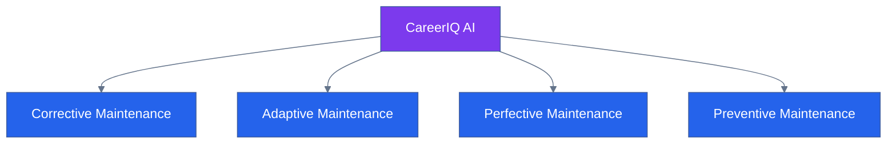

---

# 4. Maintenance Lifecycle


CareerIQ AI follows a structured maintenance lifecycle.


---

# 4.1 Maintenance Process


---

# 4.2 Maintenance Workflow


Every maintenance activity follows:


```
Identify

    ↓

Prioritize

    ↓

Develop Solution

    ↓

Test

    ↓

Release

    ↓

Monitor Impact

```


---

# 5. Application Maintenance


Application maintenance manages changes across the software stack.


---

# 5.1 Application Maintenance Areas


| Component | Maintenance Activities |
|---|---|
|Angular Frontend|UI updates, dependency management|
|Laravel Backend|API improvement, bug fixing|
|FastAPI AI|Model updates, optimization|
|Database|Performance tuning|
|Infrastructure|Cloud maintenance|


---

# 5.2 Application Maintenance Architecture


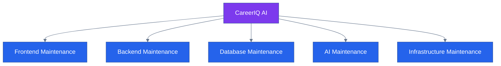

---

# 6. Monitoring Overview


Continuous monitoring helps detect problems before they affect users.


CareerIQ AI monitors:


- Application health
- Server performance
- Database performance
- API availability
- AI service quality


---

# 6.1 Monitoring Architecture


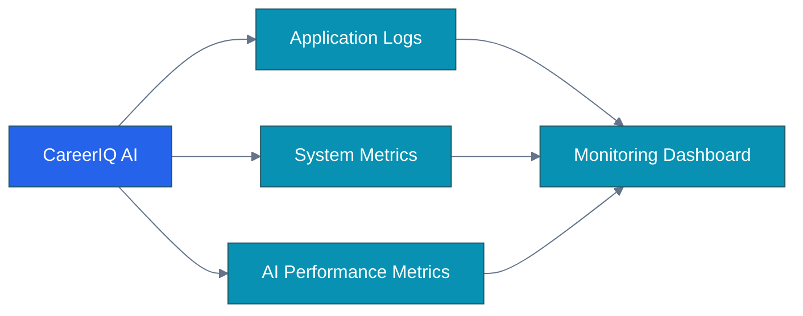

---

---

# 7. Backend Maintenance


The Laravel backend requires continuous maintenance to ensure:


- API reliability
- Secure data processing
- Business logic correctness
- Performance optimization


---

# 7.1 Backend Maintenance Activities


| Area | Maintenance Activity |
|---|---|
|Laravel Framework|Version updates and security patches|
|API Layer|Endpoint improvement and optimization|
|Business Logic|Refactoring and bug fixing|
|Authentication|Security review|
|Queue System|Worker monitoring|
|Performance|Query and code optimization|


---

# 7.2 Backend Maintenance Workflow


---

# 7.3 Laravel Maintenance Tasks


Regular tasks:


```
Update Laravel packages

↓

Review API performance

↓

Optimize database queries

↓

Check authentication security

↓

Review application logs

```


---

# 8. Frontend Maintenance


The Angular frontend requires regular maintenance to provide a consistent user experience.


---

# 8.1 Frontend Maintenance Activities


| Area | Maintenance Activity |
|---|---|
|Angular Framework|Version updates|
|UI Components|Design improvements|
|Dependencies|Security updates|
|Browser Support|Compatibility testing|
|Performance|Bundle optimization|
|Accessibility|UI improvements|


---

# 8.2 Frontend Maintenance Workflow


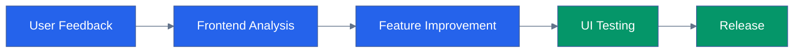

---

# 8.3 Angular Maintenance Tasks


Regular activities:


```
Update npm packages

↓

Remove unused dependencies

↓

Improve component performance

↓

Check responsive design

↓

Perform accessibility review

```


---

# 9. Database Maintenance


Database maintenance ensures:


- Data consistency
- Query performance
- Reliability
- Availability


---

# 9.1 Database Maintenance Activities


| Activity | Purpose |
|---|---|
|Backup Verification|Ensure recovery capability|
|Index Optimization|Improve query speed|
|Query Analysis|Detect slow queries|
|Migration Review|Maintain schema consistency|
|Data Cleaning|Remove unnecessary data|


---

# 9.2 Database Maintenance Architecture


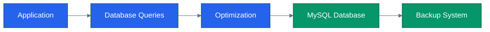

---

# 9.3 Database Health Checks


Regular checks:


```
Connection Status

↓

Query Performance

↓

Storage Usage

↓

Backup Verification

↓

Security Review

```


---

# 10. Infrastructure Maintenance


Infrastructure maintenance ensures cloud resources remain secure and reliable.


CareerIQ AI infrastructure includes:


- AWS EC2
- AWS RDS
- AWS S3
- CloudFront
- Redis
- Networking components


---

# 10.1 Infrastructure Maintenance Activities


| Component | Maintenance |
|---|---|
|EC2|OS updates and resource monitoring|
|RDS|Database maintenance|
|S3|Storage optimization|
|CloudFront|Cache management|
|Network|Security review|


---

# 10.2 Infrastructure Monitoring Flow


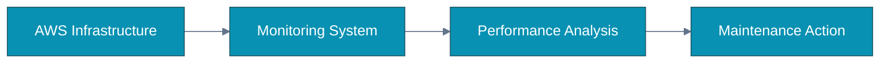

---

# 11. Dependency Management


Modern applications depend on external libraries and frameworks.


CareerIQ AI manages:


- PHP packages
- Composer dependencies
- npm packages
- Python libraries


---

# 11.1 Dependency Update Strategy


Updates follow:


```
Check New Version

        ↓

Review Changes

        ↓

Test Compatibility

        ↓

Update Dependency

        ↓

Deploy

```


---

# 11.2 Dependency Management Tools


| Technology | Tool |
|---|---|
|PHP|Composer|
|JavaScript|npm|
|Python|pip|
|Container|Docker Image Updates|


---

# 12. Security Maintenance


Security maintenance protects:


- User information
- Authentication systems
- Uploaded files
- AI services


---

# 12.1 Security Maintenance Activities


| Activity | Frequency |
|---|---|
|Dependency Security Scan|Regularly|
|Vulnerability Review|Regularly|
|Access Review|Periodic|
|Security Updates|Immediately when required|
|Permission Audit|Periodic|


---

# 12.2 Security Maintenance Architecture


---

# 13. Incident Management


Incident management defines how production problems are handled.


---

# 13.1 Incident Response Lifecycle


---

# 13.2 Incident Priority Levels


|Priority|Example|Response|
|---|---|---|
|Critical|System unavailable|Immediate action|
|High|Major feature failure|Urgent fix|
|Medium|Performance issue|Scheduled fix|
|Low|Minor UI issue|Future release|


---

---

# 14. AI Model Lifecycle Management


CareerIQ AI contains intelligent features powered by AI models.


Unlike traditional software, AI systems require continuous monitoring and improvement.


AI maintenance focuses on:


- Model performance
- Data quality
- Prediction accuracy
- Recommendation relevance
- Model updates


---

# 14.1 AI Lifecycle Overview


The AI lifecycle includes:


```text
Data Collection

        ↓

Data Validation

        ↓

Model Training

        ↓

Model Evaluation

        ↓

Model Deployment

        ↓

Performance Monitoring

        ↓

Model Improvement

```


---

# 14.2 AI Model Lifecycle Architecture


```mermaid
%%{init:{
"theme":"base",
"themeVariables":{
"primaryColor":"#D97706",
"primaryTextColor":"#FFFFFF",
"lineColor":"#64748B"
}
}}%%


flowchart LR


DATA["Data Collection"]


VALIDATE["Data Validation"]


TRAIN["Model Training"]


EVALUATE["Model Evaluation"]


DEPLOY["Model Deployment"]


MONITOR["Model Monitoring"]


IMPROVE["Model Improvement"]



DATA --> VALIDATE

VALIDATE --> TRAIN

TRAIN --> EVALUATE

EVALUATE --> DEPLOY

DEPLOY --> MONITOR

MONITOR --> IMPROVE

IMPROVE --> TRAIN



classDef ai fill:#D97706,color:white;

classDef process fill:#2563EB,color:white;


class DATA,VALIDATE,TRAIN,EVALUATE,DEPLOY,MONITOR ai;

class IMPROVE process;

```

---

# 14.3 AI Model Maintenance Activities


| Activity | Purpose |
|---|---|
|Model Evaluation|Measure prediction quality|
|Performance Monitoring|Track real-world behavior|
|Data Validation|Ensure input quality|
|Model Updating|Improve accuracy|
|Model Versioning|Track model changes|


---

# 15. AI Model Monitoring


AI systems require continuous observation after deployment.


CareerIQ AI monitors:


- Recommendation quality
- Prediction accuracy
- Processing time
- Failure rate
- User feedback


---

# 15.1 AI Monitoring Architecture


---

# 15.2 AI Quality Metrics


| Metric | Purpose |
|---|---|
|Accuracy|Correctness of predictions|
|Precision|Quality of recommended results|
|Recall|Coverage of relevant results|
|F1 Score|Balanced evaluation|
|Latency|Processing speed|
|User Feedback|Real-world satisfaction|


---

# 16. Data Drift Monitoring


AI model performance may decrease when real-world data changes.


Data drift occurs when:


```
Training Data

        ≠

Production Data

```


Examples:


- New job market trends
- New technologies
- Changing skill requirements
- Different user behavior


---

# 16.1 Data Drift Detection Flow


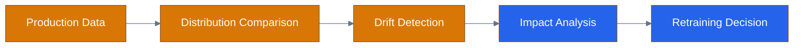

---

# 16.2 Data Drift Response


When drift is detected:


```
Detect Drift

        ↓

Analyze Impact

        ↓

Review Model Performance

        ↓

Retrain Model (If Required)

        ↓

Deploy Updated Model

```


---

# 17. Model Retraining Strategy


AI models require periodic improvement.


Retraining may occur because of:


- Performance degradation
- New training data
- New career domains
- User feedback


---

# 17.1 Model Retraining Pipeline


---

# 17.2 Model Version Management


CareerIQ AI maintains model versions.


Example:


```
Model v1.0

        ↓

Model v1.1

        ↓

Model v2.0

```


Each version stores:


- Training data information
- Model parameters
- Evaluation results
- Deployment date


---

# 18. Site Reliability Engineering (SRE)


CareerIQ AI follows SRE principles to maintain reliability.


SRE focuses on:


- Availability
- Performance
- Monitoring
- Incident prevention


---

# 18.1 Reliability Architecture


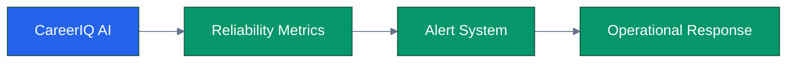

---

# 18.2 Service Level Indicators (SLI)


SLIs measure system performance.


CareerIQ AI monitors:


| SLI | Measurement |
|---|---|
|Availability|System uptime|
|Latency|Response time|
|Error Rate|Failed requests|
|AI Processing Time|Model response duration|
|Database Performance|Query efficiency|


---

# 18.3 Service Level Objectives (SLO)


Example targets:


| Objective | Target |
|---|---|
|Application Availability|99.5%|
|API Success Rate|High reliability|
|Database Availability|99.9%|
|AI Processing Success|95%+|


---

# 19. Performance Management


Performance maintenance ensures the system remains fast as usage grows.


---

# 19.1 Performance Monitoring Areas


| Area | Monitoring |
|---|---|
|Frontend|Page load speed|
|Backend|API response time|
|Database|Query performance|
|AI Service|Processing latency|
|Infrastructure|CPU and memory usage|


---

# 19.2 Performance Optimization Cycle


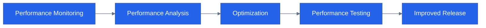

---

---

# 20. Change Management


Change management ensures that modifications to CareerIQ AI are introduced safely and systematically.


Changes may include:


- New features
- Bug fixes
- Infrastructure updates
- AI model updates
- Security improvements


---

# 20.1 Change Management Process


---

# 20.2 Change Classification


| Change Type | Example | Risk |
|---|---|---|
|Minor Change|UI improvement|Low|
|Feature Change|New career module|Medium|
|System Change|Architecture modification|High|
|AI Change|New model deployment|High|


---

# 21. Release Management


Release management controls how new versions are delivered.


CareerIQ AI follows semantic versioning.


---

# 21.1 Versioning Strategy


Format:


```
MAJOR.MINOR.PATCH


Example:


2.4.1

```


Meaning:


|Version|Meaning|
|---|---|
|Major|Large architectural change|
|Minor|New features|
|Patch|Bug fixes|


---

# 21.2 Release Process


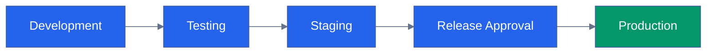

---

# 21.3 Rollback Strategy


If a release causes issues:


```
Detect Problem

        ↓

Stop Deployment

        ↓

Restore Previous Version

        ↓

Verify System

        ↓

Analyze Root Cause

```


Rollback methods:


- Previous Docker image
- Previous application version
- Database recovery point


---

# 22. Technical Debt Management


Technical debt represents future maintenance challenges caused by shortcuts or outdated solutions.


---

# 22.1 Technical Debt Categories


| Category | Example |
|---|---|
|Code Debt|Duplicate code|
|Architecture Debt|Old design decisions|
|Dependency Debt|Outdated libraries|
|Database Debt|Poor query design|
|AI Debt|Model performance degradation|


---

# 22.2 Technical Debt Management Process


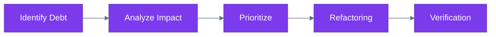

---

# 23. Knowledge Management


Proper documentation ensures long-term maintainability.


CareerIQ AI maintains:


- Technical documentation
- API documentation
- Deployment documentation
- Architecture documentation
- Maintenance records


---

# 23.1 Documentation Maintenance


Documentation should be updated when:


```
New Feature Added

        ↓

Architecture Changed

        ↓

API Modified

        ↓

Deployment Updated

        ↓

Documentation Revised

```


---

# 24. Backup and Recovery Maintenance


Backup systems require continuous verification.


---

# 24.1 Backup Maintenance Activities


| Activity | Purpose |
|---|---|
|Backup Testing|Verify recovery capability|
|Snapshot Review|Ensure database safety|
|Storage Monitoring|Manage capacity|
|Recovery Testing|Validate disaster plan|


---

# 24.2 Recovery Maintenance Flow


---

# 25. User Support Strategy


User support ensures problems and feedback are handled efficiently.


---

# 25.1 Support Workflow


```mermaid
%%{init:{
"theme":"base",
"themeVariables":{
"primaryColor":"#2563EB",
"primaryTextColor":"#FFFFFF",
"lineColor":"#64748B"
}
}}%%


flowchart LR


USER["User Issue"]


TICKET["Support Ticket"]


CLASSIFY["Issue Classification"]


RESOLVE["Resolution"]


FEEDBACK["User Feedback"]


USER --> TICKET

TICKET --> CLASSIFY

CLASSIFY --> RESOLVE

RESOLVE --> FEEDBACK


classDef support fill:#2563EB,color:white;


class USER,TICKET,CLASSIFY,RESOLVE,FEEDBACK support;

```

---

# 25.2 Support Categories


| Category | Example |
|---|---|
|Technical Issue|Application error|
|Account Issue|Login problem|
|AI Issue|Incorrect recommendation|
|Feature Request|New functionality|


---

# 26. Service Level Agreement (SLA)


SLA defines expected response and resolution times.


---

# 26.1 SLA Priority Levels


|Priority|Example|Response Target|Resolution Target|
|---|---|---|---|
|Critical|System unavailable|1 hour|24 hours|
|High|Major feature failure|4 hours|3 days|
|Medium|Performance issue|1 day|1 week|
|Low|Minor UI issue|3 days|Next release|


---

# 27. Future Improvement Roadmap


CareerIQ AI will continuously evolve.


---

# 27.1 Improvement Phases


```
Phase 1

System Stabilization


        ↓


Phase 2

AI Accuracy Improvement


        ↓


Phase 3

Advanced Analytics


        ↓


Phase 4

Enterprise Features

```


---

# 27.2 Future Enhancement Areas


## AI Improvements


- Better recommendation models
- Personalized career prediction
- Advanced interview simulation


## Platform Improvements


- Mobile application
- Advanced analytics dashboard
- Enterprise integrations


## Infrastructure Improvements


- Improved scalability
- Multi-region deployment
- Advanced monitoring


---

# 28. Final Maintenance Architecture


```mermaid
%%{init:{
"theme":"base",
"themeVariables":{
"primaryColor":"#2563EB",
"primaryTextColor":"#FFFFFF",
"lineColor":"#64748B"
}
}}%%
 
 
flowchart TB


SYSTEM["CareerIQ AI"]


APPLICATION["Application Maintenance"]

SECURITY["Security Maintenance"]

DATABASE["Database Maintenance"]

INFRA["Infrastructure Maintenance"]

AI["AI Model Maintenance"]

MONITOR["Monitoring"]

SUPPORT["User Support"]

IMPROVE["Continuous Improvement"]


SYSTEM --> APPLICATION

SYSTEM --> SECURITY

SYSTEM --> DATABASE

SYSTEM --> INFRA

SYSTEM --> AI


APPLICATION --> MONITOR

SECURITY --> MONITOR

DATABASE --> MONITOR

INFRA --> MONITOR

AI --> MONITOR


MONITOR --> SUPPORT

SUPPORT --> IMPROVE

IMPROVE --> SYSTEM


classDef system fill:#7C3AED,color:white;

classDef maintenance fill:#2563EB,color:white;

classDef monitor fill:#0891B2,color:white;

classDef improvement fill:#059669,color:white;


class SYSTEM system;

class APPLICATION,SECURITY,DATABASE,INFRA,AI maintenance;

class MONITOR,SUPPORT monitor;

class IMPROVE improvement;

```

---

